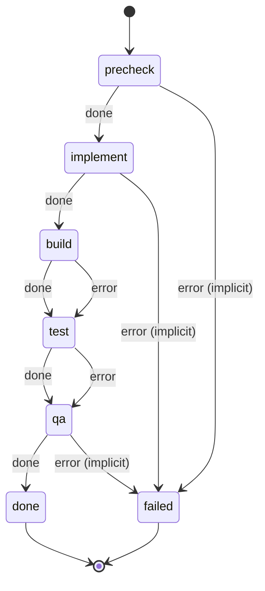

# rust_develop

Implement a message in a Rust project with Claude, build and test it, then have Claude fix any failures.

Machine: [machines/rust_develop.yml](../machines/rust_develop.yml)

```mermaid
stateDiagram-v2
    [*] --> precheck
    build --> test: done
    build --> test: error
    implement --> build: done
    implement --> failed: error (implicit)
    precheck --> implement: done
    precheck --> failed: error (implicit)
    qa --> done: done
    qa --> failed: error (implicit)
    test --> qa: done
    test --> qa: error
    done --> [*]
    failed --> [*]
```
