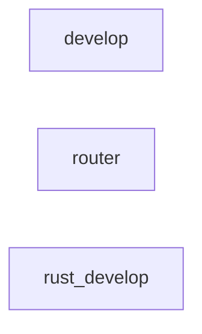

# All machines

Every machine, the `emits` and `invokes` edges between them, and cron entry points.

- [develop](develop.md): Implement a message with Claude, then have it verify the acceptance criteria.
- [router](router.md): Ask Claude to pick one of the options in the request.
- [rust_develop](rust_develop.md): Implement a message in a Rust project with Claude in small, logged steps, run the gate (fmt, clippy, tests), and have Claude fix failures only if the gate fails.

