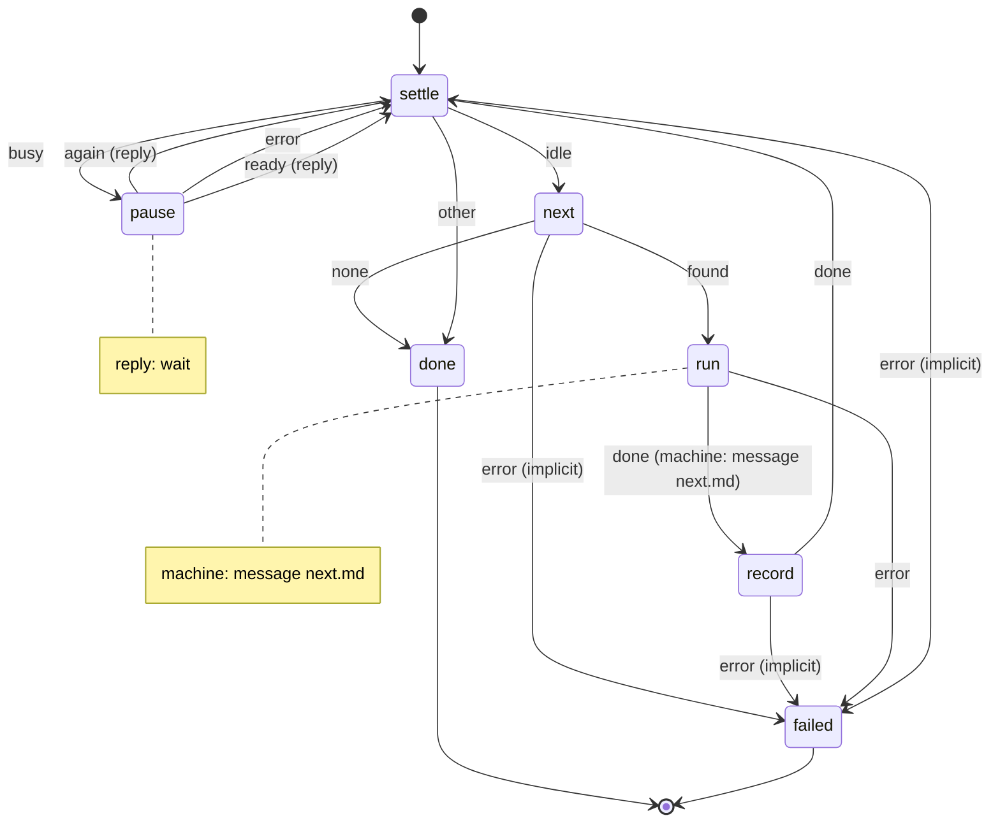

# order

At daemon start, run each machine's order/ files one at a time in file-name order, once each, and again when a file changes.

Machine: [machines/order/machine.yml](machine.yml)

```mermaid
stateDiagram-v2
    [*] --> settle
    next --> failed: error (implicit)
    next --> run: found
    next --> done: none
    pause --> settle: again (reply)
    pause --> settle: error
    pause --> settle: ready (reply)
    record --> settle: done
    record --> failed: error (implicit)
    run --> record: done (machine: message next.md)
    run --> failed: error
    settle --> pause: busy
    settle --> failed: error (implicit)
    settle --> next: idle
    settle --> done: other
    done --> [*]
    failed --> [*]
    note right of pause
        reply: wait
    end note
    note right of run
        machine: message next.md
    end note
```
