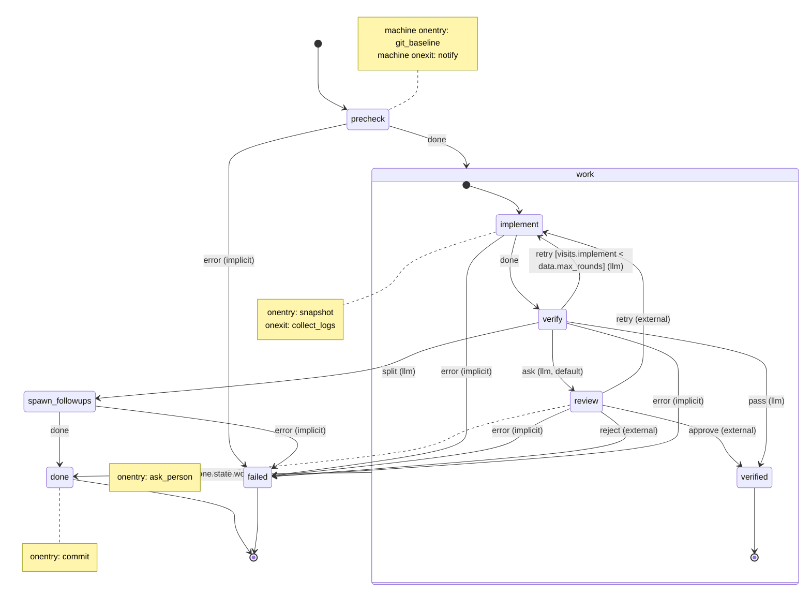

# decree 0.5.0: Messages, Machines, Scripts — Implementation Spec

This file is the source of truth for the 0.5.0 rewrite. It was checked against the 0.4.2 source and migrations 01–33. A worked example of everything below, with real files, lives in `mock/` (start at `mock/README.md`).

## 1. How to use this spec

decree 0.5.0 is rebuilt from three building blocks: **messages** (markdown), **machines** (YAML statecharts) and **scripts** (executables, bash by default). Every ticket in section 11 implements against the contracts in sections 2–9.

Rules for every ticket:

1. **Verify before delete.** Every deletion starts with the grep listed in section 10. If something is used in a way this spec does not cover, stop and raise it.
2. **Nothing beyond the spec.** Do not add config keys, flags, file formats or extension points that are not written here. If you think one is needed, raise it first.
3. **Done means demonstrated.** A ticket is done when every acceptance criterion is shown by a passing test, or by a command whose output is printed in the run log.
4. **Breaking release.** All of this ships as 0.5.0. There are no compatibility shims for 0.4.x layouts or config keys: the one-time script in ticket M5.4 rewrites them. One exception: messages accept `routine:` as an alias of `machine:`, because migration files are immutable and existing projects have unprocessed migrations that still carry it.
5. **Keep 0.4.2 features.** Retries, `timeout_s`, `max_depth`, `max_log_size`, `DECREE_TRIGGER`, `DECREE_FINAL_ATTEMPT`, the `onDeadLetter` hook, the git-stash hook templates, shared routines, the decree skill written by `init`, `process --dry-run` and `daemon --interval` all survive, mapped as this spec describes.
6. **Do not invent.** Where this spec follows an existing standard (section 13), follow that standard's semantics. Where it deviates, section 13 says so and why.

### Terms

Machines follow W3C SCXML 1.0 (the State Chart XML recommendation): its terms, its transition semantics, and a strict subset of its features (section 5, SCXML subset). They are written in YAML, never XML. Anyone, human or AI, who knows SCXML knows how a decree machine behaves.

| Term | Meaning |
| --- | --- |
| Message | A markdown file: YAML frontmatter (structured) plus a body (unstructured task text). One message = one run. |
| Machine | A YAML statechart in `.decree/machines/<name>.yml`: one SCXML document, written as YAML. A type, never an instance. |
| State | An SCXML state: atomic (does one step), compound (has child `states`) or final (`final: true`, ends the run). |
| Configuration | SCXML's term for the set of active states: the current atomic state and all its ancestors. |
| Script | An executable file in `.decree/scripts/` (shared by all machines) or `.decree/scripts/<machine>/` (one machine's override). Machines refer to scripts by name, never by path. |
| Invoke | A state's main script, `invoke: <name>`: an SCXML `<invoke>`. It runs while the state is active and its completion raises exactly one event. |
| `onentry`, `onexit` | Scripts run when a state is entered or exited: SCXML executable content in `<onentry>` and `<onexit>`. They produce no event. |
| Event | A name such as `done`, `error` or `pass` that selects a transition out of a state. |
| Transition | An entry under a state's `transitions:` mapping an event to a `target`, optionally with a `cond`: an SCXML `<transition event target cond>`. |
| Data | A machine's typed, read-only values (`data:`), set from a message's `params`: SCXML `<data>`, initialised the way `<invoke><param>` initialises an invoked session. |
| Router state | A decree extension: a state with `router: llm`. When its invoke does not name an event, a model picks one of the state's declared events. |
| Run | One message moving through one machine (an SCXML session), stored in `.decree/runs/<message id>/`. |

## 2. Architecture

decree splits structured from unstructured data across three blocks. Messages carry the task, machines carry the control flow, and scripts do the work. The LLM only ever chooses among edges a machine declares.

```text
            decree emit
  +-------------------------------+
  |                               v
  |   Message   (frontmatter = structured, body = unstructured)
  |      | names machine; decree mirrors state
  |      v
  |   Machine   (states, transitions, conds, script names)  <-- options / one event -->  LLM router
  |      | script name + DECREE_* env       ^ event: exit code or JSON line
  |      v                                  |
  +-- Scripts   (scripts/<name>, bash by default)
```

Everything that crosses a boundary is listed below. Nothing else may cross.

| From → to | What crosses, exactly | Spec |
| --- | --- | --- |
| Message → machine | Frontmatter `machine` and `params`. The body is passed through untouched. | Section 4 |
| Machine → script | A script name, plus the `DECREE_*` environment variables. | Section 6 |
| Script → machine | One event, from an invoke only: from the exit code, or a JSON object on the last stdout line. | Section 6 |
| Machine → LLM router → machine | The state's options with their descriptions, the invoke's stdout tail and the message body. One event back, validated against the options. | Section 7 |
| Script → message | `decree emit` writes a new message to `inbox/`. Allowed only for machines in the state's `emits`. | Section 8 |

Three guardrails keep the blocks apart:

- Machines contain no code and no file paths.
- Scripts make no routing decisions beyond an invoke printing one event.
- Messages hold no graph data. decree mirrors the current `state` into the run's copy for humans; the run's `events.jsonl` is the record.

If a change needs one block to know another block's internals, the boundary is leaking. Raise it before writing code.

## 3. File layout

`.decree/` shrinks from 12 locations to 9, and each building block gets its own directory.

```text
.decree/
  config.yml                        # global settings only (below)
  .gitignore                        # contains: inbox/ and runs/
  migrations/                       # ordered run-once messages, committed, never edited (section 4)
  processed.md                      # committed ledger: one migration filename per line
  inbox/                            # queued messages: *.md; files starting with "." are ignored
  runs/<message id>/                # one folder per run, created when the message is claimed
    message.md                      # the claimed message; decree mirrors frontmatter `state`
    events.jsonl                    # one JSON line per event: the run's record and its telemetry (section 7)
    0001-<state>-<script>.log       # stdout+stderr of each script execution, numbered in run order
    .lock                           # pid of the process stepping this run (section 4)
  cron/                             # *.md cron templates (format unchanged except `routine:` -> `machine:`)
  machines/<machine name>.yml         # statecharts (section 5)
  scripts/<name>                    # executables shared by every machine; optional extension: verify.sh (section 6)
  scripts/<machine name>/<name>       # optional: a machine's own script, overriding scripts/<name> for that machine
```

Removed: `outbox/`, `dead/`, `router.md`, `routines/`, `prompts/`, and the `hooks`, `routines`, `shared_routines`, `default_routine`, `routine_source` and `commands.ai_interactive` keys in `config.yml`. `migrations/` and `processed.md` are committed to git; `inbox/` and `runs/` are not.

**Shared machines.** If `shared_source` is set, that directory has the same `machines/` and `scripts/` layout. Machines resolve project-local first, then `shared_source`; a project-local machine with the same id hides the shared one. Scripts resolve as section 6 describes, project before shared, for every machine, so a project can override a script that a shared machine uses.

### config.yml

```yaml
commands:
  ai_router: claude -p {prompt}  # kept from 0.4.2. Router command; {prompt} is replaced, shell-escaped (section 7).
max_attempts: 3                  # kept. Default attempts per invoke (section 6).
max_depth: 10                    # kept. Max emit chain depth (section 8, emit).
max_log_size: 2097152            # kept. Max bytes per script log; truncated as 0.4.2 does.
default_machine: develop         # was default_routine. Machine for messages with no machine: key.
shared_source: ~/.decree/shared  # was routine_source. Shared machines and scripts (above).
```

Unknown keys are an error (`deny_unknown_fields`), so a 0.4 config fails loudly and points to the M5.4 script. The daemon poll interval stays the `decree daemon --interval` flag.

## 4. Messages

A message is one markdown file. decree reads and writes only the frontmatter, and never changes the body.

```markdown
---
id: 20261001T143005Z-3fa9c1
machine: feature
state: verify
parent: 20261001T120000Z-0b12aa
depth: 1
trigger: emit
params:
  max_rounds: 3
---
# Add rate limiting to /api/upload
Given ... When ... Then ...
```

### Frontmatter keys

| Key | Type | Required | Written by | Meaning |
| --- | --- | --- | --- | --- |
| `id` | string | No | decree, at claim, if missing | `YYYYMMDDTHHMMSSZ-xxxxxx`: UTC time plus 6 lowercase hex chars. Names the run folder. (Migrations: the file stem.) |
| `machine` | string | Only if `default_machine` is unset | Author, `decree emit`, cron | Machine name, matching `machines/<name>.yml`. |
| `state` | string | No | decree only | Mirror of the run's current state, in `runs/<id>/message.md` only. Authors never set it. |
| `parent` | string | No | `decree emit` | `id` of the run that emitted this message. |
| `depth` | int | No | `decree emit` | Parent's `depth` + 1. Absent means 0. |
| `trigger` | string | No | decree | `migration`, `cron`, `emit` or `inbox`. Exposed as `DECREE_TRIGGER`. |
| `params` | map of string to string, int or bool | No | Author, `decree emit` | Sets the machine's `data` for this run, overriding defaults (like SCXML `<invoke><param>`). Unknown names fail validation. |
| `to` | string | Reply messages only | Author, `decree event`, any tool | The wait id (or run id) of a waiting run. Makes the message a reply, not a new run (Events for waiting runs, below). |
| `event` | string | Reply messages only | Author, `decree event`, any tool | The event to deliver. |

`routine` is read as an alias of `machine` (section 1, rule 4). Any other key is kept exactly as written and ignored by decree.

The 6 hex chars are the low 24 bits of (sub-second nanoseconds XOR process id). If that id already exists in `inbox/` or `runs/`, add 1 and retry. No new dependency.

### Parsing and writing

- A UTF-8 BOM at the start is ignored. Lines may end in `\n` or `\r\n`, mixed.
- Frontmatter exists only if line 1, with trailing whitespace removed, is `---`. It ends at the next line that, with trailing whitespace removed, is `---`. No opening fence means an empty map and the whole file is the body.
- An opening fence with no closing fence is a parse error. Never fall back to treating it as body.
- Parse frontmatter into `serde_norway::Mapping` so unknown keys and key order survive. Duplicate keys and a non-mapping top level are parse errors. Parse errors name the file and the file line (not the line inside the YAML).
- Write back as `---\n` + serialized mapping + `---\n` + the original body bytes, unchanged (including their line endings).
- Every write by decree goes to a temp file `.<name>.tmp` in the same directory, then `std::fs::rename` over the target. Nothing ever writes a message in place.

### Lifecycle

1. **Queue.** A file appears in `inbox/`. Humans may write directly. Programs must write `.<name>.tmp` then rename; `decree emit` and cron do this for you and name the file `<id>.md`. Files whose names start with `.` are ignored.
2. **Claim.** decree takes the inbox file with the lowest byte-order filename, so emitted and cron messages run first-in, first-out. A file with `to:` is a reply and is delivered instead (below). Otherwise decree assigns `id` if missing, sets `trigger: inbox` if missing, creates `runs/<id>/`, and renames the file to `runs/<id>/message.md`. The rename is the claim: if it fails with not-found, another process won, so skip it.
3. **Validate.** If the frontmatter does not parse, `machine` is unknown, or a param is unknown or the wrong type, the run starts in `failed`: write one `transition` event with `to: "failed"`, `source: "invalid_message"` and the reason, mirror `state: failed` (unless the frontmatter itself did not parse, then leave `message.md` unchanged), and run nothing.
4. **Run.** The interpreter steps the machine (section 7). A run that reaches a waiting state pauses until a reply arrives (below).
5. **Finish.** The run ends when it enters a root-level final state. The run folder is kept. Cleanup is out of scope.
6. **Interrupt.** A run that stops before a final state is *interrupted*, and decree never continues it on its own. Stopping is often deliberate, and decree cannot tell a deliberate kill from a crash, so it does not guess. Only `decree retry <id>` continues an interrupted run (section 8).

**Source of truth.** The run's state is the `to` of the last `transition` event in `events.jsonl`. `message.md`'s `state` is a mirror for humans and tools; whenever decree touches a run and the two disagree (a crash between the two writes), it rewrites the mirror. This is event sourcing: the log is the record, everything else is derived.

**Run status** is derived from the last event, in this order:

| Status | Condition |
| --- | --- |
| `finished` | The last `transition` event's `to` is a final state. |
| `active` | The run's `.lock` holds a live pid. |
| `waiting` | The last event is `waiting`: the run is in a waiting state and has asked for an external event. |
| `pending` | The last event is `received`, or a `transition` with `source: "retry"`. `process` and `daemon` continue it. |
| `interrupted` | Anything else. Includes a run whose last event is `interrupted`, and a run left mid-step by a crash. |

When `process` or `daemon` starts, it appends an `interrupted` event with `cause: "crash"` to every run that is interrupted but whose last event is not already `interrupted`, so the stop is visible in the log. It continues `pending` runs, in `id` order, before reading `inbox/`.

### Events for waiting runs

A waiting state (section 5, Kinds of state) pauses the run until an external event arrives. decree does not know who is asked or how: the state's `onentry` scripts do that. This is SCXML's external event queue, and the same pattern as the AWS Step Functions callback (`.waitForTaskToken`): the wait id plays the task token.

1. **Wait.** After the waiting state's `onentry` scripts run, decree appends a `waiting` event with the **wait id** `<run id>.w<seq>` (`seq` is that of the `transition` event that entered the state), the events the state accepts, and the deadline if `timeout_s` is set. The lock is released and the run's status becomes `waiting`. The `onentry` scripts see the wait id and the accepted events in their environment (section 6), so they can tell a person, a UI or another system how to reply.
2. **Reply.** A reply is an ordinary inbox message with `to:` (the wait id, or the run id meaning "its current wait") and `event:`. The body is optional: a note or data for the run's later scripts. `decree event <wait id> <event> [-m <note>]` writes one through the `emit` writer; any program can write one the same way (section 4, Lifecycle step 1).
3. **Deliver.** When decree claims a reply, it checks that the run is `waiting`, that `to` is the current wait id (or the run id), and that `event` is one the state accepts. Then it moves the message to `runs/<run id>/received/<filename>`, appends a `received` event, and the run is `pending`: decree continues it at once, taking the transition for that event with `source: "external"`.
4. **Reject.** A reply that fails any check (unknown run, run not waiting, stale wait id, event not accepted) becomes a run of its own that ends `failed` with `invalid_message` and the reason, so it is visible in `decree status`. The waiting run is unchanged.
5. **Timeout.** If the waiting state sets `timeout_s`, every `process` and `daemon` pass checks the deadline. Once it has passed, decree appends a `received` event for `error` with `timed_out: true`, and continues the run.

A waiting migration blocks later migrations, as a `failed` or `interrupted` one does. `decree process` ends by printing every waiting run, its question (the state's `description`), the accepted events and the `decree event` command for each, and exits 0.

**Stopping.** On SIGINT or SIGTERM, decree stops the running script (section 6), appends an `interrupted` event with `cause: "signal"`, deletes the lock and exits. No `onexit` scripts run; `decree retry` re-runs the `onentry` scripts instead (section 7, step 1).

### Run lock

Before stepping a run, create `runs/<id>/.lock` with `OpenOptions::create_new` and write the process id into it. If it already exists, read the pid. If `libc::kill(pid, 0)` says that process is alive, the run is `active`: skip it. Otherwise the lock is stale: the run was interrupted by a crash (above). Delete the lock when the run reaches a final state or is interrupted by a signal. The lock guards against two processes; it never causes a takeover.

### Migrations: ordered, run once, stop on error

`.decree/migrations/*.md` is a second queue for work that must happen exactly once, in order, with its history in git. Migrations are immutable: decree never edits, moves or renames them. The committed `processed.md` ledger records which have run. Any machine can run a migration; the queue only controls order.

1. **Run from a copy.** A migration's `id` is its file stem. To start one, decree creates `runs/<id>/` with `std::fs::create_dir` (already-exists means the migration has a run already: see rule 4) and copies the file to `runs/<id>/message.md`, adding `id` and `trigger: migration`. The run then works like any other.
2. **Run once.** A migration whose filename is in `processed.md` is skipped. `processed.md` is read as a set; duplicate lines are harmless.
3. **Strict order.** Migrations run in byte-order of filename. Migration N+1 starts only when N is in `processed.md` and `inbox/` is empty, so follow-ups that N emits run before N+1 starts. This keeps the 0.4.2 behaviour of migration 28.
4. **Stop on error.** A migration whose run is `failed` or `interrupted` blocks every later migration until `decree retry <id>` finishes it; `process` stops and exits 1, naming the migration and the `retry` command. A `waiting` migration also blocks later migrations until its reply arrives.
5. **Ledger write.** When a migration's run enters a final state other than `failed`, decree appends the filename to `processed.md` (temp file plus rename) before that state's `onentry` scripts run. If one of them fails (section 7), decree removes the line again.
6. **Validate first.** Before starting the first pending migration, `process` and `daemon` parse every pending migration (frontmatter, machine, `params` against the machine's `data`). If any are invalid, print every error and run nothing: `N migration(s) are invalid; nothing was processed.`, exit 1.

**Committing.** decree never runs git. Because the ledger is written before the final state's `onentry` scripts, put the commit there: `done: { final: true, onentry: [commit] }`. The commit then includes the code and the `processed.md` line, and a fresh clone knows which migrations ran. Do not commit `runs/`.

## 5. Machines

A machine is a YAML statechart in `.decree/machines/<name>.yml`: an SCXML document written as YAML. It holds only structure: states, transitions, conditions and script names, never code or paths. Keys use SCXML's names (`initial`, `transitions`, `target`, `cond`, `type`, `onentry`, `onexit`, `invoke`, `data`, `final`); a few decree extensions are marked as such.

### Example: the smallest machine

```yaml
name: hello
description: Run one script.
initial: greet
states:
  greet:
    invoke: greet                  # runs scripts/greet (or scripts/hello/greet)
    transitions: { done: done }    # exit 0 -> done; non-zero -> failed, implicitly
  done:   { final: true }
  failed: { final: true }          # every machine has one
```

### Example: waiting for a person

A state with no `invoke` and no `done` transition waits for an external event (SCXML's external event queue). Its `onentry` script tells someone; a reply message delivers the event (section 4, Events for waiting runs).

```yaml
name: deploy
description: Build, wait for a person to approve, then ship.
initial: build
states:
  build:
    invoke: build
    transitions: { done: approval }
  approval:                        # waits: no invoke, no done
    description: A person sends approve or reject.
    onentry: [ask_person]          # posts the question; decree only knows it is waiting
    timeout_s: 86400               # no reply in a day: error, which goes to failed
    transitions: { approve: ship, reject: rejected }
  ship:
    invoke: ship
    transitions: { done: done }
  done:     { final: true }
  rejected: { final: true }
  failed:   { final: true }
```

### Example: feature

The full set: data and a `cond`, root `onentry`/`onexit`, a compound state with its own final state, a model-routed decision that can escalate to a person, and an emit.

```yaml
name: feature
description: Implement one feature spec with an AI agent, verify it, and commit.
data:
  max_rounds: { type: int, default: 2 }
onentry: [git_baseline]            # root onentry: once, when the run starts
onexit: [notify]                   # root onexit: once, after a root final state is entered
initial: precheck
states:
  precheck:
    invoke: precheck
    transitions: { done: work }
  work:                            # compound: the implement/verify loop as one unit
    initial: implement
    transitions:
      done.state.work: done        # raised when work reaches its own final state
    states:
      implement:
        invoke: implement
        max_attempts: 2            # extension: re-run a crashing invoke in place
        onentry: [snapshot]
        onexit: [collect_logs]
        transitions: { done: verify }
      verify:
        description: Tests and acceptance criteria have run; decide what happens next.
        invoke: verify
        router: llm                # extension: a model picks one of these events
        default: ask
        transitions:
          pass:  { target: verified, description: All acceptance criteria are met. }
          retry: { target: implement, description: Failures look fixable; implement again., cond: "visits.implement < data.max_rounds" }
          split: { target: spawn_followups, description: Scope is too large; emit smaller follow-up messages. }
          ask:   { target: review, description: Not sure; ask a person. }
      review:                      # waits for a person
        description: A person sends approve, retry or reject.
        onentry: [ask_person]
        timeout_s: 172800
        transitions: { approve: verified, retry: implement, reject: failed }
      verified: { final: true }    # raises done.state.work
  spawn_followups:
    invoke: spawn
    emits: [feature]               # extension: machines its scripts may emit messages for
    transitions: { done: done }
  done:   { final: true, onentry: [commit] }   # migrations: processed.md is written first, so the commit includes it
  failed: { final: true }
```

There are two retry mechanisms, and they mean different things. `max_attempts` re-runs a crashing invoke in place: same state, no `onexit` or `onentry`. A transition back to an earlier state (`retry` above) is a new round chosen by the machine, bounded by a `visits` condition.

### Keys

"SCXML" gives the element or attribute a key stands for; "extension" marks keys SCXML does not have.

| Where | Key | Type | SCXML | Meaning |
| --- | --- | --- | --- | --- |
| Root | `name` | string | `<scxml name>` | Must equal the file stem. `^[a-z][a-z0-9_]*$`. |
| Root | `description` | string | extension | Required. Used in router prompts, `decree status` and graphs. |
| Root | `data` | map of name to `{type, default}` | `<datamodel><data id>` | Optional. `type` is `string`, `int` or `bool`. `default` is required and must match `type`. A message's `params` override the defaults; nothing else changes them. |
| Root | `onentry`, `onexit` | list of script names | `<onentry>`, `<onexit>` on `<scxml>` | Optional. Root `onentry` runs once when the run starts (and again when `decree retry` continues it); root `onexit` runs once after a root final state is entered. |
| Root | `initial` | state id | `<scxml initial>` | Required. Must be a direct child in `states`. |
| Root | `states` | map of id to state | child `<state>` and `<final>` | Required. The map key is the state's `id`. |
| State | `final` | `true` | `<final>` | Marks a final state. Final states may only have `description`, `onentry` and `emits`. |
| State | `description` | string | extension | Required on router and waiting states. Optional elsewhere. |
| State | `invoke` | script name | `<invoke src>` | Optional on atomic states. |
| State | `max_attempts` | int | extension | Optional on states with an `invoke`. Default: config `max_attempts`. Section 6. |
| State | `timeout_s` | int | extension | Optional on states with an `invoke` (time limit for the script) and on waiting states (time limit for the reply). No default: no timeout. |
| State | `onentry`, `onexit` | list of script names | `<onentry>`, `<onexit>` | Optional. Run every time this state is entered or exited. |
| State | `initial`, `states` | as root | `<state initial>`, child states | Present together on compound states, absent on all others. |
| State | `transitions` | map of event to target | `<transition event target cond type>` | Short form `event: target`, or long form `{target, cond, type, description}`. Not allowed on final states. |
| State | `router` | `llm` | extension | Makes this a router state (section 7). |
| State | `default` | event name | extension | Required on router states, forbidden elsewhere. The event taken when the router fails twice. |
| State | `emits` | list of machine names | extension | Machines this state's scripts may emit messages for. Enforced by `decree emit`, drawn by `decree graph`. |

### Kinds of state

| Kind | How to recognise it | What happens when it is entered |
| --- | --- | --- |
| Compound | has `states` | Its `initial` child is entered. |
| Final | `final: true` | At the root, the run ends. Inside a compound state `P`, decree raises the event `done.state.<P>` at once. |
| Invoke | atomic, has `invoke` | The script runs; its result is the event: `done`, `error`, or an event it prints. |
| Router | atomic, `router: llm` | The invoke (if any) runs; unless it prints an event, a model picks one (section 7). |
| Pass-through | atomic, no `invoke`, not a router, has `done` | `done` is taken at once: an SCXML eventless transition. |
| Waiting | atomic, no `invoke`, not a router, no `done` | The run waits for an external event (section 4, Events for waiting runs). |

### SCXML subset

decree implements SCXML's semantics (the algorithm in Appendix D, "Algorithm for SCXML Interpretation") for exactly this subset:

| SCXML feature | In decree |
| --- | --- |
| `<scxml>`, `<state>` (atomic and compound), `<final>` (at any level), `initial` | Yes. |
| `<transition event target cond type>` on atomic and compound states | Yes. One transition per event per state (a map), always with a target. `type: internal` as in SCXML. |
| Event matching | SCXML's: a transition's event matches an event with the same name, or one that extends it after a `.` (`done.state` matches `done.state.work`). The active state's transitions are checked first, then each ancestor's, innermost first. |
| `done.state.<id>` | Yes: raised when a compound state's own final child is entered, and handled before anything else. |
| External events | Yes: a waiting state receives them through reply messages (section 4). |
| `<onentry>`, `<onexit>` | Yes, as lists of scripts. |
| `<invoke>` | Yes: one per atomic state, a script. Completion raises `done` (SCXML `done.invoke.<id>`); failure raises `error` (SCXML `error.execution`). |
| Eventless transitions | Only the form above: `done` on a state with no `invoke`. |
| Data model | A custom data model (SCXML allows these through the `datamodel` attribute): read-only typed `data`, plus `visits.<state>`. A `cond` is one comparison over them (Rules). |
| `<parallel>`, `<history>` | No. A run is always in exactly one atomic state, which is what `events.jsonl` records. |
| `<send>`, `<raise>`, `<assign>`, `<script>`, `<if>`, `<foreach>`, `<log>`, `<cancel>`, `<donedata>` | No. An invoke's event replaces `<raise>`; `decree emit` replaces `<send>` to other sessions; `data` is read-only. Scripts do the work; decree only moves between states. |
| Targetless transitions | No. |
| XML | Never. YAML is the only syntax. |

Where SCXML leaves a choice to the platform, decree's choice is in this spec. Anything outside the subset fails validation with a message that names the SCXML feature and the decree alternative, for example `<raise> is not supported: have the state's invoke print the event`.

### Rules

- **State ids are unique across the whole machine,** as SCXML requires. A target is always a bare state id.
- **Events.** `done` means the invoke exited 0. `error` means it, or an `onentry` script, exited non-zero, or a `timeout_s` ran out. `done.state.<id>` is raised by decree. An invoke may print any other event (section 6); a waiting state receives events from reply messages. Event names match `^[a-z][a-z0-9_]*(\.[a-z0-9_]+)*$`. Events printed by an invoke or sent in a reply may not be `done`, `error`, or start with `done.` or `error.`.
- **Selecting a transition.** For an event, check the current atomic state's `transitions`, then its parent's, up to the root, and take the first match (Event matching, above).
- **Unhandled error.** If `error` matches nothing, the target is the root-level final state `failed`. Every machine must have it. (Like a Step Functions `Catch` on `States.ALL`.) Any other event that matches nothing becomes `error`.
- **Router states** may not declare `done`. They may declare `error`, which is still taken deterministically. Their options are their own events only, never an ancestor's.
- **`cond`** is allowed only on router-state transitions, where it decides which events the router may pick. Grammar: exactly one comparison, `<operand> <op> <operand>`. Operand: integer literal, double-quoted string, `true`, `false`, `data.<name>`, `visits.<state>`. Op: `==` `!=` `<` `<=` `>` `>=`. No `&&`, no `||`, no parentheses. Conditions are always deterministic.
- **`visits.<state>`** is how many times that state has been entered in this run, derived from `events.jsonl` (section 7).
- **Exit and entry order** is SCXML's. The transition domain is the deepest compound state (or the root) that is a proper ancestor of both the source and the declared target; for a `type: internal` transition from a compound state to one of its descendants, it is the source itself. Exiting runs `onexit` from the innermost active state outward, stopping below the domain. Entering runs `onentry` from the outermost new state inward, then follows `initial` down to an atomic state. A self-transition therefore exits and re-enters its state.

### Rust types

Live in `src/machine.rs`. Deserialize with `serde_norway`. Use `deny_unknown_fields` so typos fail loudly. No SCXML library: the Rust SCXML crates either only parse XML (`harel`) or simulate without exposing exit and entry sets (`scxml`), and decree's subset of the Appendix D algorithm is small.

Machines are YAML 1.2. YAML 1.1 tools (PyYAML, some editors) read some bare words as booleans (`on`, `no`), the "Norway problem" `serde_norway` is named after. decree's parser reads them as strings, and a test pins that.

```rust
#[derive(Deserialize)]
#[serde(deny_unknown_fields)]
pub struct Machine {
    pub name: String,
    pub description: String,
    #[serde(default)] pub data: BTreeMap<String, DataSpec>,
    #[serde(default)] pub onentry: Vec<String>,
    #[serde(default)] pub onexit: Vec<String>,
    pub initial: String,
    pub states: BTreeMap<String, State>,
}

#[derive(Deserialize)]
#[serde(deny_unknown_fields)]
pub struct DataSpec { #[serde(rename = "type")] pub kind: DataType, pub default: serde_norway::Value }

#[derive(Deserialize)]
#[serde(rename_all = "lowercase")]
pub enum DataType { String, Int, Bool }

#[derive(Deserialize)]
#[serde(deny_unknown_fields)]
pub struct State {
    #[serde(default)] pub final: bool,
    pub description: Option<String>,
    pub invoke: Option<String>,
    pub max_attempts: Option<u32>,
    pub timeout_s: Option<u64>,
    #[serde(default)] pub onentry: Vec<String>,
    #[serde(default)] pub onexit: Vec<String>,
    pub initial: Option<String>,
    #[serde(default)] pub states: BTreeMap<String, State>,
    #[serde(default)] pub transitions: BTreeMap<String, Transition>,
    pub router: Option<RouterKind>,                          // only Llm
    pub default: Option<String>,
    #[serde(default)] pub emits: Vec<String>,
}

#[derive(Deserialize)]
#[serde(untagged)]
pub enum Transition {
    Short(String),
    Long {
        target: String,
        description: Option<String>,
        cond: Option<String>,
        #[serde(rename = "type")] kind: Option<TransitionType>,   // only Internal; omitted means external
    },
}
```

(`final` is a reserved word in Rust: name the field `r#final` or `is_final` with `#[serde(rename = "final")]`.)

After loading, flatten each machine into an arena: `Vec<Node>` where each `Node` has `id`, `parent: Option<usize>`, `depth`, and its resolved fields. The interpreter, validator and graph exporter all work on the arena, never on the raw structs.

### Validation

`decree check` runs every rule below, plus the message checks M1–M3. `process` and `daemon` run V1–V19 at start; any failure stops startup. Each rule needs one passing and one failing fixture test. Error format: `<path relative to .decree/>: <state path or line>: <message>`.

| Rule | Check |
| --- | --- |
| V1 | `name` equals the file stem and matches `^[a-z][a-z0-9_]*$`. |
| V2 | State ids match the same pattern and are unique across the machine. |
| V3 | Root and every compound `initial` names a direct child. |
| V4 | Every transition target and `default` exists. `default` is a key of `transitions`. |
| V5 | A root-level final state named `failed` exists. |
| V6 | Compound states have `initial` and `states`, and no `invoke`, `router` or `default`. |
| V7 | Final states have only `final`, `description`, `onentry` and `emits`. |
| V8 | Every invoke state that is not a router handles `done`, itself or through an ancestor. |
| V9 | Router states: no `done`; at least 2 events other than `error`; every event other than `error` uses the long form with a `description`; `default` set; state `description` set. |
| V10 | `cond` appears only on router states, parses under the grammar, and references existing `data` and atomic states. The default event has no `cond`. |
| V11 | Every state is reachable from root `initial`, and every non-final state can reach a root-level final state. |
| V12 | Every script name (`invoke`, `onentry`, `onexit`, root `onentry`, `onexit`) resolves to exactly one executable file (section 6). |
| V13 | Every `emits` entry is an existing machine name. |
| V14 | Every `data` default matches its `type`. |
| V15 | Every compound state with a final child handles `done.state.<id>`, itself or through an ancestor, so the run cannot stall. |
| V16 | Waiting states have a `description` and at least one event other than `error`; `timeout_s` is only on invoke and waiting states. |
| V17 | `type: internal` appears only on a compound state's transition whose target is one of its descendants. |
| V18 | Event names follow the Rules; no reserved name (`done`, `error`, `done.*`, `error.*`) is used as an event a waiting state receives. |
| V19 | Nothing outside the SCXML subset: unknown keys fail with the name of the SCXML feature, when there is one, and the decree alternative. |
| M1 | Every pending migration (not in `processed.md`) parses, names a known machine (or `default_machine` is set), and has valid `params` for that machine's `data`. |
| M2 | Every `inbox/*.md` passes the same checks. |
| M3 | Every `cron/*.md` passes the same checks, and its `cron:` expression parses. |

## 6. Scripts and runtime

A script is any executable file. decree runs it directly, so the shebang picks the language. Bash is the default for every template `decree init` writes. decree is Unix-only (it already depends on `libc` and `signal-hook`).

### Resolution

Scripts live in one flat directory shared by every machine, with an optional per-machine directory that overrides it. Script `X` used by machine `M` resolves by checking these directories in order, and the first directory that holds a match wins:

1. `.decree/scripts/M/`
2. `.decree/scripts/`
3. `<shared_source>/scripts/M/`
4. `<shared_source>/scripts/`

A match is a file named exactly `X`, or `X.<ext>` with one extension (`verify.sh`, `verify.py`). The winning directory must hold exactly one match, it must be a regular file, and `mode & 0o111` must be non-zero. Anything else fails V12. There is no other search path. Script names match `^[a-z][a-z0-9_]*$`, so a script can never be confused with a per-machine directory.

The order means a generic script (`commit`, `notify`) is written once in `scripts/`, a machine that needs its own version puts it in `scripts/<machine>/`, and a project can override any script a shared machine uses. Every `script` event records the path that was run (section 7), so an override is always visible.

### Execution

The same executor runs invokes and `onentry`/`onexit` scripts.

- `Command::new(path)`, with no `bash` wrapper. Working directory is the project root (the directory containing `.decree/`). stdin is `/dev/null`. The parent environment is inherited, plus the variables below.
- Spawn in its own process group with `std::os::unix::process::CommandExt::process_group(0)`. To stop a script (on SIGINT, SIGTERM or timeout), decree sends SIGTERM to the group with `libc::kill(-pgid, SIGTERM)`, waits up to 10 s, then sends SIGKILL. 0.4.2 already spawns with `process_group(0)` and signals the group (`commands/process.rs`); reuse it.
- stdout and stderr are both read line by line, on two threads, into one log file `runs/<id>/NNNN-<state>-<script>.log`. `NNNN` is a 4-digit counter of script executions in this run, starting at `0001`; every attempt gets its own number. stderr lines get the prefix `[stderr] ` (with one trailing space). Root `entry` and `exit` actions use `_root` as the state.
- decree also keeps the last 50 stdout lines of an invoke in memory for the router prompt.
- **Timeout.** If the state sets `timeout_s` and the invoke runs longer, decree stops it and treats it as a non-zero exit. Its `script` event records `"timed_out": true`.
- **Attempts.** If the invoke exits non-zero (or times out) and the state has attempts left, decree runs it again without leaving the state: no `onexit` or `onentry`, one `transition` event with `event: "error"`, `from` and `to` equal, and `source: "attempt"`. Attempts = state `max_attempts`, else config `max_attempts`. Only when attempts run out does `error` take its transition. `onentry` failures are not retried.
- **Signals.** If decree receives SIGINT or SIGTERM while a script runs, it stops the script, writes no `script` event for it, and interrupts the run (section 4, Stopping). `decree retry` re-runs the step, so scripts must be safe to re-run.
- **Logs** are truncated at `max_log_size` the way 0.4.2's `truncate_log_if_needed` does. Reuse it.

### Environment

| Variable | Value |
| --- | --- |
| `DECREE_PROJECT_ROOT` | Absolute path of the directory containing `.decree/`. |
| `DECREE_MESSAGE` | Absolute path of `runs/<id>/message.md`. |
| `DECREE_MESSAGE_ID` | The message `id`. |
| `DECREE_MACHINE` | Machine name. |
| `DECREE_STATE` | State the script runs for, or `_root`. |
| `DECREE_PHASE` | `onentry`, `invoke` or `onexit`. |
| `DECREE_VISITS` | `visits.<state>` for this state, including the current visit. `0` for `_root`. |
| `DECREE_RUN_DIR` | Absolute path of `runs/<id>/`. |
| `DECREE_ATTEMPT` | Attempt number of the invoke in this visit, from 1. `1` for `onentry` and `onexit` scripts. |
| `DECREE_MAX_ATTEMPTS` | Attempts allowed for this state. |
| `DECREE_FINAL_ATTEMPT` | `true` if `DECREE_ATTEMPT` equals `DECREE_MAX_ATTEMPTS`, else `false`. |
| `DECREE_TRIGGER` | The message's `trigger`. |
| `DECREE_WAIT_ID` | For `onentry` scripts of a waiting state: the wait id a reply must name. Empty otherwise. |
| `DECREE_ACCEPTS` | For `onentry` scripts of a waiting state: the events it accepts, space-separated, in name order. Empty otherwise. |
| `DECREE_RECEIVED` | Absolute path of the last reply this run received (`runs/<id>/received/<file>`), or empty. |
| `DECREE_DATA_<NAME>` | One per `data` entry, `<NAME>` uppercased: the message's `params` value, else the default. Ints as decimal, bools as `true` or `false`. |

### Events from an invoke

1. It exits non-zero: the event is `error`. Nothing else is read.
2. It exits 0 and the last non-empty stdout line parses as a JSON object with a string field `event`: that is the event. In a router state this skips the LLM.
3. It exits 0 with no such line: the event is `done` in normal states. In router states, the router decides (section 7).
4. An event from step 2 that is reserved (section 5, Rules), or that matches no transition of the state or its ancestors: the event becomes `error`, and the `transition` event records `"invalid_event": "<name>"`.

`onentry` and `onexit` scripts never produce events:

- An `onentry` script exits non-zero: skip the remaining `onentry` scripts and the invoke. The event is `error`, resolved on the atomic state being entered. If it is a root `onentry` script, the target is `failed`.
- An `onexit` script exits non-zero: record it in the `transition` event under `exit_failures` and continue. The event and target do not change.

### Example scripts

`scripts/feature/verify.sh` (a `feature`-only script): a test pass is deterministic, and only failures go to the LLM.

```bash
#!/usr/bin/env bash
set -uo pipefail
cargo test 2>&1 | tail -n 40
if [ "${PIPESTATUS[0]}" -eq 0 ]; then
  echo '{"event":"pass"}'
fi
exit 0
```

`scripts/feature/spawn.sh` (also `feature`-only): follow-ups go through `decree emit`, never by writing files.

```bash
#!/usr/bin/env bash
set -euo pipefail
decree emit --machine feature <<'EOF'
# Follow-up: split rate limiting per route
Given ... When ... Then ...
EOF
```

## 7. Interpreter and router

The interpreter is deterministic everywhere except router states. Even there, the router can only pick from the events the state declares, and decree validates the pick.

### Step loop

Code lives in `src/interpreter.rs`. The run's current state is always an atomic state, `S`.

1. **Start or continue.** New run: append the claim event (`type: "transition"`, `from: null`, `event: "claimed"`, `to`: root `initial` followed down to an atomic state), mirror `state`, run root `onentry`, then the `onentry` of each state from root `initial` down to `S`. A `pending` run after `decree retry`: run root `onentry`, then the `onentry` of every ancestor of `S` and of `S` itself, outermost first; scripts must be safe to re-run. A `pending` run after a `received` event (a reply or a timeout): go to step 4 with that event; nothing is re-run, because the run only paused.
2. **Invoke.** Run `S.invoke`, if set (section 6).
3. **Pick the event.** An `onentry` failure or a non-zero exit gives `error`. Otherwise use the invoke's explicit event if there is one. Otherwise `done` in an invoke or pass-through state, or the router's choice in a router state. A waiting state stops here: append `waiting`, release the lock, and end this step; a reply or timeout continues at step 4 (section 4).
4. **Find the target.** Select the transition for the event (section 5, Rules): the state's own, else the nearest ancestor's. An `error` that matches nothing targets `failed`. If the target is compound, follow `initial` down to an atomic or final state. That state is `T`.
5. **Exit.** Run `onexit` scripts from `S` outward, up to but not including the transition domain (section 5, Rules).
6. **Record.** Append a `transition` event, then mirror `state: T` into `message.md`.
7. **Enter.** For a migration entering a final state other than `failed`, write the ledger line first (section 4). Run `onentry` scripts from the first state below the transition domain down to `T`.
8. **Finish or loop.** If `T` is a final state inside a compound state `P`, raise `done.state.<P>` and go to step 4 with it, from `T`. If `T` is a root-level final state, run root `onexit`, append `run_finished`, delete the lock and end the run. Otherwise set `S = T` and go to step 2.

**Final-state `onentry` failure.** If an `onentry` script of a final state other than `failed` exits non-zero, append a `transition` event with event `error` and `to: failed`, mirror `state: failed`, remove the ledger line if one was written, run `failed`'s `onentry`, then root `onexit`. A failing `onentry` script on `failed` itself is only logged.

**Visits.** `visits.<state>` counts the `transition` events whose `to` is that state, excluding `source: "attempt"`. The claim event counts, and so does a `retry` event (it re-enters the state). Only atomic states have visits.

### Router (provisional)

> **Provisional.** The router contract is being decided by the spike in `docs/spikes/router.md` (typed-choice models such as Jev versus chat models, confidence gating). The interpreter side below (options, `cond`s, validation, fallback) is stable. The wire protocol, the prompt template and `commands.ai_router` may change. Tickets M3.2 and M3.3 wait for the spike.

Runs only in step 3, for a router state whose invoke exited 0 without an explicit event (or that has no invoke).

1. **Options.** Take every event in `transitions` except `error`. Drop those whose `cond` is false. The `default` event never has a `cond`, so at least one option remains.
2. **One option** is taken without asking the router. Record `source: "single_option"`.
3. **Ask.** Build a `RouterRequest` and call the router.
4. **Validate.** Accept the reply only if its `event` is one of the options. Never fuzzy-match an event name.
5. **Ask again once.** If the router failed or its reply was rejected, ask once more with `previous_error` set to why.
6. **Fall back.** If the second reply is also rejected, take `default`, with `source: "default"` and `router_error` set.

Every decision, including `single_option`, appends one `router` event before the `transition` event it causes.

The router sits behind a trait. The seam is structured, so a typed-choice backend needs no prompt, a chat backend renders one, and tests never call a model:

```rust
pub struct RouterOption { pub event: String, pub description: String }

pub struct RouterRequest {
    pub machine: String, pub machine_description: String,
    pub state: String, pub state_description: String,
    pub options: Vec<RouterOption>,          // `transitions` key order, after conds
    pub step_output: String,                 // last 50 stdout lines of the invoke
    pub message_body: String,
    pub previous_error: Option<String>,      // set on the second ask
}

pub struct RouterReply {
    pub event: String,
    pub reason: Option<String>,
    pub confidence: Option<f64>,                        // 0..1, if the backend reports it
    pub probabilities: Option<BTreeMap<String, f64>>,   // per option, if the backend reports it
}

pub trait Router {
    fn decide(&self, req: &RouterRequest) -> Result<RouterReply, RouterError>;
}
pub struct CommandRouter { /* production; contract set by the spike */ }
pub struct ScriptedRouter { pub replies: RefCell<VecDeque<Result<RouterReply, RouterError>>> } // tests
```

### Draft chat prompt (provisional)

The prompt a chat-model `CommandRouter` renders from a `RouterRequest`, as 0.4.2's `invoke_ai_router` sends `commands.ai_router` today. The spike confirms or replaces it.

```text
You choose the next step of a workflow. Reply with only a JSON object:
{"event": "<one option name>", "reason": "<one sentence>"}

Workflow: {machine}: {machine_description}
Current step: {state}: {state_description}
Step output (last 50 lines):
{step_output}

Task message:
{message_body}

Options:
- {event}: {description}
- ...
```

### events.jsonl

One JSON object per line (JSON Lines), appended with a single `write` call on a file opened with `O_APPEND`. This file is both the run's record (section 4, Source of truth) and its telemetry: it is designed to be shipped to Loki as it is (section 9a).

Every event carries these fields, so each line stands alone in a log pipeline:

| Field | Type | Meaning |
| --- | --- | --- |
| `v` | int | Schema version, `1`. Added fields do not bump it; renamed or removed fields do. |
| `seq` | int | 1, 2, 3, … per run, across all types. |
| `ts` | string | RFC 3339 UTC with milliseconds, when the event was written. |
| `type` | string | `transition`, `script`, `router`, `waiting`, `received`, `run_finished` or `interrupted`. |
| `run_id` | string | The message `id`. |
| `machine` | string | Machine name. |
| `trigger` | string | The message's `trigger`. |

**`transition`**: the state changed (or an attempt was recorded). The only type that state, status and visits are derived from.

| Field | Type | When | Meaning |
| --- | --- | --- | --- |
| `from` | string or null | Always | Atomic state left. `null` on the claim and `invalid_message` events. |
| `event` | string | Always | Event taken. `claimed` on the claim event. |
| `to` | string | Always | Atomic state entered (`T`). |
| `source` | string | Always | `claim`, `exit_code`, `stdout`, `attempt`, `single_option`, `llm`, `default`, `internal`, `external`, `invalid_message` or `retry`. |
| `exit_code` | int or null | Always | The invoke's exit code. `null` if there was no invoke. |
| `invalid_event` | string | Section 6, step 4 | The undeclared event the invoke printed. |
| `exit_failures` | list of strings | An `onexit` script failed | Names of the failed scripts. |
| `file` | string | Claim event | Original inbox or migration filename. |
| `error` | string | `invalid_message` | Validation message. |

`source` meanings: `exit_code` is `done`/`error` from the exit code (or a pass-through `done`); `stdout` is an event the invoke printed; `llm`, `single_option` and `default` come from the router; `internal` is a `done.state.<id>` event decree raised; `external` is a reply or a timeout delivered to a waiting state; `retry` is written by `decree retry`.

**`script`**: one script execution finished. Written after the script exits, before any `transition` it causes.

| Field | Type | When | Meaning |
| --- | --- | --- | --- |
| `state` | string | Always | State the script ran for, or `_root`. |
| `phase` | string | Always | `onentry`, `invoke` or `onexit`. |
| `script` | string | Always | Script name. |
| `path` | string | Always | File that ran, relative to the project root, or `shared:` plus the path relative to `shared_source`. |
| `attempt` | int | Always | `DECREE_ATTEMPT`. |
| `started_at` | string | Always | RFC 3339 UTC with milliseconds. |
| `duration_ms` | int | Always | Wall time. |
| `exit_code` | int or null | Always | `null` if killed by a signal. |
| `timed_out` | bool | Timed out | Always `true` when present. |
| `log` | string | Always | Log filename in the run folder. |

**`router`**: one router decision.

| Field | Type | When | Meaning |
| --- | --- | --- | --- |
| `state` | string | Always | The router state. |
| `options` | list of strings | Always | Options after `cond`s. |
| `event` | string | Always | Event taken. |
| `source` | string | Always | `llm`, `single_option` or `default`. |
| `reason` | string | Reply gave one | Reason from the reply. |
| `confidence` | number | Backend reported it | 0 to 1. |
| `probabilities` | map of string to number | Backend reported it | Per option. |
| `router_error` | string | `source: default` | Why both replies were rejected. |
| `asks` | int | Not `single_option` | `1` or `2`. |
| `duration_ms` | int | Always | Wall time of all asks. |
| `log` | string | Not `single_option` | Router log filename. |

**`run_finished`**: the run reached a final state and root `onexit` has run.

| Field | Type | Meaning |
| --- | --- | --- |
| `state` | string | The final state (`done`, `failed`, …). |
| `duration_ms` | int | From the claim event to now. |

**`waiting`**: the run is paused in a waiting state.

| Field | Type | Meaning |
| --- | --- | --- |
| `state` | string | The waiting state. |
| `wait_id` | string | `<run id>.w<seq>`; a reply must name it (or the run id). |
| `accepts` | list of strings | Events the state accepts, in name order. |
| `timeout_at` | string or null | RFC 3339 deadline from `timeout_s`, or `null`. |

**`received`**: an external event arrived for a waiting run.

| Field | Type | When | Meaning |
| --- | --- | --- | --- |
| `wait_id` | string | Always | The wait it answers. |
| `event` | string | Always | The event delivered. |
| `file` | string | A reply | The reply's filename under `received/`. |
| `timed_out` | bool | A timeout | Always `true` when present; `event` is `error`. |

**`interrupted`**: the run stopped before a final state.

| Field | Type | Meaning |
| --- | --- | --- |
| `state` | string | State the run was in. |
| `cause` | string | `signal` (SIGINT or SIGTERM) or `crash` (found later with a stale or missing lock). |
| `script` | string | Script that was running, if known. |

## 8. CLI

0.5.0 has 10 commands, plus `--version` from `clap`. All are `clap` subcommands in `src/cli.rs`, and each has an integration test in `tests/` using `assert_cmd`.

| Command | Behaviour | Exit code |
| --- | --- | --- |
| `decree init [--ai <claude\|copilot\|opencode>] [--permissions]` | Creates the section 3 layout, `config.yml`, the built-in machines and scripts (M5.1, M5.2), and the decree skill (M5.6). `--ai` picks the backend for `commands.ai_router`; without it, the first one found on `PATH` in 0.4.2's detection order, else `opencode`. `--permissions` writes the backend's default permissions file as 0.4.2 offered to. Everything it writes passes `decree check`. No interactive prompts. Refuses to touch an existing `.decree/`. | 0, or 2 if `.decree/` exists |
| `decree process [--dry-run]` | `--dry-run` lists what would run, as 0.4.2 does, and runs nothing. Otherwise: validates all machines and pending migrations. Then marks crashed runs `interrupted` and repeats until nothing is left: deliver replies and timeouts, continue `pending` runs, drain `inbox/` in filename order, start the next migration (section 4). Never continues an `interrupted` run. Stops at the first run that ends in `failed`, and before a `failed`, `interrupted` or `waiting` migration. Ends by printing every waiting run with its question, the accepted events and a `decree event` command for each. | 0 if everything finished or is waiting, 1 if it stopped on a `failed` or `interrupted` run or invalid input, 130 on SIGINT or SIGTERM (the current run is `interrupted`) |
| `decree daemon [--interval <s>]` | Validates all machines, marks crashed runs `interrupted`, then loops: deliver replies and timeouts, continue `pending` runs, cron tick, drain inbox, next migration, sleep `--interval` seconds. It calls the same functions as `process`; there is no second pipeline. A failed or interrupted inbox run does not stop it; a failed, interrupted or waiting migration blocks later migrations only. On SIGINT or SIGTERM it interrupts the current run (section 4, Stopping) and exits. | 0 on signal stop |
| `decree check` | Runs V1–V19 and M1–M3. Prints one line per error. | 0 if valid, else 1 |
| `decree graph [<machine>]` | Prints a Markdown document with the Mermaid diagram in a fenced block (section 9). No argument means the whole-system graph. decree renders no images; `--help` says how to view the output. | 0, or 1 on unknown machine |
| `decree emit --machine <id> [--param k=v]...` | Reads the body from stdin and writes `inbox/<id>.md` via temp file and rename. Sets `parent` from `DECREE_MESSAGE_ID` and `depth` to the parent's `depth` + 1; refuses if that exceeds `max_depth`. Sets `trigger: emit`. If `DECREE_MACHINE` and `DECREE_STATE` are set, `<id>` must be in that state's `emits`. Validates `--param` against the target machine. Prints the new `id`. | 0, or 1 on any check failure |
| `decree status [<id>] [--cron]` | No id: counts and lists of runs by status (`active`, `waiting`, `pending`, `interrupted`, finished per final state) and of queued messages; waiting runs show their wait id and accepted events. With id: frontmatter, status, and the events as a table (transitions, scripts with durations, router decisions, waits and replies). `--cron`: cron files and next fire time. | 0 |
| `decree retry <id> [--state <s>]` | For `interrupted` and finished runs; not for `waiting` runs, which take a reply instead. Appends a `transition` event with `source: "retry"` and `to: <s>`, and mirrors `state`; the run is then `pending` and the next `process` or `daemon` continues it. Default `<s>`: for an interrupted run, the state it was in; for a finished run, the `from` of the last `transition` that has one. | 0, or 1 if the run is `active` or `pending`, or `<s>` is not an atomic state |
| `decree event <wait id \| run id> <event> [-m <note>]` | Writes a reply message (section 4, Events for waiting runs) to `inbox/` via the `emit` writer, with the note as its body. Checks first that the run is waiting and accepts the event, so mistakes fail at once. The next `process` or `daemon` pass delivers it. | 0, or 1 if the run is not waiting or does not accept the event |
| `decree help` | Provided by `clap`. | 0 |

Removed commands: `routine`, `routine sync`, `routine verify`, `cron list` (now `status --cron`), `log` (now `status <id>`) and `skill` (the decree skill is written by `init`). Keep the existing usage-error exit code constant (`EXIT_USAGE = 2`). Delete `EXIT_PRECHECK`.

## 9. Graph export

`decree graph` prints a Markdown document holding a Mermaid `stateDiagram-v2` diagram, generated from the same arena the interpreter runs, so the picture can never drift from the behaviour. Saved as a `.md` file it renders as it is in VS Code, GitHub, GitLab and Obsidian. decree renders no images, so it stays a small single binary. Code lives in `src/graph.rs`. Output must be byte-for-byte deterministic.

### Document

For a single machine:

````markdown
# <machine name>

<machine description>

```mermaid
<diagram>
```
````

For the whole system the heading is `# All machines` and the line under it is `Every machine, the \`emits\` edges between them, and cron entry points.`. The file ends with one newline after the closing fence. The sections below define `<diagram>`.

### Single machine: emission order

For each container (the root, then each compound state recursively), with 4-space indent per level:

1. `[*] --> <initial>`
2. For each compound child, in `BTreeMap` order: `state <name> {`, the same 4 steps for its contents, then `}`.
3. Every transition whose transition domain is this container, sorted by (source state name, event name). Transitions declared on compound states are included, drawn from the compound state. Format: `<source> --> <declared target>: <label>`.
4. For each final child: `<name> --> [*]`.

After the root's last line, emit notes, also at root level:

- For the root: `note left of <root initial>` with lines `machine onentry: <scripts>` and `machine onexit: <scripts>`, then `end note`. Omit empty lines and omit the note if both are empty.
- For each state with `onentry` or `onexit`, in `BTreeMap` order: `note right of <state>` with `onentry: <scripts>` and `onexit: <scripts>`, then `end note`.

Labels are the event name plus these suffixes, in this order:

- ` [<cond>]` if there is a `cond`.
- ` (llm)` if the source is a router state and the event is not `error`. Use ` (llm, default)` for its `default` event.
- ` (external)` if the source is a waiting state and the event is not `error`: the event comes from a reply.
- ` (internal)` for a `type: internal` transition.
- ` (implicit)` on unhandled `error` edges to `failed`. Draw one from every non-final atomic state that has an `invoke`, an `onentry` or a `timeout_s`, when neither it nor any ancestor has a transition matching `error`.

Escape `<` as `#lt;` and `>` as `#gt;` in labels (Mermaid entity codes).

### Expected output for the section 5 example

This is the `<diagram>` for the section 5 example: the fenced block in `mock/graph/feature.md` and in the M1.4 fixture `tests/fixtures/graph/feature.md`.



### Whole system (no argument)

The system graph shows how machines connect, one box per machine; each machine's own graph shows its states. It is a Mermaid `flowchart LR`, not a state diagram, because machines are not states of one machine. Flowchart nodes also accept Mermaid `click` directives, which a UI built on decree can add.

```text
flowchart LR
    <machine>["<machine>"]                      one per machine, in name order
    cron__<id>[/"cron: <stem>"/]                one per cron file, in filename order
    cron__<id> -->|cron| <machine>              one per cron file, in filename order
    <machine> -->|emits| <target machine>       one per distinct (machine, target) pair from `emits`, sorted
```

`<id>` is the cron file's stem with every character outside `[a-z0-9_]` replaced by `_`; a cron file without `machine:` points at `default_machine`. Indent 4 spaces.

### Viewing

`decree graph --help`, `decree init`'s closing message and the README all give the same instructions:

1. Save the output: `decree graph feature > feature.md` (or `decree graph > machines.md`).
2. Open it in VS Code and press `Ctrl+Shift+V` (`Cmd+Shift+V` on macOS) for the preview; VS Code 1.121 and later render Mermaid in Markdown without an extension. GitHub, GitLab and Obsidian render the file as it is.
3. Without any of those, copy the lines inside the `mermaid` fence into https://mermaid.live.

Mermaid and its live editor are MIT-licensed, so a team can host its own editor.

**Stable ids, for tools built on top.** Node ids in the output are the state ids (single machine) or the machine names and `cron__<id>` (system graph), and `events.jsonl` carries `machine`, `state` and `run_id`. A UI outside decree can therefore link any node in a rendered graph to that state's logs (for example a Grafana Explore query on `{job="decree", machine="feature"} | json | state="verify"`). Building such a UI is outside decree; these ids and fields are the contract it relies on.

DOT, SCXML (XML) and image output are out of scope; `docs/spikes/graph.md` records why.

## 9a. Observability

`events.jsonl` is the telemetry interface: decree adds no metrics endpoint and no exporter. Any log shipper that tails files can read it; the reference setup is Grafana Alloy into Loki, shown in `mock/observability/config.alloy`.

- **Ship** `.decree/runs/*/events.jsonl` (events) and, optionally, `.decree/runs/*/*.log` (script output).
- **Timestamps.** Use the event's `ts` as the log timestamp, so back-filled and late-shipped events land at the right time.
- **Labels** must stay low-cardinality: `machine`, `type`, and for script output `script`. `run_id`, `state` and `seq` are fields or structured metadata, never labels, because a label per run makes Loki slow.
- **Script output files** carry their context in the path: `runs/<run_id>/<NNNN>-<state>-<script>.log`. State and script names cannot contain `-`, so the regex `/runs/(?P<run_id>[^/]+)/(?P<n>\d{4})-(?P<state>[^-]+)-(?P<script>[^/]+)\.log$` is unambiguous.
- **Stability.** Field names and meanings in section 7 are a public contract under `v: 1`. Dashboards may depend on them.

Example LogQL, also in `mock/README.md`:

```logql
# p95 script duration by script, last 24 h
quantile_over_time(0.95, {job="decree", type="script"} | json | unwrap duration_ms [24h]) by (script)

# runs that ended in failed, per machine, per day
sum by (machine) (count_over_time({job="decree", type="run_finished"} | json | state="failed" [1d]))

# interrupted runs waiting for `decree retry`
{job="decree", type="interrupted"} | json

# router decisions below a confidence floor
{job="decree", type="router"} | json | confidence < 0.6
```

The events map directly onto OpenTelemetry traces (run = trace, script and router events = spans with start and duration), so an OTLP exporter can be added later without changing the schema. It is out of scope for 0.5.0.

## 10. Deletion list

21 items go. Most exist only because routing was global and unconstrained, or because the same idea had two homes.

**Verify before every deletion.** For each symbol, run `rg -n -w '<symbol>' src tests` and print the hits in the run log. If a hit does something this spec does not replace, stop and raise it.

| # | Delete | Code reference (crate 0.4.2) | Replaced by | Ticket |
| --- | --- | --- | --- | --- |
| 1 | Global router prompt | `config::ROUTER_FILE`, `message::build_router_prompt` | Router states (section 7) | M5.3 |
| 2 | Fuzzy routine matching | `routine::levenshtein`, `routine::find_closest_routine` | Validation V4 and V12. Invalid names cannot reach runtime. | M5.3 |
| 3 | Routine registry and sync | `commands::routine_sync::{discover, run, scan_routine_names}`, `config::RoutineEntry`, `commands::routine` (incl. `verify`), `routine_detail`, `RoutineDetail` | Scan of `machines/*.yml`, plus `decree check` | M5.3 |
| 4 | Migration vs. inbox message types | `MigrationFile`, `parse_migration`, `InboxMessage`, `chain_seq_from_filename`, `select_next_message`, `extract_seq` | One message type. Keep `list_migration_files`, `read_processed`, `unprocessed_migrations`, `mark_processed` and `unmark_processed` for the section 4 ledger. | M4.1 |
| 5 | Outbox relay | `OUTBOX_DIR`, relay step in `commands::process` | `decree emit`, temp file plus rename | M4.3 |
| 6 | Dead-letter directory | `DEAD_DIR` | The `failed` final state | M4.1 |
| 7 | Id and chain scheme | `message::MessageId`, `next_day_counter`, `build_chain_id`, `find_matching_runs` | `id` and `parent` frontmatter keys | M4.1 |
| 8 | Hooks subsystem | `hooks::{HookType, HookContext, HookError, HookOutput, configured_hook_names, hook_routine_name, run_hook, run_hook_with_config}`, `config::HooksConfig` | `entry` and `exit` actions (section 5) | M5.3 |
| 9 | Three script resolvers | `routine::find_routine_script`, `find_routine_script_layered`, `resolve_routine` | One script resolver (section 6) | M5.3 |
| 10 | Comment-scraped metadata | `routine::extract_descriptions`, `message::extract_routine_description`, `routine::discover_custom_params`, `CustomParam` | `description` and `data` keys in machines | M5.3 |
| 11 | Precheck channel | `routine::run_precheck`, `error::EXIT_PRECHECK` | An ordinary first state | M5.3 |
| 12 | `skill` command | `commands::skill::run`, `cli::SkillScope`, `cli::SkillTarget`, the `sow` skill | `decree init` writes the decree skill (M5.6) | M5.3 |
| 13 | `log` and `cron list` commands | `commands::log`, `commands::cron_list` | `decree status <id>` and `decree status --cron` | M4.4 |
| 14 | Colour wrapper module | `error::color::{bold, dim, error, init, is_tty, success, warning}` | Call `colored` directly. It already honours `NO_COLOR`. | M0.3 |
| 15 | `serde_yaml` dependency | `Cargo.toml` | `serde_norway`. `serde_yaml` is deprecated and archived. | M0.2 |
| 16 | `inquire` dependency | `Cargo.toml`; used by `init`, `routine`, `log` and `skill` | Non-interactive `init` (M0.5). The dependency goes once the other three commands are gone. | M5.3 |
| 17 | `walkdir` dependency | `Cargo.toml`; used by `routine_sync` and `message.rs` routine listing (nested routine names) | `std::fs::read_dir`. The 0.5 layout is flat. Goes with the routine system. | M5.3 |
| 18 | Public internals | `lib.rs` exports all 8 modules | `pub(crate)` modules. Tests that need internals move to unit tests or `tests/` against the binary. | M0.4 |
| 19 | Duplicate pipeline in the daemon | `commands::daemon::{process_single_message, execute_routine, collect_outbox, clear_outbox, dead_letter, append_to_file, truncate_log_if_needed, write_run_json, format_bytes, format_duration, shell_escape, value_as_env_string}` | `daemon` calls the same functions as `process` | M4.4 |
| 20 | Claude token-exhaustion handling in core | `commands::process::{detect_token_exhaustion, extract_session_id, extract_reset_time, wait_for_token_reset}` | Moved into the `develop` and `rust_develop` scripts (M5.1) | M5.3 |
| 21 | `run.json` | `commands::process::write_run_json` | `events.jsonl` | M4.4 |

Keep unchanged: the `cron` module (`CronFile`, `CronTracker`, `scan_cron_files`, `cron_to_inbox_message`, with `routine:` renamed to `machine:`), `signal-hook`, `libc`, `chrono`, `clap`, `thiserror`, `serde_json`, `cron` and `colored`. `config::CommandsConfig` keeps `ai_router` only.

## 11. Milestones and tickets

Six milestones, merged in order M0 → M1 → M2 → M3 → M4 → M5. Exception: validation rule V12 needs the script resolver, so do M2.1 before M1.3. Each ticket is one migration. Indented bullets are its acceptance criteria.

### M0: Clean-up, no behaviour change

- [ ] **M0.1 Inventory and lint baseline.** Record the baseline commit (`git rev-parse HEAD`), the section 10 greps, where signal handling kills child process groups, and every use of `inquire` and `walkdir`. Write `docs/0.5-inventory.md`. Then run `cargo fmt` and fix every clippy finding without changing behaviour: 0.4.2 fails `cargo fmt --check` and has 21 `clippy -D warnings` errors, and every later ticket needs both to pass.
    - Every symbol in section 10 has a hit count and file list.
    - `cargo fmt --check` and `cargo clippy --all-targets -- -D warnings` pass; `cargo test` passes with the same number of tests.
- [ ] **M0.2 Swap `serde_yaml` for `serde_norway`.**
    - `cargo tree -i serde_yaml` finds nothing.
    - A new test parses every existing YAML fixture and template and compares against committed expected values.
    - A test shows duplicate frontmatter keys are rejected, and that the YAML key `on` (and the value `no`) parse as strings.
- [ ] **M0.3 Delete `error::color`.** Call `colored` directly.
    - The module is gone.
    - A test runs `decree status` with `NO_COLOR=1` and asserts no ANSI escape bytes in the output.
- [ ] **M0.4 Make modules `pub(crate)`.**
    - `cargo test` passes.
    - New dead-code warnings are listed in `docs/0.5-inventory.md`. Do not fix them in this ticket unless they are in section 10. Add a crate-level `#![allow(dead_code)]` so clippy passes; M5.3 removes it.
- [ ] **M0.5 Non-interactive `init`.** Replace every prompt in `init` (backend selection, permissions file, overwrite confirmation) with the section 8 flags and behaviour.
    - `decree init` with stdin closed asks nothing and exits 0.
    - `decree init` in a directory with `.decree/` exits 2 and changes nothing.

### M1: Machines (new code, not wired to `process` yet)

- [ ] **M1.1 Types and loader** in `src/machine.rs` (section 5 structs, arena), loading project-local then `shared_source` machines (section 3).
    - The three section 5 examples load; `feature`'s arena has 9 states plus the root.
    - A misspelled key fails with `machines/<id>.yml: <state path>: unknown field`.
- [ ] **M1.2 `cond` parser and evaluator** in `src/cond.rs`.
    - One test per operator and per operand kind.
    - These fail to parse: `a && b`, `visits.x <`, `data.y == 1 == 2`, `foo == 1`, `exit_code == 0`, the empty string.
- [ ] **M1.3 Validator and `decree check`.**
    - One passing and one failing fixture per rule V1–V19 and M1–M3 in `tests/fixtures/check/`.
    - Exit codes match section 8.
- [ ] **M1.4 `decree graph`.**
    - Output for the section 5 example equals `tests/fixtures/graph/feature.md` byte for byte.
    - `npx -y @mermaid-js/mermaid-cli -i tests/fixtures/graph/feature.md -o /tmp/feature.md` exits 0 (mermaid-cli renders every `mermaid` block in a Markdown file; if `npx` is unavailable, say so in the run log).
    - A whole-system test with two machines, one `emits` edge and one cron file matches its fixture.
    - Run with `mock/` as the project root, `decree graph <m>` equals `mock/graph/<m>.md` for every machine, and `decree graph` equals `mock/graph/system.md`.
    - `decree graph --help` contains the viewing instructions.

### M2: Runtime

- [ ] **M2.1 Script resolver.**
    - Tests for: exact name, one extension, two matches in one directory (error), not executable (error), missing (error).
    - Precedence: `scripts/<machine>/x` beats `scripts/x`, which beats `<shared_source>/scripts/<machine>/x`, which beats `<shared_source>/scripts/x`; a match in a higher directory hides an ambiguous pair in a lower one.
- [ ] **M2.2 Script executor** in `src/runtime.rs`: spawn, environment, logs, stdout tail, process group, attempts, timeout, event parsing, `script` events.
    - Fixture scripts prove: exit 0 gives `done`; exit 3 gives `error`; a JSON last line gives its event; a JSON last line then exit 1 gives `error`; stderr lines carry `[stderr] ` in the log; every section 6 variable is set.
    - Each execution appends one `script` event with every section 7 field, and `duration_ms` of a `sleep 1` script is between 1000 and 2000.
    - Sending SIGTERM to decree kills a running `sleep 100` child within 10 s.
    - A state with `timeout_s: 1` running `sleep 100` ends with `error` and `timed_out: true`.

### M3: Interpreter and router

- [ ] **M3.1 Step loop, `events.jsonl` and visits** in `src/interpreter.rs`, with the `Router` trait and `ScriptedRouter` from section 7, and the router steps 1–6 (options, `cond`s, single option, validation, second ask, default).
    - A state with `max_attempts: 3` whose invoke fails twice then succeeds takes `done`, with two `attempt` lines and `DECREE_FINAL_ATTEMPT=true` on the third run.
    - A test machine whose every script appends its own name to one file. Assert the exact order for: a normal path, a self-transition, leaving a compound state, an unhandled error, an entry failure, an exit failure, a final-state entry failure, and reaching a final state (root exit runs last).
    - The `cond` `visits.implement < 2` ends a retry loop after exactly 2 visits to `implement`, and `attempt` lines do not count as visits.
    - `ScriptedRouter` tests: a valid reply; an invalid event then a valid one; two invalid replies give `default` with `router_error`; `cond`s leaving one option give `single_option` and leave the reply queue untouched.
    - Every `transition`, `script`, `router` and `run_finished` field in section 7 appears in at least one test.
- [ ] **M3.4 Composition, waiting states and SCXML conformance** (runs right after M3.1; M3.2 and M3.3 wait for the router spike). Transitions on compound states with bubbling, `type: internal`, nested final states and `done.state.<id>`, and the interpreter side of waiting states.
    - Composition: an event unhandled by an atomic state is taken by its nearest ancestor; a `type: internal` transition from a compound state runs no `onexit`/`onentry` of that state; entering a nested final state raises `done.state.<parent>` and its handler runs before anything else; only a root-level final state ends the run.
    - Waiting: entering a waiting state runs its `onentry` with `DECREE_WAIT_ID` and `DECREE_ACCEPTS` set, appends `waiting`, and stops; a `received` event continues it at step 4 without re-running anything.
    - If the W3C SCXML 1.0 IRP tests can be downloaded, those whose features all fall inside the section 5 subset are ported to YAML fixtures in `tests/fixtures/scxml/` and pass; `tests/fixtures/scxml/README.md` lists the rest with the feature each needs.
- [ ] **M3.2 Router contract** (blocked on `docs/spikes/router.md`). Rewritten from the spike's outcome: the wire protocol between decree and a router backend, and its config.
- [ ] **M3.3 Router backends** (blocked on `docs/spikes/router.md`). Rewritten from the spike's outcome: the chat-model backend (moving 0.4.2's `invoke_ai_router`) and, if the spike recommends it, a typed-choice backend such as Jev.

### M4: Messages and CLI wiring

- [ ] **M4.1 Message parse and write, claim, validation, migration queue.** Delete section 10 items 4, 6 and 7.
    - A round-trip test keeps unknown keys, key order and the body bytes (including CRLF).
    - A BOM, CRLF and trailing spaces on fences parse; an unclosed fence fails with the file line.
    - Two threads claiming the same inbox file: exactly one succeeds.
    - An invalid message ends in `failed` with an `invalid_message` line. Each of the six migration rules in section 4 has its own test, including stop on error and validate first.
- [ ] **M4.2 Interrupts, run status and lock.**
    - SIGTERM during a sleeping invoke: the child is gone within 10 s, the run's last event is `interrupted` with `cause: "signal"`, no `onexit` script ran, and `decree process` exits 130.
    - SIGKILL during a sleeping invoke, then `decree process`: the run gets an `interrupted` event with `cause: "crash"` and is not continued.
    - `decree retry <id>` on that run, then `decree process`: it continues at the recorded state, with root `onentry` and the state's `onentry` scripts re-run.
    - An interrupted migration blocks the next migration, and `process` exits 1 naming the `retry` command.
    - A lock with a live pid makes the run `active` and it is skipped. A mirror that disagrees with `events.jsonl` is rewritten.
    - A run whose last event is `waiting` holds no lock and is `waiting`, not a crash.
- [ ] **M4.3 `decree emit`, `decree event`, replies, and cron through the same writer.** Delete item 5.
    - The writer never creates a partial `*.md` in `inbox/` (assert the temp name is used).
    - Emitting a machine not in the current state's `emits` fails with exit 1.
    - `parent` and `depth` are set from the emitting run; an emit past `max_depth` fails with exit 1.
    - A reply naming the current wait id and an accepted event continues the waiting run with `source: external`, and the reply is moved to `received/`; a stale wait id or an unaccepted event leaves the run waiting and ends as a failed `invalid_message` run.
    - A waiting state with `timeout_s: 1` gets a `received` `error` with `timed_out: true` on the next pass after the deadline.
    - `decree event` exits 1 for a run that is not waiting or an event it does not accept.
- [ ] **M4.4 `init`, `process`, `daemon`, `status`, `retry`.** Delete items 13, 19 and 21.
    - Exit codes match section 8.
    - End to end: `init`, then `emit`, then `process`, then `status` shows the run `done`, with its script durations.
    - End to end with a waiting state: `process` prints the wait and exits 0; `decree event` then `process` finishes the run.
    - After `init`, `.decree/` contains exactly the section 3 entries.

### M5: Port and delete

- [ ] **M5.1 Port each built-in routine** (`src/templates/develop.sh`, `src/templates/rust-develop.sh`) to a machine plus bash scripts (`develop`, `rust_develop`). Move Claude token-exhaustion detection, the wait until reset, and session resume (migrations 29–30) into those scripts.
    - Each passes `decree check`.
    - Each has an end-to-end test, with a stubbed `claude`, that ends in the same outcome as 0.4.2 on the same input message.
- [ ] **M5.2 Port hooks.** `beforeAll` becomes root `onentry`; `afterAll` becomes root `onexit`; `beforeEach` becomes `onentry` on each atomic state; `afterEach` becomes `onexit` on each atomic state; `onDeadLetter` becomes `failed`'s `onentry`. Port `git-baseline.sh` and `git-stash-changes.sh` to scripts `decree init` writes, using `DECREE_ATTEMPT`, `DECREE_MAX_ATTEMPTS` and `DECREE_FINAL_ATTEMPT`.
    - The 0.4.2 hook tests, rewritten as machines, produce the same script order.
- [ ] **M5.3 Delete section 10 items 1–3, 8–12, 16, 17 and 20,** plus `src/templates/router.md` and the 0.4 skill templates.
    - `rg` finds zero hits for every symbol in those rows.
    - `cargo tree -i inquire` and `cargo tree -i walkdir` find nothing.
    - `cargo build` has no warnings with the M0.4 `#![allow(dead_code)]` removed, and all tests pass.
- [ ] **M5.4 Layout migration script** `scripts/migrate-0.4-to-0.5.sh`, outside the binary. It leaves `migrations/` and `processed.md` untouched, moves pending inbox and outbox files into `inbox/`, renames `default_routine` to `default_machine` and `routine_source` to `shared_source` in `config.yml`, removes the deleted config keys, and moves every removed path into `.decree/legacy-0.4/`.
    - On a fixture 0.4.2 project, after the script, `decree check` and `decree status` succeed.
- [ ] **M5.5 README and help.** Rewrite around messages, machines and scripts. Set the version to 0.5.0.
    - Every command in the README runs as written on a fresh `decree init`.
- [ ] **M5.6 Decree skill.** Rewrite the decree skill (`SKILL.md` plus `reference/`) around messages, machines, scripts, `decree check`, `decree graph` and `decree emit`, using `mock/` as its worked example. `decree init` writes it to `.claude/skills/decree/` (backend `claude`) or `.github/skills/decree/` (backend `copilot`), and never overwrites an existing file. Refresh this repository's installed copies.
    - After `decree init --ai claude`, `.claude/skills/decree/SKILL.md` exists and mentions no 0.4 concept (`routine`, `outbox`, `hooks`, `router.md`).

## 12. Testing and definition of done

No test may call a real LLM or the network. Router tests use `ScriptedRouter`, or a `commands.ai_router` built from `printf` and `tee`.

### Test layout

- Unit tests sit next to the code: `machine.rs`, `cond.rs`, `interpreter.rs`, `router.rs`, `runtime.rs`, `graph.rs`.
- Integration tests in `tests/` drive the binary with `assert_cmd`, which is already a dev-dependency. Each test builds its own `.decree/` in a temp directory.
- Fixtures live in `tests/fixtures/scxml/`, `tests/fixtures/check/`, `tests/fixtures/graph/`, `tests/fixtures/machines/`, `tests/fixtures/scripts/` and `tests/fixtures/messages/`. Fixture scripts are bash and committed with the executable bit set.
- Do not add new dev-dependencies. Compare snapshots with `assert_eq!` against fixture files.

### Every ticket

- `cargo fmt --check`, `cargo clippy --all-targets -- -D warnings` and `cargo test` pass.
- Acceptance criteria are shown in the run log, with test names or command output.
- Deletions include the `rg` output from section 10.

### 0.5.0 is done when

- Every ticket in section 11 is checked.
- `decree check` passes on every built-in machine, on the `decree init` result, and on `mock/.decree/` (with `mock/` as the project root).
- `rg` finds zero hits for every symbol in section 10.
- `Cargo.toml` says `0.5.0`. The release notes list every removed command, directory and config key, and point to `scripts/migrate-0.4-to-0.5.sh`.

## 13. Standards and prior art

decree 0.5 composes existing, well-specified ideas. Nothing here is new; the value is in the narrow combination. Where decree deviates, the reason is to keep machines small enough to validate statically and to run from bash.

| decree concept | Drawn from | What decree takes | Deliberate deviation |
| --- | --- | --- | --- |
| Machine semantics: states, compound states, finals, `initial`, `onentry`/`onexit`, `invoke`, `cond` | W3C SCXML 1.0 (Recommendation, 2015), itself built on Harel statecharts (1987) | The normative standard. Terms, key names and behaviour are SCXML's; section 5 lists the exact subset. | YAML instead of XML. No `<parallel>`, `<history>`, eventless or targetless transitions, `<send>`, `<raise>`, `<assign>` or other executable content; final states only at the root; one transition per event. |
| Exit and entry order, transition domain | SCXML Appendix D (Algorithm for SCXML Interpretation) | Exit innermost-first below the transition domain; enter outermost-first; entering a compound state enters its `initial`. All transitions external. | One transition per event, so SCXML's conflict resolution never arises. |
| Waiting states and replies | SCXML external events (a state with no eventless transition waits); AWS Step Functions callback pattern (`.waitForTaskToken`, `SendTaskSuccess`) | A run pauses until an external event arrives; a token (the wait id) correlates the reply. | Replies are files in the inbox, so any tool can answer; decree does not know who is asked. |
| `invoke` → `done` / `error` | SCXML `<invoke>` (`done.invoke.<id>`, `error.execution`) | Long-running work belongs to a state; its completion is an event. | The invoked thing is a script, not an SCXML session; `done` and `error` are the prefix descriptors SCXML would match. `onentry` and `onexit` scripts are processes that block, where SCXML executable content is instantaneous. |
| `data`, `params`, `cond` | SCXML `<datamodel>`/`<data>`, `<invoke><param>`, `cond`; SCXML allows custom data models | Typed values set by the invoker; a condition enables a transition. | A custom, read-only data model: `data` plus `visits`. `cond` is one comparison, only on router states, where it limits the model's options. Small enough to validate in `decree check`. |
| `max_attempts`, `timeout_s`, unhandled error → `failed` | AWS Step Functions (Amazon States Language: `Retry.MaxAttempts`, `TimeoutSeconds`, `Catch` on `States.ALL`, `Fail` state) | Per-state retry and timeout, and a catch-all failure path. | No backoff or jitter; attempts are immediate. |
| LLM router state | LangGraph conditional edges; constrained tool choice / enum outputs | The model picks the next edge from a fixed set. | The set and its descriptions come from the machine, `cond`s prune it, the reply is validated by decree, and a declared `default` replaces any invalid reply. The model never names a state or a machine directly. |
| `events.jsonl` as the record; `decree retry` | Event sourcing; JSON Lines (jsonlines.org); durable-execution engines (Temporal) | An append-only log is the source of truth; current state is derived from it; work is at-least-once, so steps must be idempotent. | No automatic recovery: an interrupted run waits for `decree retry`, because a kill may be deliberate. Continuing re-runs root and ancestor `onentry` scripts, so setup such as a git baseline is re-established. |
| Telemetry | Grafana Loki and Alloy label practice; OpenTelemetry span model | Structured JSON Lines with a small label set; start time plus duration per unit of work. | No exporter or metrics endpoint in 0.5.0; a log shipper tails the files. |
| Typed router reply | Typed-choice decision models (TypeSafe Jev's Choice: declared options in, choice with probabilities and confidence out); confidence-gated routing | A closed set of options, a validated choice, a recorded confidence. | Under evaluation: `docs/spikes/router.md`. |
| Messages | Markdown with YAML frontmatter (the Jekyll convention, also used by Hugo and agent skill files); YAML 1.2 via `serde_norway` | Structured header, free-text body. | None. |
| Inbox claim and writes | Maildir delivery (write to a temp name, `rename` into place); POSIX `rename(2)` atomicity | Readers never see partial files; a rename is the claim. | One directory with dot-prefixed temp names instead of `tmp/`/`new/`/`cur/`. |
| Run lock | pidfile with `O_EXCL` and `kill(pid, 0)` liveness check | Single owner per run; a stale lock marks a crash. | A stale lock never causes a takeover: the run becomes `interrupted`. |
| Process control | POSIX process groups; SIGTERM, grace period, SIGKILL (as `docker stop`, 10 s default) | Kill the whole script tree on stop or timeout. | None. |
| Exit codes and events | POSIX exit status; `128 + n` for signals (130 = SIGINT) | 0 is `done`, non-zero is `error`. | An optional JSON line names a richer event. |
| Ids and timestamps | ISO 8601 basic format; RFC 3339 | Sortable, human-readable ids and log times. | 6 hex chars instead of a UUIDv7 (RFC 9562) suffix, to stay readable without a dependency. |
| Cron files | Standard cron expressions (the `cron` crate, as in 0.4.2) | Unchanged. | None. |
| Graph | Mermaid `stateDiagram-v2` in Markdown (renders in VS Code 1.121+, GitHub, GitLab, Obsidian, mermaid.live; MIT, self-hostable) | Generated from the arena the interpreter runs; viewing is left to existing tools. | No built-in image rendering, to keep decree small. SCXML (XML), DOT and other exports are out of scope. |

## 14. Open questions

Q12 is open; the rest have a decision, listed so they are not reopened without reason.

| # | Question | Decision |
| --- | --- | --- |
| Q1 | How is a migration recorded as run? | The committed `processed.md` ledger; migrations stay immutable (section 4). |
| Q2 | What happens to `config::CommandsConfig`? | Keep `ai_router` as the router command; delete `ai_interactive` (only `init` and tests use it). |
| Q3 | Do the `HookType` variants map onto `onentry`/`onexit`? | All five do (M5.2). |
| Q4 | Does a skill survive? | Yes: `init` writes a rewritten decree skill (M5.6). The `skill` command and the `sow` skill go. |
| Q5 | Should runs execute in parallel? | No. One run at a time per process. The run lock only guards against two processes. |
| Q6 | Should the router use an HTTP API with schema-constrained output instead of a command? | No. decree validates replies itself, so a command is enough, and it adds no HTTP dependency. |
| Q7 | Is `decree replay` (re-run a run with recorded router choices) wanted? | Deferred past 0.5.0, but the router spike uses the same idea as its benchmark harness. `events.jsonl` plus the router logs store what it needs. |
| Q8 | In what order do emitted messages run? | First-in, first-out by filename (section 4). A step that must finish before the parent continues belongs in the same machine, not in a separate message. |
| Q9 | How is a free-form message routed to a machine, as 0.4.2's global router did? | By an ordinary machine: a router state picks an event, and the target state's invoke runs `decree emit` for the chosen machine. See `mock/.decree/machines/triage.yml`. |
| Q10 | Should decree continue a run that was killed? | No. Signals and crashes both leave the run `interrupted`; only `decree retry` continues it. A kill may be deliberate, and decree cannot tell. |
| Q11 | Where do scripts live? | One flat `scripts/` directory shared by all machines, with optional `scripts/<machine>/` overrides (section 6). |
| Q12 | Which router contract: chat prompt, typed choice (Jev), or both? | Open. Decided by the spike in `docs/spikes/router.md` before M3.2 and M3.3. |
| Q13 | How does a user see a graph outside an IDE or a website? | decree prints Markdown with a Mermaid block; users open it in VS Code, GitHub or Obsidian, or paste the block into mermaid.live (section 9, Viewing). No renderer in decree. |
| Q14 | How does a run wait for a person without anyone running `decree retry`? | Waiting states plus reply messages (section 4, Events for waiting runs). decree never knows it is a question. |
