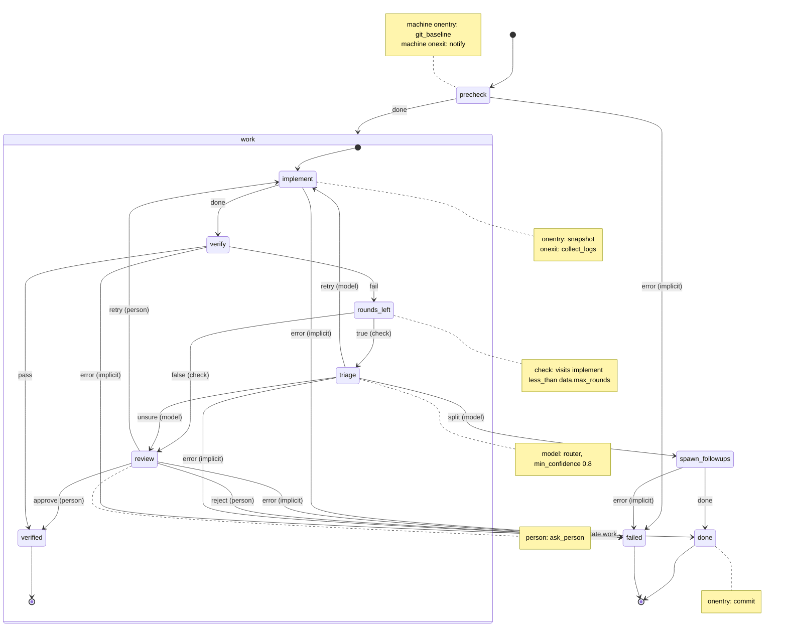

# Graph

`decree graph` prints a Markdown document holding a Mermaid `stateDiagram-v2` diagram, generated from the same arena the interpreter runs, so the picture can never drift from the behaviour. Saved as a `.md` file it renders as it is in VS Code, GitHub, GitLab and Obsidian. decree renders no images, so it stays a small single binary. Output is byte-for-byte deterministic.

## Document

`decree graph` writes one Markdown file per machine, `.decree/graph/<machine name>.md`:

````markdown
# <machine name>

<machine description>

Machine: [machines/<machine name>.yml](../machines/<machine name>.yml)

```mermaid
<diagram>
```
````

and `.decree/graph/system.md`, whose heading is `# All machines`, whose line under it is `Every machine, the \`emits\` and \`invokes\` edges between them, and cron entry points.`, followed by one line per machine in name order, `- [<name>](<name>.md): <description>`, a blank line, and the `<diagram>` block. Every file ends with one newline after the closing fence. Files are deterministic, so committing them shows real changes only. The sections below define `<diagram>`.

**Linking back.** YAML has no link type, so a machine links to its graph with a comment, which decree ignores: `# Graph: ../graph/<machine name>.md`, on the line after the `$schema` comment ([Schema](machines.md#schema)). `decree init` writes both into the machines it creates.

## Single machine: emission order

For each container (the root, then each compound state recursively), with 4-space indent per level:

1. `[*] --> <initial>`
2. For each compound child, in name order: `state <name> {`, the same 4 steps for its contents, then `}`.
3. Every transition whose transition domain is this container, sorted by (source state name, event name). Transitions declared on compound states are included, drawn from the compound state. Format: `<source> --> <declared target>: <label>`.
4. For each final child: `<name> --> [*]`.

After the root's last line, emit notes, also at root level:

- For the root: `note left of <root initial>` with lines `machine onentry: <scripts>` and `machine onexit: <scripts>`, then `end note`. Omit empty lines and omit the note if both are empty.
- For each state with `onentry`, `onexit` or a decision invoke, in name order: `note right of <state>` with, in this order and only when present, `check: <condition>` (as `<subject> <name> <op> <value>`, e.g. `visits implement less_than data.max_rounds`, `data file matches '<regex>'`, `confidence big_model at_least 0.4`, or `output read_text matches '<regex>'`), `model: <router machine>` plus `, min_confidence <n>`, `machine: <name>`, `person: <ask script>`, `onentry: <scripts>` and `onexit: <scripts>`, then `end note`.

Labels are the event name plus these suffixes, in this order:

- ` (check)` if the source state invokes a `check`.
- ` (model)` if it invokes a `model`, or ` (model: <router>)` when the invoke names a router. Not on `error`.
- ` (machine: <name>)` if it invokes a machine. Not on `error`.
- ` (person)` if it invokes a `person`. Not on `error`.
- ` (internal)` for a `type: internal` transition.
- ` (implicit)` on unhandled `error` edges to `failed`. Draw one from every non-final atomic state that invokes a script, a machine, a `model` or a `person`, or has an `onentry`, when neither it nor any ancestor has a transition matching `error`.

Escape `<` as `#lt;` and `>` as `#gt;` in labels (Mermaid entity codes).

## Example: feature

This is the `<diagram>` for the [`feature` machine](machines.md#example-feature): the fenced block in [`mock/.decree/graph/feature.md`](../../mock/.decree/graph/feature.md).



## Whole system (no argument)

The system graph shows how machines connect, one box per machine; each machine's own graph shows its states. It is a Mermaid `flowchart LR`, not a state diagram, because machines are not states of one machine. Flowchart nodes also accept Mermaid `click` directives, which a UI built on decree can add.

```text
flowchart LR
    <machine>["<machine>"]                      one per machine, in name order
    cron__<id>[/"cron: <stem>"/]                one per cron file, in filename order
    cron__<id> -->|cron| <machine>              one per cron file, in filename order
    <machine> -->|emits| <target machine>       one per distinct (machine, target) pair from `emits`, sorted
    <machine> -->|invokes| <child machine>      one per distinct pair from `machine` invokes and routers (named or default), sorted
```

`<id>` is the cron file's stem with every character outside `[a-z0-9_]` replaced by `_`; every cron file has `machine:` (M3). Indent 4 spaces.

## Viewing

`decree graph --help` and the [README](../../README.md) give the same instructions:

1. Run `decree graph`, then open `.decree/graph/<machine>.md` (or `system.md`).
2. In VS Code, press `Ctrl+Shift+V` (`Cmd+Shift+V` on macOS) for the preview; VS Code 1.121 and later render Mermaid in Markdown without an extension. GitHub, GitLab and Obsidian render the committed files as they are.
3. Without any of those, copy the lines inside the `mermaid` fence into https://mermaid.live.

Mermaid and its live editor are MIT-licensed, so a team can host its own editor.

**Stable ids, for tools built on top.** Node ids in the output are the state ids (single machine) or the machine names and `cron__<id>` (system graph), and `events.jsonl` carries `machine`, `state` and `run_id`. A UI outside decree can therefore link any node in a rendered graph to that state's logs (for example a Grafana Explore query on `{job="decree", machine="feature"} | json | state="verify"`). Building such a UI is outside decree; these ids and fields are the contract it relies on.

DOT, SCXML (XML) and image output are out of scope; [the decision log](../decisions.md#d14-the-graph-is-mermaid-text-in-markdown) records why.
