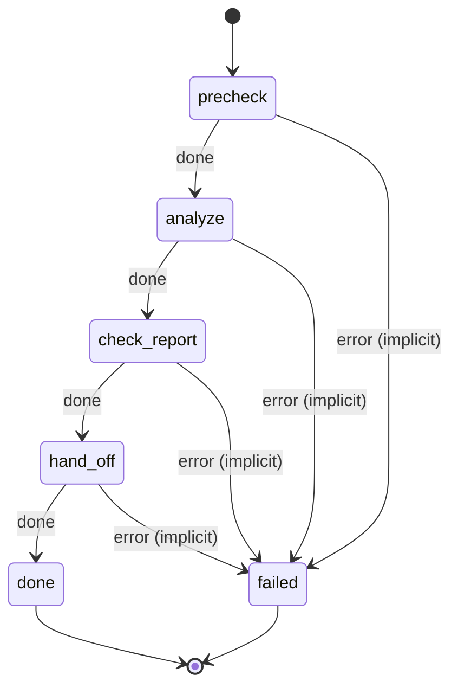

# competitive_landscape

Second step of a business evaluation. Map competitors and positioning, building on the market analysis, then hand off to financial_model.

Machine: [machines/competitive_landscape.yml](../machines/competitive_landscape.yml)

