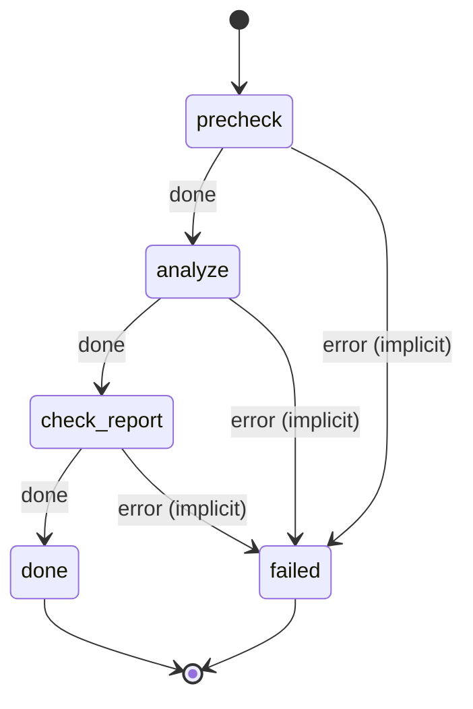

# executive_summary

Last step of a business evaluation. Synthesize the prior analyses into a scorecard and a go/no-go recommendation.

Machine: [machines/executive_summary.yml](../machines/executive_summary.yml)

