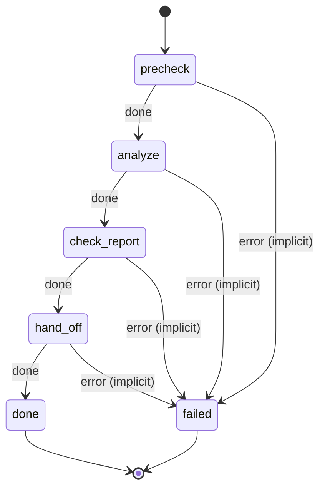

# financial_model

Third step of a business evaluation. Build projections, unit economics and funding needs from the prior analyses, then hand off to executive_summary.

Machine: [machines/financial_model.yml](../machines/financial_model.yml)

