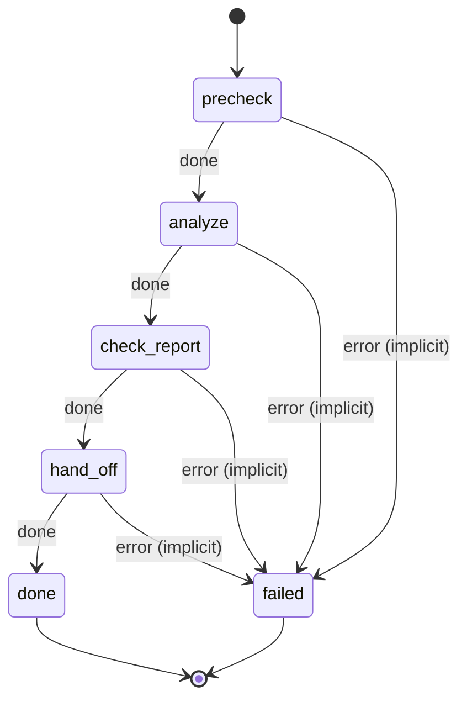

# market_analysis

First step of a business evaluation. Analyze the market for the idea in the message body, then hand off to competitive_landscape.

Machine: [machines/market_analysis.yml](../machines/market_analysis.yml)

