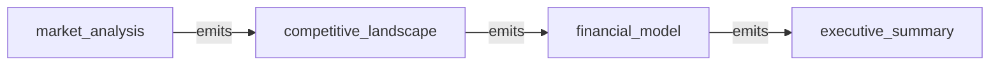

# All machines

Every machine, the `emits` and `invokes` edges between them, and cron entry points.

- [competitive_landscape](competitive_landscape.md): Second step of a business evaluation. Map competitors and positioning, building on the market analysis, then hand off to financial_model.
- [executive_summary](executive_summary.md): Last step of a business evaluation. Synthesize the prior analyses into a scorecard and a go/no-go recommendation.
- [financial_model](financial_model.md): Third step of a business evaluation. Build projections, unit economics and funding needs from the prior analyses, then hand off to executive_summary.
- [market_analysis](market_analysis.md): First step of a business evaluation. Analyze the market for the idea in the message body, then hand off to competitive_landscape.

