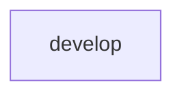

# All machines

Every machine, the `emits` and `invokes` edges between them, and cron entry points.

- [develop](develop.md): Implement a message with opencode, then have it verify the acceptance criteria.

