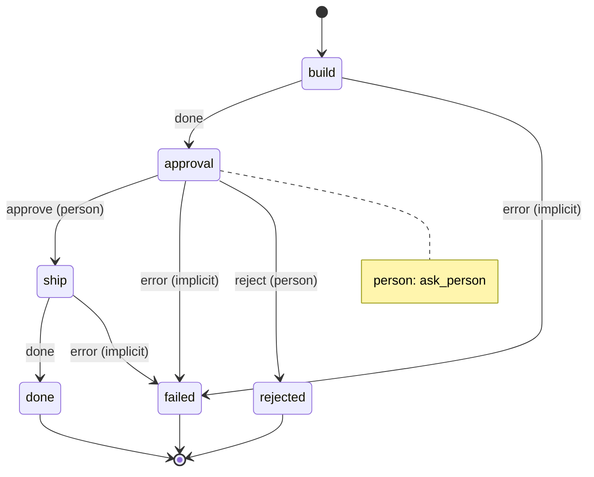

# deploy

Build, ask a person to approve, then ship.

Machine: [machines/deploy.yml](../machines/deploy.yml)

```mermaid
stateDiagram-v2
    [*] --> build
    approval --> ship: approve (person)
    approval --> failed: error (implicit)
    approval --> rejected: reject (person)
    build --> approval: done
    build --> failed: error (implicit)
    ship --> done: done
    ship --> failed: error (implicit)
    done --> [*]
    failed --> [*]
    rejected --> [*]
    note right of approval
        person: ask_person
    end note
```
