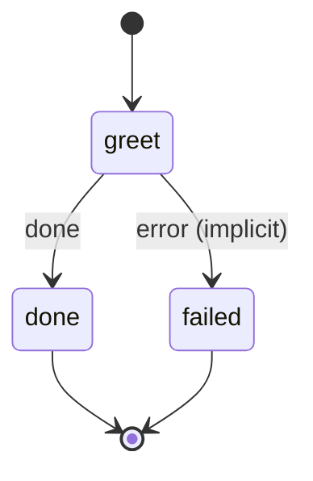

# hello

Run one script.

Machine: [machines/hello.yml](../machines/hello.yml)

```mermaid
stateDiagram-v2
    [*] --> greet
    greet --> done: done
    greet --> failed: error (implicit)
    done --> [*]
    failed --> [*]
```
