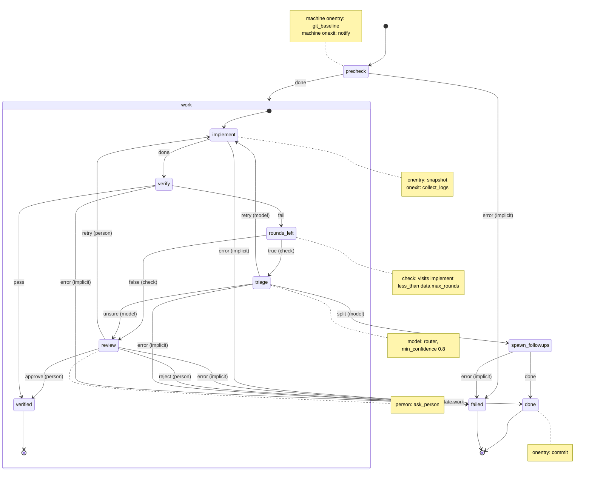
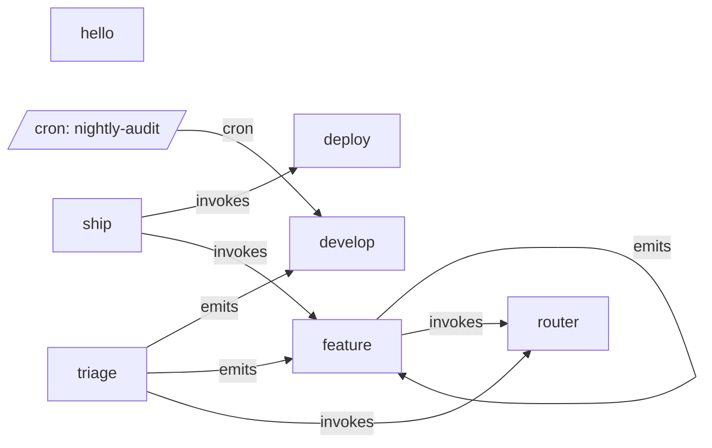

# Feature: one project, every building block

This example is a decree project frozen partway through its life. Its centre is the `feature` machine, which implements a spec with an AI agent and uses everything a machine can do: nesting, a `check`, a model's choice, escalation to a person, `data`, `emits`, and `onentry` and `onexit` scripts. Around it are six smaller machines, their scripts, two finished runs (with their router child runs), one run waiting for a person, one interrupted run, and three queued messages (one of them the person's reply).

Nothing here runs on its own: it is a snapshot that shows exactly what the files of a decree project look like, and the [reference](../../docs/reference/README.md) quotes it. Tests hold it to the reference: `decree check` passes here, `decree graph` reproduces `.decree/graph/*.md` byte for byte, and each recorded run replays through decree to the same events. [`observability`](../observability/README.md) ships these runs to Grafana.

## Running it

Read it rather than run it: its scripts stand in for an AI agent and a deploy, and `decree process` would continue the recorded runs. These commands only read the project:

```bash
cd examples/feature
decree check                          # every machine and message is valid
decree graph                          # rewrites .decree/graph/ with no change
decree status                         # the waiting run, the interrupted run and the queue
decree status 01-rate-limit-upload    # one finished run: its states, scripts and logs
```

## The three building blocks

```text
examples/feature/.decree/
  machines/                       MACHINES: control flow, no code (first lines: the $schema line, then # Graph: ../graph/<name>.md)
    hello.yml                       the smallest machine: one script
    deploy.yml                      build, wait for a person to approve, ship
    develop.yml                     small change, then tests
    triage.yml                      free-form request -> the right machine
    feature.yml                     everything: nesting, a check, a model's choice, escalation to a person, commit
    ship.yml                        composes two machines: feature, then deploy
    router.yml                      the router: how a model is asked (replaceable)
  scripts/                        SCRIPTS: the work, bash, no routing; shared by every machine
  scripts/<machine>/                  a machine's own scripts, checked before scripts/
  migrations/  processed.md       MESSAGES: ordered, run-once queue, committed
  inbox/                          MESSAGES: FIFO queue (emit, cron, humans), not committed
  cron/                           message templates that drop into inbox/ on a schedule
  runs/<id>/                      one folder per run: message copy, events.jsonl, numbered logs
  graph/                          written by `decree graph`: one Markdown file per machine, plus system.md
  schema/                         written by `decree schema`: the JSON Schemas machines and messages are checked against
```

- A **message** says *what* to do (markdown body) and *which machine* does it (`machine:` in the frontmatter).
- A **machine** says *in what order*: states, what each state invokes, and which event leads to which state. It names functions but never contains code or paths.
- A **script** does one piece of work and reports one outcome: exit 0 (`done`), non-zero (`error`), or a richer event it names in a file (`echo pass > "$DECREE_EVENT_FILE"`). Generic scripts (`commit`, `notify`, `snapshot`, `test`) live once in `scripts/` and serve every machine; `scripts/feature/implement.sh` and `scripts/develop/implement.sh` are each machine's own `implement`, found first because `scripts/<machine>/` is checked before `scripts/`.

There is no configuration file. A `model` with no `router:` uses the machine named `router`, every message names its machine, and retries are set per script with `attempts` inside its invoke.

Every state **invokes one function**, and the function's result is an event. The function is a script, or one of decree's three built-in decisions: `check` (a deterministic condition), `model` (a model picks an option) or `person` (a person picks an option). AI and people appear only where a machine invokes `model` or `person`.

## Reading a machine

Start small. [`machines/hello.yml`](.decree/machines/hello.yml) is a whole machine:

```yaml
name: hello
description: Run one script.
initial: greet
states:
  greet:
    invoke: greet                  # runs scripts/greet (or scripts/hello/greet)
    transitions: { done: done }    # exit 0 -> done; non-zero -> failed, implicitly
  done:   { final: true }
  failed: { final: true }          # every machine has one
```

`greet` runs `scripts/hello/greet.sh`. Exit 0 is the event `done`, which goes to `done`. Anything else is `error`; `greet` has no `error` transition, so it goes to `failed`, which every machine has.

[`machines/deploy.yml`](.decree/machines/deploy.yml) adds a person:

```yaml
name: deploy
description: Build, ask a person to approve, then ship.
initial: build
states:
  build:
    invoke: build
    transitions: { done: approval }
  approval:                        # a person picks one option; the run pauses for the reply
    invoke:
      person:
        question: Ship this build?
        ask: ask_person
        timeout: 1d
    transitions:
      approve: { target: ship, description: Ship this build. }
      reject:  { target: rejected, description: Do not ship. }
  ship:
    invoke: ship
    transitions: { done: done }
  done:     { final: true }
  rejected: { final: true }
  failed:   { final: true }
```

`approval` invokes a `person`: its `ask` script, [`ask_person.sh`](.decree/scripts/ask_person.sh), tells someone the options, and the run pauses until a reply picks one (see Asking a person, below). decree only knows the run is waiting for `approve` or `reject`. No reply in a day (`timeout: 1d`) is an `error`.

[`machines/feature.yml`](.decree/machines/feature.yml) uses everything, drawn by `decree graph` ([`.decree/graph/feature.md`](.decree/graph/feature.md)):



- `work` is a **compound state**: the states inside it loop until it reaches its own final state `verified`. Reaching it raises `done.state.work`, which `work` handles by going to `done`. The inner states never need to know what happens after `work`.
- `verify` is a **script** that names `pass` or `fail` in `$DECREE_EVENT_FILE`.
- `rounds_left` is a **check**: `visits implement less_than data.max_rounds`. Deterministic, no AI. `true` gives the model a go; `false` goes straight to a person.
- `triage` is a **model's choice** between `retry` and `split`. Below `min_confidence: 0.8` it produces `unsure`, which hands the decision to `review`.
- `review` is a **person's choice**, like `deploy`'s `approval`.
- `triage` doesn't call a model itself: it hands a request to the **router machine** `router` (see Models and routers).
- Unhandled errors **bubble up**: the state's own transitions are checked first, then `work`'s, then the root's, and an `error` nobody handles goes to `failed` (the `(implicit)` edges).
- Edge labels say who decided: `(check)`, `(model)`, `(person)`; plain labels are script results.

A machine is an SCXML statechart written in YAML. The keys are SCXML's names; if you (or an AI) know SCXML, you know how this file behaves. decree implements a strict subset of SCXML ([SCXML subset](../../docs/reference/machines.md#scxml-subset)), plus a few marked extensions:

| Key | SCXML | What decree does with it |
| --- | --- | --- |
| `name`, `initial`, `states` | `<scxml name initial>`, child `<state>` | Where a run starts; nesting. |
| `invoke: implement` | `<invoke type="decree:script">` | Runs the `implement` script (here `scripts/feature/implement.sh`). Its result is the event: `done`, `error` or the name it writes to `$DECREE_EVENT_FILE`. |
| `invoke: { check: … }` | `<invoke type="decree:check">` | A typed condition: one subject (`output`, `data`, `visits` or `confidence`) and one operator. Produces `true` or `false`. |
| `invoke: { model: { question: …, output: … } }` | `<invoke type="decree:model">` | A router machine asks a model the `question`, given the `output` state's output; the state's transitions, with their descriptions, are the answers. `unsure` below `min_confidence`. |
| `invoke: { machine: deploy }` | `<invoke type="http://www.w3.org/TR/scxml/">` (a child state machine) | Runs the machine as a child run; the final state it reaches is the event. |
| `invoke: { person: { question: …, ask: … } }` | `<invoke type="decree:person">` | The `ask` script posts the question and options; the run pauses until a reply picks one. |
| `transitions: { done: verify }` | `<transition event target>` | Event → next state. Long form `{ target, description }`; the description is what a chooser reads. |
| `onentry: [snapshot]`, `onexit: [collect_logs]` | `<onentry>`, `<onexit>` | Scripts run every time the state is entered or exited. They report no event. |
| `final: true` | `<final>` | At the root, ends the run. Inside a compound state `P`, raises `done.state.P`. |
| `type: internal` (not used here) | `type="internal"` | A compound state's transition to its own child without leaving the compound. |
| `data` (in the machine), `params` (in a message) | `<datamodel><data>`, `<invoke><param>` | Typed, read-only values; a message's `params` set them for its run. Scripts see `DECREE_DATA_MAX_ROUNDS`. |
| `emits: [feature]` | extension | Which machines this state's scripts may queue messages for, via `decree emit`. |
| `invoke: { script: { name: implement, attempts: 2 } }`, `timeout` | extension (as AWS Step Functions `Retry`, `TimeoutSeconds`) | Mechanical retry and time limit for a script (inside its invoke), or for a reply (inside `person`). |

## Composing machines

[`machines/ship.yml`](.decree/machines/ship.yml) runs two whole machines in turn:

```yaml
name: ship
description: Implement a feature, then deploy it.
initial: build
states:
  build:
    invoke: { machine: feature }
    transitions: { done: release }
  release:
    invoke: { machine: deploy }
    transitions: { done: done, rejected: done }
  done:   { final: true }
  failed: { final: true }
```

Each `invoke: { machine: … }` starts a **child run** in its own folder under `runs/`, with `parent:` pointing back, so its events and logs stay separate but linked. The child's final state is the parent state's event: `feature` ending in `done` is `done`; `deploy` ending in `rejected` is `rejected`; any `failed` is `error`. If the child pauses for a person, the parent waits with it.

## The life of one migration

`migrations/01-rate-limit-upload.md` names `machine: feature`. `processed.md` lists it, so it has run. Its run folder, `runs/01-rate-limit-upload/`, holds the whole story. [`events.jsonl`](.decree/runs/01-rate-limit-upload/events.jsonl) has one line per thing that happened; each `script` event names the log file it wrote:

| Event (`seq`, `type`) | Log | What happened | Why |
| --- | --- | --- | --- |
| 1 `transition` `claimed → precheck` | | decree created `runs/01-rate-limit-upload/`, copied the migration to `message.md` (adding `id` and `trigger: migration`) and recorded the claim. | Migrations are immutable; the run works on a copy. |
| 2 `script` git_baseline, onentry | `0001` | Root `onentry`, 41 ms. | `onentry: [git_baseline]` at the machine root runs once, first. |
| 3 `script` precheck, invoke | `0002` | Exit 0. | |
| 4 `transition` `precheck → implement` (`done`) | | Target was `work`, a compound state, so decree followed `work.initial` to `implement`. | SCXML: entering a compound enters its initial child. |
| 5 `script` snapshot, onentry | `0003` | `onentry` of `implement`. | `onentry` runs on every entry into the state. |
| 6 `script` implement, invoke | `0004` | The agent implemented the spec: 11 min 44 s (`duration_ms: 704512`). `path` shows `scripts/feature/implement.sh` ran. | |
| 7 `script` collect_logs, onexit | `0005` | `onexit` of `implement`, on the way to `verify`. | `onexit` runs on every exit from the state. |
| 8 `transition` `implement → verify` (`done`) | | | |
| 9 `script` verify, invoke | `0006` | `cargo test` failed; `verify.sh` wrote `fail` to `$DECREE_EVENT_FILE`. | A script names its own result. |
| 10 `transition` `verify → rounds_left` (`fail`, `source: script`) | | | |
| 11 `decision` rounds_left, `check` | | `visits implement` (1) `less_than data.max_rounds` (2): `true`. | Deterministic; no log, no AI. |
| 12 `transition` `rounds_left → triage` (`true`, `source: check`) | | | |
| 13 `waiting` triage, child `20261001T144327Z-6a1f03` | | `triage` handed the question to the router machine `router`, as a child run with its own folder. | Routers are machines: replaceable, visible, logged separately. |
| 14 `decision` triage, `model` | | The child read [`request.json`](.decree/runs/20261001T144327Z-6a1f03/request.json), asked Claude ([its log](.decree/runs/20261001T144327Z-6a1f03/0001-ask-ask_claude.log)) and wrote [`reply.json`](.decree/runs/20261001T144327Z-6a1f03/reply.json): `retry`, confidence 0.86 (≥ 0.8). decree checked it is an option and recorded pick, reason and confidence. | Every model decision is auditable. |
| 15 `transition` `triage → implement` (`retry`, `source: model`) | | | |
| 16 `script` snapshot, onentry | `0007` | Round 2 (`DECREE_VISITS=2`). | |
| 17 `script` implement, invoke, attempt 1 | `0008` | The agent's API call failed: exit 1. | |
| 18 `transition` `implement → implement` (`error`, `source: attempt`) | | `attempts: 2` in `implement`'s invoke, so decree re-ran it in place: no `onexit` or `onentry`. | Attempts are mechanical retries; they are not visits. |
| 19 `script` implement, invoke, attempt 2 | `0009` | `DECREE_FINAL_ATTEMPT=true`. Succeeded. | |
| 20 `script` collect_logs, onexit | `0010` | | |
| 21 `transition` `implement → verify` (`done`) | | | |
| 22 `script` verify, invoke | `0011` | Tests passed; the script wrote `pass` to `$DECREE_EVENT_FILE`. | Nobody else was asked. |
| 23 `transition` `verify → verified` (`pass`, `source: script`) | | `verified` is `work`'s own final state. | |
| 24 `transition` `verified → done` (`done.state.work`, `source: internal`) | | decree raised `done.state.work` at once; `work` handles it. decree appended `01-rate-limit-upload.md` to `processed.md`, *then* ran `done`'s `onentry`. | So the commit includes the ledger line. |
| 25 `script` commit, `onentry` of `done` | `0012` | One commit with the code and the ledger line. | decree never runs git itself. |
| 26 `script` notify, root `onexit` | `0013` | Last script of the run. | |
| 27 `run_finished` `done` | | 21 min 7 s end to end. | |

Had the second round failed too, `rounds_left` would have said `false` (`visits implement` 2 is not less than 2), and the run would have gone straight to a person: the loop is bounded by the machine, not by the model's judgement.

`runs/01-rate-limit-upload/message.md` says `state: done`. That is a mirror for humans. The record is the last `transition` event; if decree crashes between the two writes, it trusts the log and repairs the mirror.

## Asking a person

Migration 02 is in [`runs/02-upload-quota-per-plan/`](.decree/runs/02-upload-quota-per-plan/events.jsonl), paused. Nobody needs to run `decree process --retry`: the run continues by itself when the reply arrives.

1. `verify` named `fail`; `rounds_left` said `true` (1 < 3); the model picked `retry` but with confidence 0.55, below 0.8, so `triage` produced `unsure` (event 14; the router's own run is [`20261001T150122Z-c03b7e`](.decree/runs/20261001T150122Z-c03b7e/reply.json)). The run went to `review` (event 15).
2. `review` invokes `person`. Its `ask` script, `ask_person.sh`, ran with `DECREE_WAIT_ID=02-upload-quota-per-plan.w15` and `DECREE_CHOICES` pointing at the options and their descriptions, and printed how to reply ([`0007-review-ask_person.log`](.decree/runs/02-upload-quota-per-plan/0007-review-ask_person.log)). A real one would post this to chat or open an issue.
3. decree appended a `waiting` event (event 17) with the wait id, the options and the deadline (`timeout: 2d`). `decree status` lists the run as `waiting`; `decree process` prints the same commands and exits 0. Migrations after 02 wait too.
4. A person replied with `decree event 02-upload-quota-per-plan.w15 retry -m "..."`, which wrote [`inbox/20261001T160301Z-9be210.md`](.decree/inbox/20261001T160301Z-9be210.md):

   ```markdown
   ---
   id: 20261001T160301Z-9be210
   to: 02-upload-quota-per-plan.w15
   event: retry
   ---
   plans.toml lives in config/, next to the other settings. Read it from there.
   ```

   Any tool can write the same file (a chat bot, a web UI), so the person never needs a terminal.
5. On the next `process` or `daemon` pass, decree checks that the run is still waiting on `.w15` and that `retry` is an option, moves the message to `runs/02-upload-quota-per-plan/received/`, appends `received` and `decision` events, and continues: `review → implement` with `source: person`. `implement.sh` finds the note through `DECREE_RECEIVED`.

A reply to a stale wait id, or with an event that is not an option, is not applied; it shows up in `decree status` as a failed message with the reason.

## Two kinds of retry

| | `attempts` | A transition back (`retry`) |
| --- | --- | --- |
| Means | "That crashed; run it again." | "That worked but the result is wrong; do another round." |
| Decided by | Exit code | The machine: a script's result, a `check`, a model or a person |
| Leaves the state? | No: no `onexit` or `onentry`, no new visit | Yes: `onexit`, `onentry`, `visits` + 1 |
| Bounded by | `attempts` in the script invoke (default 1; a list gives each attempt a value) | A `check` on `visits` |
| In `events.jsonl` | `transition` with `source: attempt`, `from == to` | An ordinary `transition` |

## Routing a free-form request

A request that does not say which machine should do the work goes to a machine that asks a model: [`machines/triage.yml`](.decree/machines/triage.yml).

1. Someone dropped `dark-mode.md` (`machine: triage`) into `inbox/`. decree claimed it as `runs/20261001T151455Z-5d2e90/`.
2. `classify` invokes `model`, so the router machine `router` ran as a child run ([`20261001T151455Z-8d21f4`](.decree/runs/20261001T151455Z-8d21f4/0001-ask-ask_claude.log)). Claude's reply came back in a code fence, which `ask_claude` handles; it chose `small_change` (confidence 0.93).
3. `to_develop` invoked `forward.sh`, which piped the body into `decree emit --machine develop`. `emit` checked that `develop` is in `to_develop`'s `emits`, wrote `inbox/.20261001T151502Z-a41c07.md.tmp`, and renamed it into place with `parent`, `depth: 1` and `trigger: emit`.
4. That message is waiting in [`inbox/`](.decree/inbox/20261001T151502Z-a41c07.md). The inbox drains in filename order (FIFO): it runs first, then the reply for migration 02, then `fix-login-typo.md`.

If the model had failed twice, `classify` would have produced `error`, which goes to `failed`: nothing is forwarded on a guess.

## The whole system

`decree graph` also writes [`.decree/graph/system.md`](.decree/graph/system.md), which shows how machines connect: one box per machine, `emits` and `invokes` edges between them, and cron files as entry points. Each machine's own graph shows its states.



## Viewing the graphs

`decree graph` writes one Markdown file per machine into [`.decree/graph/`](.decree/graph/), plus [`system.md`](.decree/graph/system.md), which links to all of them. They are committed, so they render on GitHub as they are. Each starts with a link back to its machine file, and each machine file's second line points to its graph: `# Graph: ../graph/feature.md`, below the line that points editors at [`.decree/schema/`](.decree/schema/) ([Schema](../../docs/reference/machines.md#schema)).

1. Run `decree graph` after changing a machine; `decree check` warns when the files are out of date.
2. Open a file in VS Code and press `Ctrl+Shift+V` (`Cmd+Shift+V` on macOS). VS Code 1.121 and later render Mermaid in the Markdown preview with no extension. GitHub, GitLab and Obsidian render it as it is.
3. Anywhere else: copy the lines inside the `mermaid` fence into https://mermaid.live.

Mermaid and its live editor are MIT-licensed, so a team can host its own copy.

Node ids in the graph are the state names (the machine names in the system graph), and every event in `events.jsonl` carries `machine` and `run_id`, and an event about a state names it (`state`, or `from` and `to`). A UI built outside decree can use those to link each node to its logs in Grafana ([`observability`](../observability/README.md)).

## What every script sees

From `0010-implement-implement.log`'s point of view:

```text
DECREE_PROJECT_ROOT=/home/me/app
DECREE_MESSAGE=/home/me/app/.decree/runs/01-rate-limit-upload/message.md
DECREE_MESSAGE_ID=01-rate-limit-upload
DECREE_MACHINE=feature
DECREE_STATE=implement
DECREE_PHASE=invoke
DECREE_VISITS=2
DECREE_RUN_DIR=/home/me/app/.decree/runs/01-rate-limit-upload
DECREE_ATTEMPT=2
DECREE_MAX_ATTEMPTS=2
DECREE_FINAL_ATTEMPT=true
DECREE_TRIGGER=migration
DECREE_DATA_MAX_ROUNDS=2
```

## Stopping and crashes

decree never continues a run on its own. A kill may be deliberate, and decree cannot tell, so it records what happened and waits for you.

[`runs/20261001T030000Z-c4e81b/`](.decree/runs/20261001T030000Z-c4e81b/events.jsonl) is the nightly cron run. Someone pressed Ctrl-C while `implement` was updating dependencies:

1. decree sent SIGTERM to the script's process group, waited for it to exit (SIGKILL after 10 s), wrote no `script` event for it, and appended `{"type":"interrupted","cause":"signal","state":"implement","script":"implement"}`. No `onexit` scripts ran. `decree process` exited 130.
2. The run is now `interrupted`. `decree status` lists it; later `process` and `daemon` passes leave it alone. Had decree been killed with SIGKILL or lost power instead, the next `process` or `daemon` would find the stale lock and append the same event with `cause: "crash"`.
3. `decree process --retry 20261001T030000Z-c4e81b` appends a `transition` with `source: "retry"` back into `implement`. That makes the run `pending`, and the same `process` continues it: root `onentry`, then the `onentry` scripts down to `implement`, then the invoke. Scripts must be safe to re-run; `git_baseline.sh` only writes its baseline the first time.

An interrupted migration blocks the migrations after it, exactly as a failed one does. `runs/<id>/.lock` only stops two decree processes from stepping the same run at once.

## Watching it live

`decree status` shows what each active run is doing right now: the script, its pid, how long it has run, and its log path. `decree tail` follows that log as it is written, moving on to the next script and into child runs. Long-running services (model servers, ComfyUI) run outside decree under systemd or llama-swap; a state that needs one starts it in an `onentry` script. [`docs/services.md`](../../docs/services.md) shows how, including switching a GPU between services and a tmux dashboard.

## Models and routers

A `model` state never calls a model itself. decree writes a `request.json` (the state's options and their descriptions, the `output` state's output, the message body and the run's history), then runs a **router**: an ordinary machine, here [`machines/router.yml`](.decree/machines/router.yml):

```yaml
name: router
description: Ask Claude to pick one of the options in the request.
initial: ask
states:
  ask:                             # renders the prompt from $DECREE_REQUEST, runs claude -p, writes $DECREE_REPLY
    invoke:                        # a reply that is not one of the options fails the script; it runs once more
      script: { name: ask_claude, attempts: 2 }
    transitions: { done: done }
  done:   { final: true }
  failed: { final: true }
```

Its script, [`ask_claude.sh`](.decree/scripts/router/ask_claude.sh), renders the prompt, asks `claude -p`, and writes `reply.json` (`event`, `reason`, `confidence`). decree then checks that the event is one of the options and applies `min_confidence`.

Because a router is just a machine, replacing it is ordinary work: edit or replace `machines/router.yml` (the router every `model` without `router:` uses), or point a state's `router:` at another machine, for example one that asks a decision model (TypeSafe's Jev, Fastino's GLiNER2.5-Decide locally, OpenAI's Decisions API), a self-hosted LLM, or a cheap model first and a stronger one only when the first is unsure ([Router machines](../../docs/routers.md#cheap-model-first-stronger-model-when-unsure)). Each router run is its own child run, so its logs and timing show up separately in `decree status` and Grafana.

## Standards this draws from

W3C SCXML (terms, semantics and key names; Harel statecharts underneath), AWS Step Functions retry/timeout/catch, LangGraph-style edge selection by a model, typed-choice models (Jev), the Step Functions callback pattern for people, event sourcing over a JSON Lines log, Loki label practice and the OpenTelemetry span model, Maildir-style temp-then-rename delivery, Mermaid for diagrams. [Standards and prior art](../../docs/reference/standards.md) lists each one, what decree takes from it, and where decree deliberately deviates.

In a real project `.decree/.gitignore` contains `inbox/` and `runs/`. This example commits them so you can read them.
