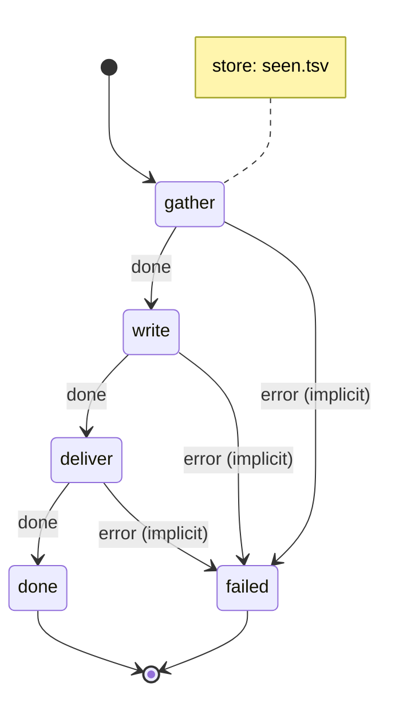

# newsletter

Gather new items from my feeds, pick and summarise the ones that fit my taste, and write the issue.

Machine: [machines/newsletter.yml](../machines/newsletter.yml)

```mermaid
stateDiagram-v2
    [*] --> gather
    deliver --> done: done
    deliver --> failed: error (implicit)
    gather --> write: done
    gather --> failed: error (implicit)
    write --> deliver: done
    write --> failed: error (implicit)
    done --> [*]
    failed --> [*]
    note left of gather
        store: seen.tsv
    end note
```
