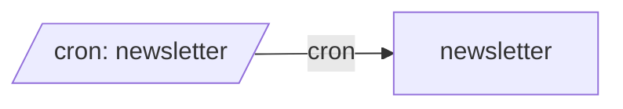

# All machines

Every machine, the `emits` and `invokes` edges between them, and cron entry points.

- [newsletter](newsletter.md): Gather new items from my feeds, pick and summarise the ones that fit my taste, and write the issue.

