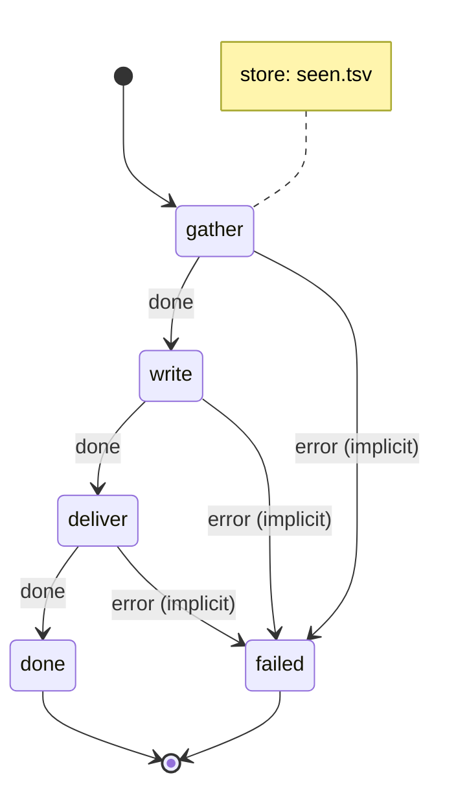

# Newsletter: feeds in, one markdown issue out

A personal newsletter: the RSS and Atom feeds you choose, gathered once a week, picked and summarised to your taste by a local model, and written as one markdown issue, with an optional [ntfy](https://ntfy.sh) ping.

It is the simplest machine that does the job, on purpose: three scripts in a straight line, run by cron. [Growing it](#growing-it) lists what to add later, and when.

## The machine

[`machines/newsletter.yml`](.decree/machines/newsletter.yml) ([graph](.decree/graph/newsletter.md)):



The machine remembers one thing between runs, declared under `store:`: `seen.tsv`, the links already sent, in `.decree/store/newsletter/` (`$DECREE_STORE`). It survives `decree prune`. In your own project it is not committed (`decree init` ignores `store/`); this example commits a sample, [`store/newsletter/seen.tsv`](.decree/store/newsletter/seen.tsv), so you can see what it holds: one link and the date it was sent, per line.

1. [`gather`](.decree/scripts/newsletter/gather.py) (Python 3, standard library only: a script can be any executable) fetches every feed in `lib/newsletter/feeds.txt`, RSS 2.0 or Atom, and writes the run's `items.jsonl`: `title`, `link`, `source`, `published` and `summary` (plain text, at most 500 characters) for each item whose link is not in `seen.tsv`, in the machine's store, newest first, at most `NEWSLETTER_MAX_ITEMS`. A feed that fails is logged and skipped; every feed failing fails the run.
2. [`write`](.decree/scripts/newsletter/write.sh) (bash, `curl` and `jq`) sends `lib/newsletter/taste.md` and `items.jsonl` to Ollama's `/api/chat`, and writes the run's `issue.md`: a title with the date, then the model's picks as markdown links. With no new items it writes an issue saying so, and does not call the model.
3. [`deliver`](.decree/scripts/newsletter/deliver.sh) copies `issue.md` to `newsletter/<YYYY-MM-DD>.md` (`-2`, `-3` if that day has one), records every gathered link in the store's `seen.tsv` with the date, and, if `NTFY_URL` is set, posts the issue's first three lines to `$NTFY_URL/$NTFY_TOPIC`. Without `NTFY_URL` it says it skipped the ping.

`gather` does not mark items seen; `deliver` does, so items from a run that fails are gathered again next time. Each script is safe to re-run.

## The files

```text
examples/newsletter/
  .decree/
    machines/newsletter.yml           gather, write, deliver
    scripts/newsletter/gather.py      feeds -> items.jsonl, new links only
    scripts/newsletter/write.sh       taste.md + items.jsonl -> Ollama -> issue.md
    scripts/newsletter/deliver.sh     issue.md -> newsletter/<date>.md, seen.tsv, ntfy
    lib/newsletter/feeds.txt          one feed URL per line, # comments
    lib/newsletter/taste.md           what you want, what you skip, and the format, in prose
    cron/newsletter.md                every Monday at 07:00
    .env.example                      OLLAMA_URL, OLLAMA_MODEL, NEWSLETTER_DIR, NEWSLETTER_MAX_ITEMS, NTFY_*; copy it to .env
    graph/  schema/                   written by `decree graph` and `decree schema`
    store/newsletter/seen.tsv         links already sent: a committed sample here; ignored in your project
  newsletter/                         the issues, once it has run
```

Edit `feeds.txt` and `taste.md` to make it yours. `taste.md` is the whole prompt about you: write it as you would to a friend picking links for you.

## Running it

These commands only read the project:

```bash
cd examples/newsletter
decree check                             # the machine, scripts and cron file are valid
decree graph                             # rewrites .decree/graph/ with no change
```

It needs Python 3, `curl`, `jq`, and Ollama with the model in `.decree/.env`, which you copy from the committed template:

```sh
cp .decree/.env.example .decree/.env
ollama pull gemma4:e4b
```

One issue, now:

```sh
echo "This week" | decree emit --machine newsletter && decree process
```

Every Monday at 07:00, from [`cron/newsletter.md`](.decree/cron/newsletter.md) (`cron: "0 7 * * 1"`):

```sh
decree daemon
```

For a ping on your phone, uncomment `NTFY_URL` and `NTFY_TOPIC` in `.decree/.env`, and subscribe to the topic in the ntfy app.

## Growing it

Add each of these only once a real issue shows the need for it:

| When | Add |
| --- | --- |
| An empty week | `gather` names `nothing_new` (`echo nothing_new > "$DECREE_EVENT_FILE"`), and `gather` gets the transition `nothing_new: done`. |
| A poor issue from the local model | `write` checks its output (every line a link from `items.jsonl`, at most 7 items) and exits non-zero, and `write` gets `attempts: [local, claude]`. |
| Too many items for the context | `write` scores each item first (a model held to a schema, reason before event), keeps the top 20, then writes; still one script. |
| Summary-only feeds | `gather` fetches the full text of each new item. |
| Several editions | An `edition` param with `enum`, choosing `lib/newsletter/<edition>/`, and one cron file each. |
| Learning from you | Rating links in the issue, served by an HTTP front door (decree-go-rest) appending to `ratings.tsv`, which `write` reads as examples. |
| Misbehaving feeds | A feed reader (Miniflux, FreshRSS) does the fetching, and `gather` reads its API. |

Why not a classifier such as GLiNER to pick the items: taste is a judgment, and classifiers are poor at judgments ([Where GLiNER fits](../../docs/routers.md#where-gliner-fits)).
