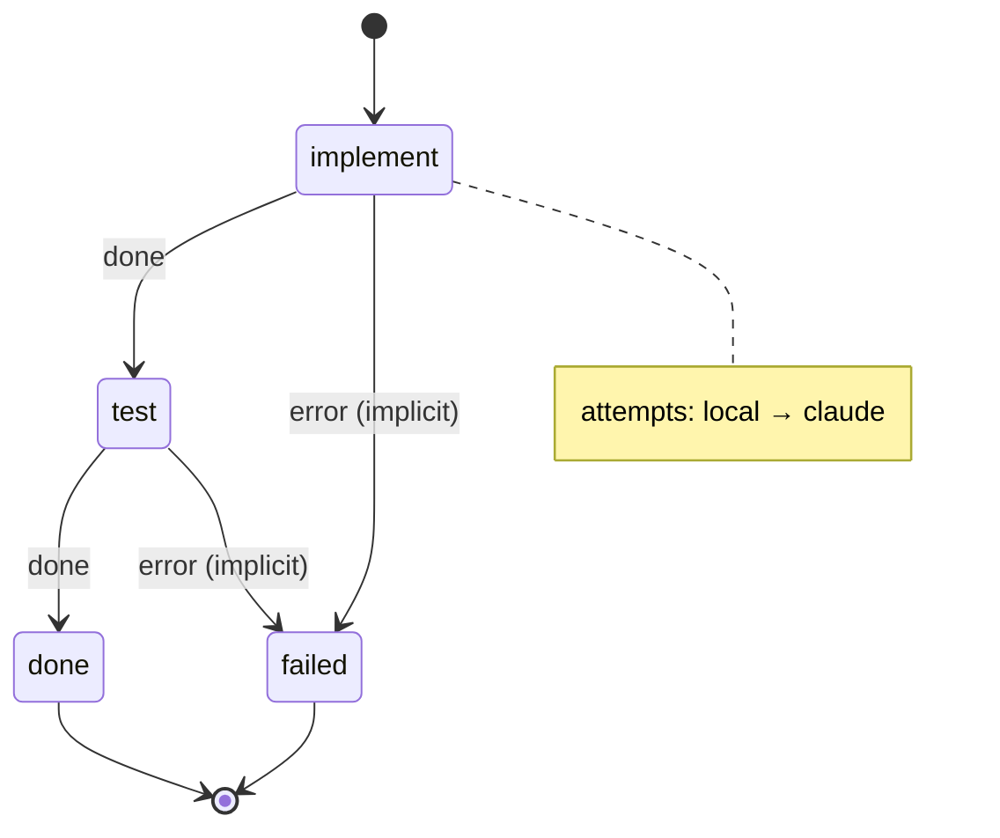

# develop

Implement a message, then test it.

Machine: [machines/develop.yml](../machines/develop.yml)

```mermaid
stateDiagram-v2
    [*] --> implement
    implement --> test: done
    implement --> failed: error (implicit)
    test --> done: done
    test --> failed: error (implicit)
    done --> [*]
    failed --> [*]
    note right of implement
        attempts: local → claude
    end note
```
