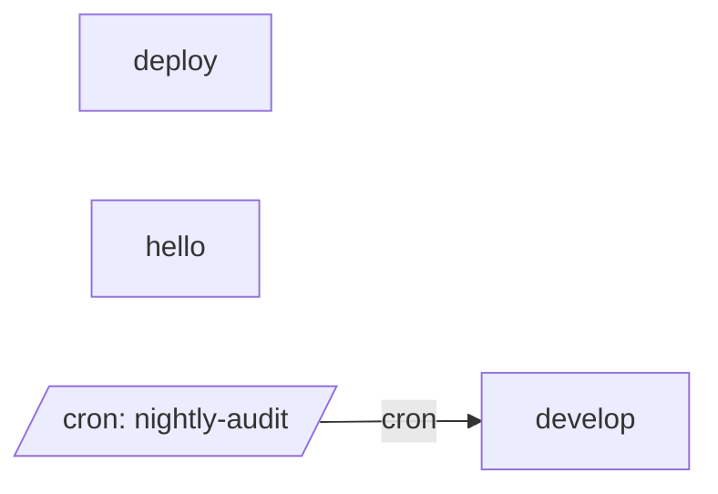

# All machines

Every machine, the `emits` and `invokes` edges between them, and cron entry points.

- [deploy](deploy.md): Build, ask a person to approve, then ship.
- [develop](develop.md): Implement a message, then test it.
- [hello](hello.md): Run one script.

