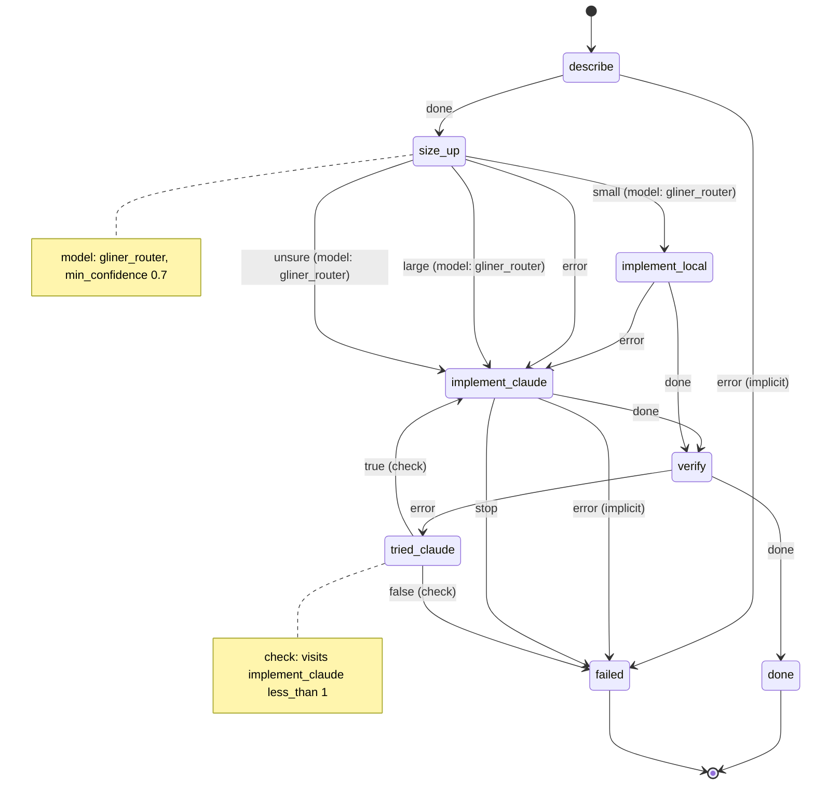

# develop_by_size

Size up a change with a local classifier, implement it with a local model or with Claude, and verify it.

Machine: [machines/develop_by_size.yml](../machines/develop_by_size.yml)

