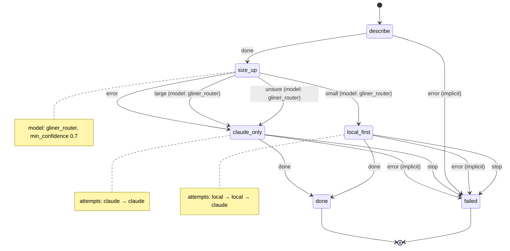

# develop_by_size

Size up a change with a local classifier, then implement and test it, locally first or with Claude only, moving to Claude when local attempts fail the tests.

Machine: [machines/develop_by_size.yml](../machines/develop_by_size.yml)

