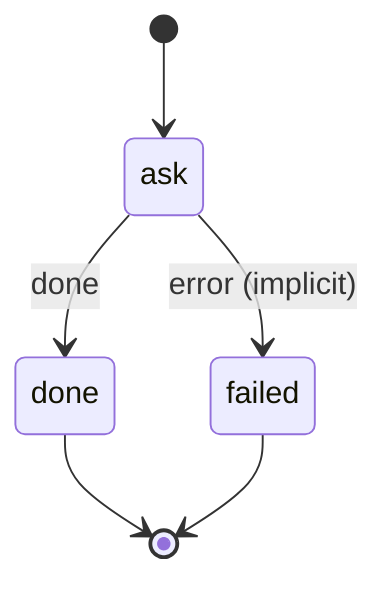

# gliner_router

Ask the local GLiNER2.5-Decide classifier to pick one of the options in the request.

Machine: [machines/gliner_router.yml](../machines/gliner_router.yml)

```mermaid
stateDiagram-v2
    [*] --> ask
    ask --> done: done
    ask --> failed: error (implicit)
    done --> [*]
    failed --> [*]
```
