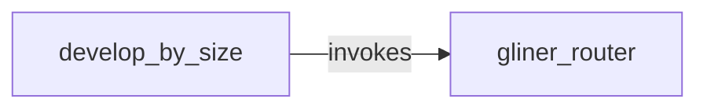

# All machines

Every machine, the `emits` and `invokes` edges between them, and cron entry points.

- [develop_by_size](develop_by_size.md): Size up a change with a local classifier, implement it with a local model or with Claude, and verify it.
- [gliner_router](gliner_router.md): Ask the local GLiNER2.5-Decide classifier to pick one of the options in the request.

