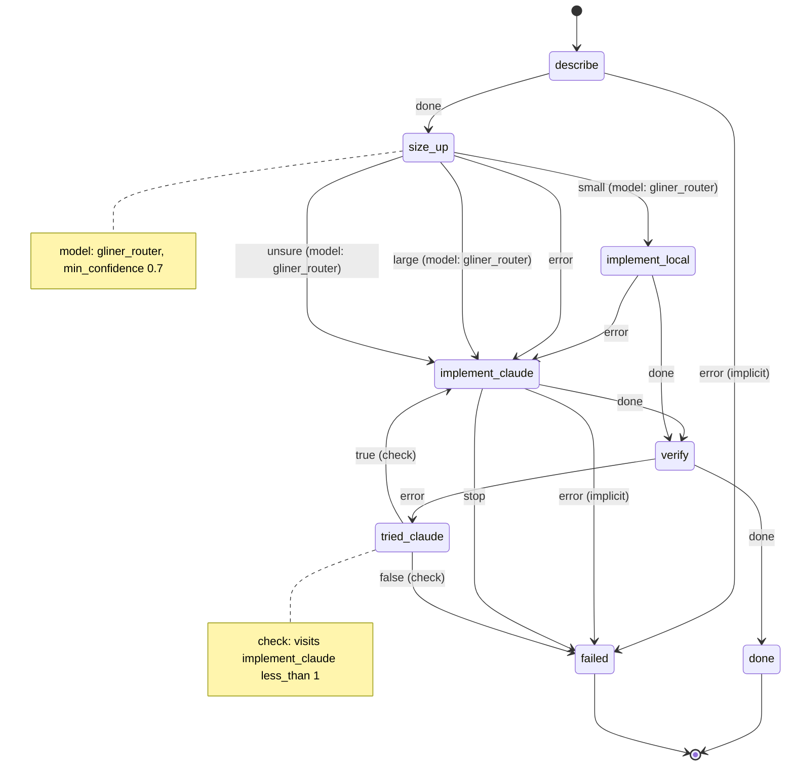

# Route by complexity: a classifier picks the model

This example sends each change to the cheapest model that can do it. A local classifier, Fastino's [GLiNER2.5-Decide](https://huggingface.co/fastino/GLiNER2.5-Decide-1B), reads the change and its size, and decides whether a local model served by Ollama can do it, or it needs Claude.

- The classifier is **typed**: it can only answer with one of the labels it is given, and its confidence is its own score. Once loaded, it costs milliseconds of CPU and no money per decision, so it runs on every message.
- Claude is **untyped**: it answers in free text, and costs money. It runs only when the classifier says the change needs it, when the classifier is not sure, or when the local model's work fails the tests.

[`docs/routers.md`](../../docs/routers.md) explains the two kinds of router.

## The machine

[`machines/develop_by_size.yml`](.decree/machines/develop_by_size.yml) ([graph](.decree/graph/develop_by_size.md)):



1. `describe` prints what the classifier reads: the message's title, its acceptance criteria, and the files it names that exist, with their line counts, so the classifier sees a size and not only prose.
2. `size_up` asks [`gliner_router`](.decree/machines/gliner_router.yml) "How much reasoning does this change need?", with two options: `small` ("A local, mechanical change: a typo, a rename, a config value, one small function with a clear spec.") and `large` ("Design, several files, unclear requirements, concurrency or security."). Below `min_confidence: 0.7` the event is `unsure`, and `unsure` goes to Claude: when in doubt, use the stronger model. So does `error`, when the classifier is not running.
3. `implement_local` runs `opencode run --model ollama/<model>`; `implement_claude` runs `claude -p`, logging each step in the run's `progress.md` and writing `STOP` instead of guessing, as `rust_develop` does.
4. `verify` runs `$TEST_CMD` (`cargo test` by default). If it fails after the local model, `tried_claude` sends the change to Claude once; if it fails after Claude, the run ends in `failed`.

## Running it

These commands only read the project:

```bash
cd examples/route-by-complexity
decree check                             # every machine and message is valid
decree graph                             # rewrites .decree/graph/ with no change
```

To use it, copy `.decree/` into a project and queue a change, such as [`migrations/01-raise-upload-limit.md`](.decree/migrations/01-raise-upload-limit.md). It needs three things running: the classifier, Ollama with a coding model, and OpenCode and Claude Code on `PATH`.

### The classifier, GLiNER2.5-Decide

[`gliner/decide_server.py`](gliner/decide_server.py) loads the model once and answers `POST /classify` on `127.0.0.1:8090`, so no decision starts Python. It needs Python 3.10 or newer:

```sh
pip install 'gliner2[local]'           # or skip this and start it with: uv run --with 'gliner2[local]' python gliner/decide_server.py
python gliner/decide_server.py         # the first start downloads the model, about 4.8 GB
curl -s 127.0.0.1:8090/classify -d '{"instructions": "How much reasoning does this change need?", "labels": {"small": "A typo or a config value", "large": "Design across several files"}, "text": "Fix a typo in README.md"}'
```

The `curl` prints the reply as `gliner_router` writes it, `{"event": "small", "confidence": ...}`. To keep the server running, use the `decide` systemd user unit in [`docs/services.md`](../../docs/services.md).

### The local model, through OpenCode

`implement_local` names the model in one variable at its top, `OLLAMA_MODEL`, which defaults to `qwen3-coder:30b` (19 GB). Pull it, and tell OpenCode about Ollama in the project's `opencode.json` ([OpenCode's Ollama provider](https://opencode.ai/docs/providers/)):

```sh
ollama pull qwen3-coder:30b
```

```json
{
  "$schema": "https://opencode.ai/config.json",
  "provider": {
    "ollama": {
      "npm": "@ai-sdk/openai-compatible",
      "name": "Ollama (local)",
      "options": { "baseURL": "http://localhost:11434/v1" },
      "models": { "qwen3-coder:30b": { "name": "Qwen3 Coder 30B" } }
    }
  }
}
```

OpenCode's docs suggest raising Ollama's `num_ctx` (16k to 32k) if tool calls do not work.

## Tuning `min_confidence`

0.7 is a starting point, and it belongs to this classifier ([Confidence is calibrated per router](../../docs/routers.md#confidence-is-calibrated-per-router)). Every `size_up` records a `decision` event with the pick, the confidence and the event that followed, and every `verify` failure is a `transition` event. Ship them to Loki as in [`observability`](../observability/README.md), and compare in Grafana:

```logql
# what the classifier picked, and how sure it was
{job="decree", type="decision", machine="develop_by_size"} | json | state="size_up" | line_format "{{.run_id}} {{.pick}} {{.confidence}} {{.event}}"

# local attempts that failed the tests and went to Claude
{job="decree", type="transition", machine="develop_by_size"} | json | from="tried_claude" and event="true"
```

If `small` picks above the threshold often fail the tests, raise it; if `unsure` changes that Claude then did were mostly small, lower it.

## The files

```text
examples/route-by-complexity/
  gliner/decide_server.py              the classifier server (the one copy of it in the repository)
  .decree/
    machines/
      develop_by_size.yml              size up, implement locally or with Claude, verify
      gliner_router.yml                a typed router: asks the classifier server (the same file as in sort-documents)
    scripts/
      develop_by_size/describe.sh      prints the title, acceptance criteria and named files with line counts
      develop_by_size/implement_local.sh   opencode run with an Ollama model
      develop_by_size/implement_claude.sh  claude -p, with progress.md and STOP
      develop_by_size/verify.sh        $TEST_CMD, cargo test by default
      gliner_router/ask_gliner.sh      posts the request to the classifier server, writes the reply
    migrations/01-raise-upload-limit.md   a small change to try it with
    graph/  schema/                    written by `decree graph` and `decree schema`
```
