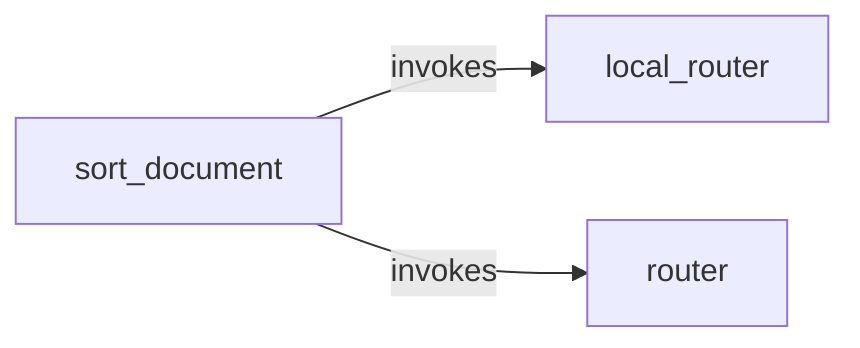

# All machines

Every machine, the `emits` and `invokes` edges between them, and cron entry points.

- [local_router](local_router.md): Ask the local classifier to score the options in the request.
- [router](router.md): Ask Claude to pick one of the options in the request.
- [sort_document](sort_document.md): File one scanned document as an invoice, a receipt or other paperwork.

