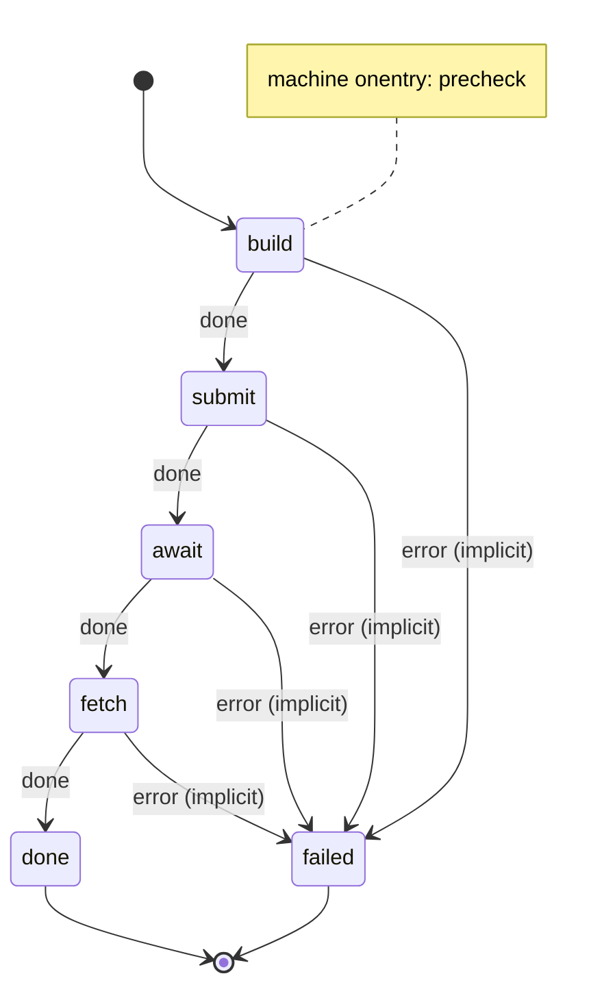

# comfy

Render the message body on ComfyUI with the workflow `method` names, wait for the render, and save it to the repo path in `output`.

Machine: [machines/comfy.yml](../machines/comfy.yml)

```mermaid
stateDiagram-v2
    [*] --> build
    await --> fetch: done
    await --> failed: error (implicit)
    build --> submit: done
    build --> failed: error (implicit)
    fetch --> done: done
    fetch --> failed: error (implicit)
    submit --> await: done
    submit --> failed: error (implicit)
    done --> [*]
    failed --> [*]
    note left of build
        machine onentry: precheck
    end note
```
