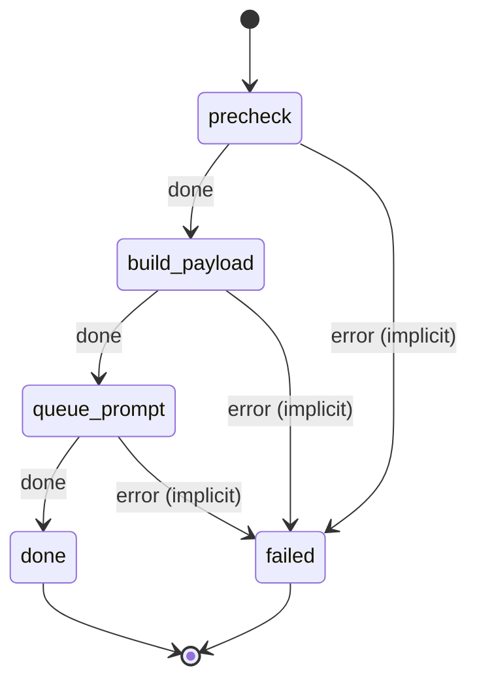

# comfy_image_text_image

Generate an image from a text prompt and a reference image with the ComfyUI FLUX2 workflow.

Machine: [machines/comfy_image_text_image.yml](../machines/comfy_image_text_image.yml)

