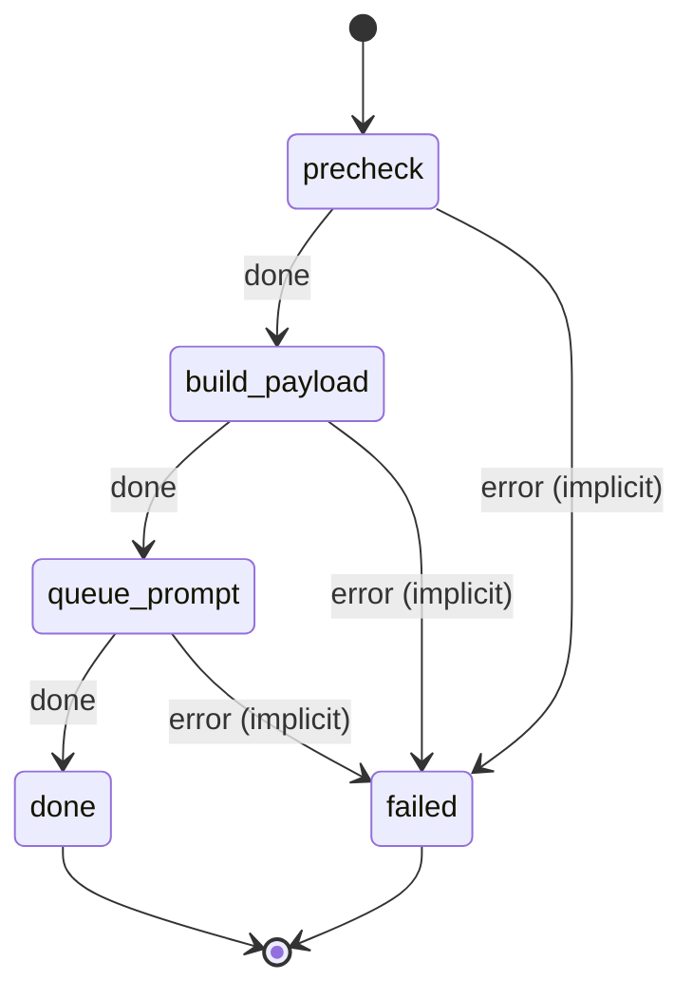

# comfy_video_i2v

Animate a still image into a video, guided by a text prompt, with the ComfyUI WAN2.2 14B workflow.

Machine: [machines/comfy_video_i2v.yml](../machines/comfy_video_i2v.yml)

```mermaid
stateDiagram-v2
    [*] --> precheck
    build_payload --> queue_prompt: done
    build_payload --> failed: error (implicit)
    precheck --> build_payload: done
    precheck --> failed: error (implicit)
    queue_prompt --> done: done
    queue_prompt --> failed: error (implicit)
    done --> [*]
    failed --> [*]
```
