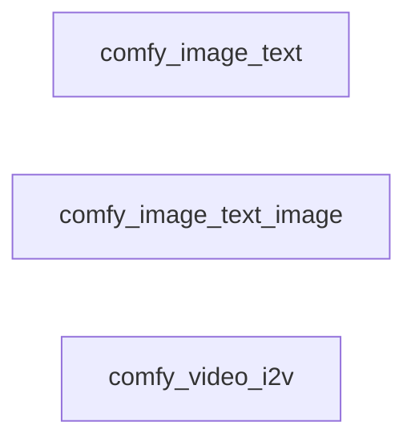

# All machines

Every machine, the `emits` and `invokes` edges between them, and cron entry points.

- [comfy_image_text](comfy_image_text.md): Generate an image from a text prompt with the ComfyUI FLUX2 workflow.
- [comfy_image_text_image](comfy_image_text_image.md): Generate an image from a text prompt and a reference image with the ComfyUI FLUX2 workflow.
- [comfy_video_i2v](comfy_video_i2v.md): Animate a still image into a video, guided by a text prompt, with the ComfyUI WAN2.2 14B workflow.

