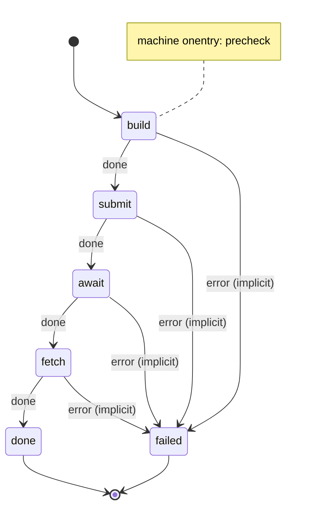

# Text to media on ComfyUI: build, submit, await, fetch

Generate images and videos with [ComfyUI](https://github.com/comfyanonymous/ComfyUI)'s API, one message per render. The message names the workflow, its body is the prompt, and the render is saved in the repository at the path the message gives.

ComfyUI's API is fire and forget: `POST /prompt` queues a workflow and answers with a prompt id at once, before anything renders. So one render is four steps: build the workflow, submit it, await the render, and fetch the files. A machine that stops after submitting never knows whether the render worked, and never gets the file.

No model is involved: the scripts call ComfyUI directly, with `curl` and `jq`.

## The machine

[`machines/comfy.yml`](.decree/machines/comfy.yml) ([graph](.decree/graph/comfy.md)):



1. The root `onentry`, [`precheck`](.decree/scripts/precheck.sh), fails fast if `curl` or `jq` is missing.
2. [`build`](.decree/scripts/comfy/build.sh) patches `.decree/lib/comfy/<method>.json`, which it reads through `$DECREE_LIB`, with the message: the body is the prompt, and `width`, `height` and `seed` replace the workflow's own values when set. It patches every workflow the same way, by node type (the positive `CLIPTextEncode`, every node with a `width`, `height`, `seed` or `noise_seed`, every `filename_prefix`), so a new method is a new workflow file. It fails, before anything is sent, on an unknown method, listing the methods, or on a missing `method`, `output` or prompt, or a missing `input_image` when the workflow loads an image.
3. [`submit`](.decree/scripts/comfy/submit.sh) uploads `input_image`, if any (`POST /upload/image`), queues the workflow (`POST /prompt`) and keeps the prompt id. It is safe to repeat, so it has `attempts: 3`.
4. [`await`](.decree/scripts/comfy/await.sh) polls `GET /history/<prompt id>` every `COMFY_POLL_S` seconds (5) until the prompt is there, which it is once it finishes, and fails if it did not succeed. It has no attempts: a render that never finishes, within its 3 h timeout, is something to look at, not to retry.
5. [`fetch`](.decree/scripts/comfy/fetch.sh) downloads each file the prompt saved (`GET /view`) to `output` plus the file's extension, or `output-<n>` plus it when there are several. It is safe to repeat, so it has `attempts: 3`.

The scripts find ComfyUI at `COMFY_URL`, `http://127.0.0.1:8188` by default.

## Methods and messages

A method is a workflow in [`.decree/lib/comfy/`](.decree/lib/comfy/), by file stem: data that scripts read, not a script, so it lives in `lib/` ([Shared code](../../docs/reference/scripts.md#shared-code)). One message per method:

### `image_flux2_text_landscape`: an image from text (FLUX2)

```yaml
---
machine: comfy
params:
  method: image_flux2_text_landscape
  output: output/unicorn_landscape   # required: repo path without extension
  width: 800                         # optional: 0 keeps the workflow's own value
  height: 400
  seed: 42                           # optional: -1 keeps the workflow's own value
---
A unicorn running along a rainbow into a pink sunset, fantasy art.
```

### `image_flux2_text_image`: an image from text and a reference image (FLUX2)

```yaml
---
machine: comfy
params:
  method: image_flux2_text_image
  output: output/style_transfer_demo
  input_image: images/reference.png  # required: repo path, uploaded to ComfyUI
---
Same character and pose as the reference image, reimagined in anime style.
```

### `video_i2v_wan2.2_14B_long`: a video from a still image (WAN2.2 14B)

```yaml
---
machine: comfy
params:
  method: video_i2v_wan2.2_14B_long
  output: output/lily_waving
  input_image: output/character_lily_fullbody.png   # required: the first frame
  width: 640
  height: 640
---
The character gently waves her hand and smiles.
```

## Running it

You need a running ComfyUI with the FLUX2 and WAN2.2 models the workflows load, and `curl` and `jq`. [`migrations/`](.decree/migrations/) holds four renders; the third restyles a picture of yours, which it expects at `images/reference.png`, and the fourth animates the second's image.

```bash
cd examples/text-to-media
decree check
decree process
decree status
```

The renders are in `output/`. To render from other tools (a game engine, a web app), queue messages and keep a daemon running:

```bash
echo "A lighthouse at dawn, oil painting" | decree emit --machine comfy --param method=image_flux2_text_landscape --param output=output/lighthouse
decree daemon
```

## Commissioning from another machine

A machine that needs art commissions it with `emits`: a state lists `comfy` in `emits`, and its script runs `decree emit` once per piece. This is how a `develop` machine can end, once a change is verified:

```yaml
  commission:                      # one comfy message per piece of art the change needs
    invoke: commission
    transitions: { done: done }
    emits: [comfy]
```

```sh
# commission.sh: art.tsv lists the pieces, one per line: method, output, prompt
while IFS=$'\t' read -r method output prompt; do
  printf '%s\n' "$prompt" | decree emit --machine comfy --param method="$method" --param output="$output"
done < "$DECREE_RUN_DIR/art.tsv"
```

Each piece becomes its own `comfy` run, with its own log and retries, so one failed render does not fail the change: the change is done, and the failed render is one run to look at and retry.

## When messages stop naming a method

Every message here names its method, and while senders can, that is all it takes. Once they cannot, for instance when a model writes the commissions in prose, the next step is to let the params narrow the choice, and a typed classifier pick among only the methods that fit:

```yaml
data:
  method:                          # "" when the sender cannot name one; else one of the workflows
    type: string
    default: ""
    enum: ["", image_flux2_text_landscape, image_flux2_text_image, video_i2v_wan2.2_14B_long]
  # output, input_image, width, height and seed as in comfy.yml
initial: has_method
states:
  has_method:
    invoke:
      check: { data: method, matches: '\S' }
    transitions: { true: build, false: has_input_image }
  has_input_image:                 # with no image, only one method fits
    invoke:
      check: { data: input_image, matches: '\S' }
    transitions: { true: pick_from_image, false: build_text }
  pick_from_image:                 # typed: the classifier can only pick a method that takes an image
    invoke:
      model:
        question: Which ComfyUI workflow fits this commission?
        router: gliner_router
        min_confidence: 0.5
    transitions:
      restyle:
        target: build_restyle
        description: A still image that edits, restyles or reworks the reference image according to the text.
      animate:
        target: build_animate
        description: A video that animates the reference image, used as its first frame.
      unsure: failed
  build: { invoke: build, transitions: { done: submit } }
  build_text:
    invoke: { script: { name: build, env: { METHOD: image_flux2_text_landscape } } }
    transitions: { done: submit }
  build_restyle:
    invoke: { script: { name: build, env: { METHOD: image_flux2_text_image } } }
    transitions: { done: submit }
  build_animate:
    invoke: { script: { name: build, env: { METHOD: video_i2v_wan2.2_14B_long } } }
    transitions: { done: submit }
```

`gliner_router` is the typed router from [`route-by-complexity`](../route-by-complexity/README.md). `enum` makes `decree check` and `decree emit` reject a method that is not a workflow before anything runs. Every `build_*` state runs the one `build` script, and its invoke's `env` names the method: `build` takes `$METHOD` when it is set, else the `method` param, so no script parses a state's name. Two options per decision keep the classifier's picks clear ([Where GLiNER fits](../../docs/routers.md#where-gliner-fits)), and the `check` states settle what the params already answer before it is asked. `unsure` fails rather than guessing, since a wrong render costs GPU time and still needs a person. This example leaves all of this out on purpose: it is not needed until senders cannot name the method.

## The files

```text
examples/text-to-media/
  .decree/
    lib/comfy/                       the methods: ComfyUI workflows in API format, by file stem
    machines/comfy.yml               build, submit, await, fetch
    scripts/
      precheck.sh                    root onentry: curl and jq are installed
      comfy/build.sh                 patches lib/comfy/<method>.json ($METHOD, else method) into runs/<id>/comfy-payload.json
      comfy/submit.sh                uploads input_image, POST /prompt, keeps the prompt id
      comfy/await.sh                 polls /history/<prompt id> until the prompt finishes
      comfy/fetch.sh                 downloads each output to `output` plus its extension
    migrations/                      four renders to try it with
    graph/  schema/                  written by `decree graph` and `decree schema`
```
