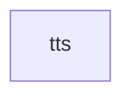

# All machines

Every machine, the `emits` and `invokes` edges between them, and cron entry points.

- [tts](tts.md): Speak a message's body with a local Chatterbox TTS server and save it as an MP3.

