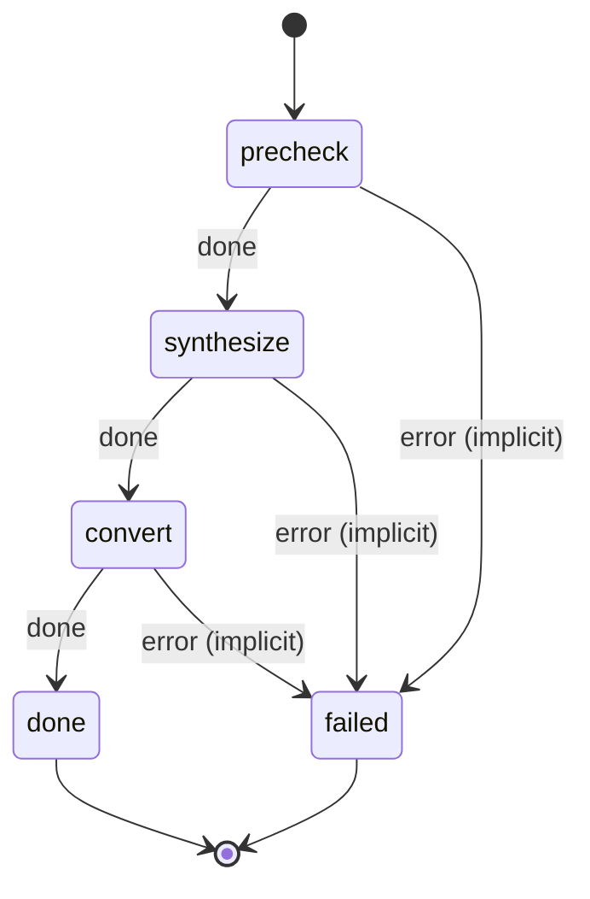

# tts

Speak a message's body with a local Chatterbox TTS server and save it as an MP3.

Machine: [machines/tts.yml](../machines/tts.yml)

```mermaid
stateDiagram-v2
    [*] --> precheck
    convert --> done: done
    convert --> failed: error (implicit)
    precheck --> synthesize: done
    precheck --> failed: error (implicit)
    synthesize --> convert: done
    synthesize --> failed: error (implicit)
    done --> [*]
    failed --> [*]
```
