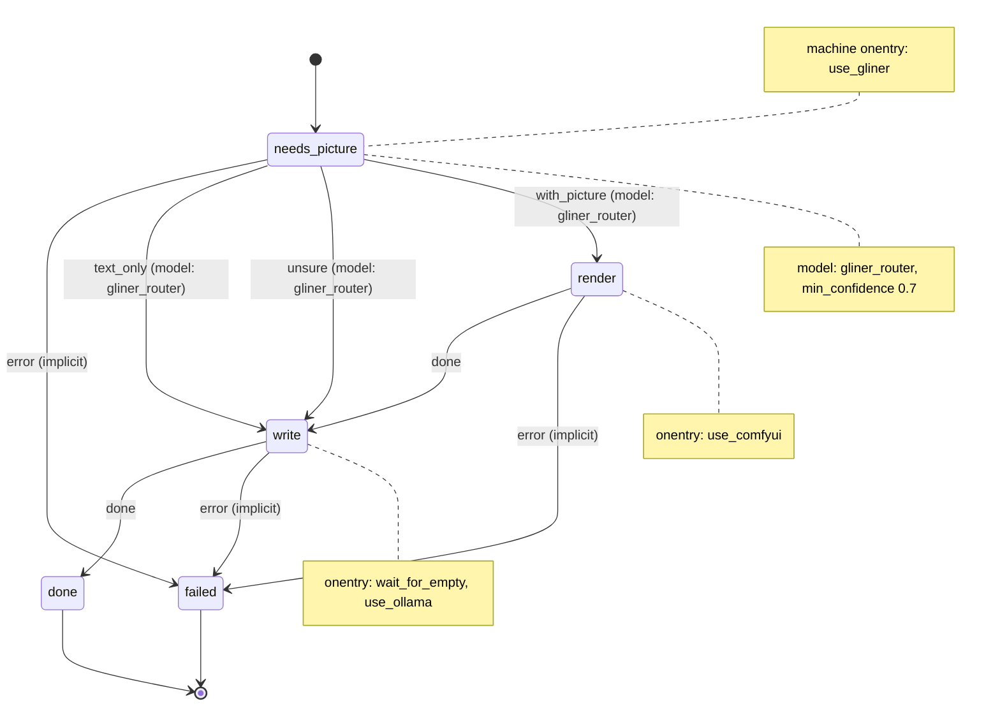

# illustrated_post

Write a short post from the message, with a picture when the message asks for one.

Machine: [machines/illustrated_post.yml](../machines/illustrated_post.yml)

```mermaid
stateDiagram-v2
    [*] --> needs_picture
    needs_picture --> failed: error (implicit)
    needs_picture --> write: text_only (model: gliner_router)
    needs_picture --> write: unsure (model: gliner_router)
    needs_picture --> render: with_picture (model: gliner_router)
    render --> write: done
    render --> failed: error (implicit)
    write --> done: done
    write --> failed: error (implicit)
    done --> [*]
    failed --> [*]
    note left of needs_picture
        machine onentry: use_gliner
    end note
    note right of needs_picture
        model: gliner_router, min_confidence 0.7
    end note
    note right of render
        onentry: use_comfyui
    end note
    note right of write
        onentry: wait_for_empty, use_ollama
    end note
```
