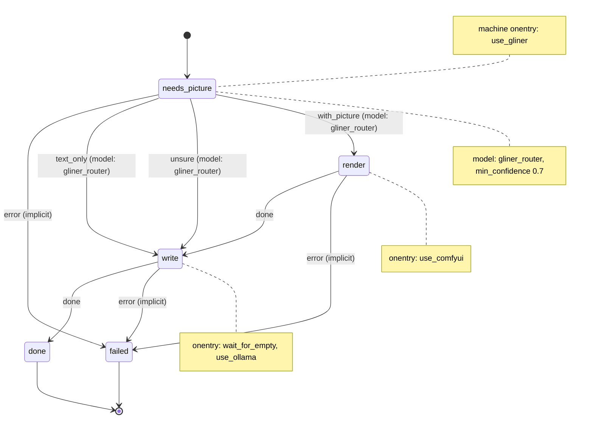

# Services in tmux sessions: GLiNER, Ollama and ComfyUI

This example runs long-running services in tmux sessions, so you can attach to them and watch them, and switches the GPU between two of them. [`docs/services.md`](../../docs/services.md) shows the same switch with systemd units.

The pattern, one `onentry` script per service:

1. **On entry**, use the service's tmux session if it is running, or start the service in a new detached session named after it.
2. **Wait** until the service answers its health URL, and fail with a clear message if it does not.
3. **Share the GPU** by ending the other service's session first: ComfyUI and Ollama never run together. GLiNER2.5-Decide runs on CPU, so it starts first and stays up.

"Attach" means "use the running session": a script cannot take over your terminal. You attach with `tmux attach -t <session>`. decree still runs every script directly, never inside tmux ([Scripts](../../docs/reference/scripts.md)); only the services live in tmux.

## The machine

[`machines/illustrated_post.yml`](.decree/machines/illustrated_post.yml) ([graph](.decree/graph/illustrated_post.md)) writes a short post from the message, with a picture when the message asks for one:



1. The root `onentry`, `use_gliner`, uses or starts the `gliner` session, running the one copy of [`decide_server.py`](../route-by-complexity/gliner/decide_server.py), and waits for its `GET /health`.
2. `needs_picture` asks [`gliner_router`](.decree/machines/gliner_router.yml) (the same file as in `route-by-complexity`) "Does this post need a picture?". `with_picture` goes to `render`; `text_only`, and `unsure` below `min_confidence: 0.7`, go straight to `write`.
3. `render`'s `onentry`, `use_comfyui`, ends the `ollama` session and uses or starts `comfyui`. `render` queues the FLUX2 text-to-image workflow from [`text-to-media`](../text-to-media/README.md) with the message as its prompt and returns at once: ComfyUI renders in the background, and the prompt id goes to `comfy-prompts.txt` in the run directory. Queue as many jobs as you like this way; nothing waits until something is about to end ComfyUI.
4. `write`'s `onentry` runs two scripts, in order. [`wait_for_empty`](.decree/scripts/wait_for_empty.sh) polls ComfyUI's `GET /queue` until nothing is running or pending, so ending ComfyUI cuts no job short; then, while ComfyUI still holds its history, it writes the images this run's prompts made to `images.txt`, and fails if one of them failed or ComfyUI lost it (a restart forgets the queue and the history). If ComfyUI is not running it returns at once, unless this run queued prompts. Only then does `use_ollama` end the `comfyui` session and use or start `ollama serve`. `write` asks Ollama's `/api/generate` for the post and writes `post.md` in the run directory, linking the images.

An `onentry` failure is the state's `error` event, and these states have no `error` transition, so a service that does not start ends the run in `failed`, with the reason in that script's log.

## The scripts

[`scripts/tmux_service.sh`](.decree/scripts/tmux_service.sh) is sourced by the three `use_*` scripts, and no machine runs it. It defines:

| Function | Does |
| --- | --- |
| `ensure_session <session> <command>` | Starts `<command>` in a new detached session unless `tmux has-session` finds it, and prints which, plus `tmux attach -t <session>`. |
| `end_session <session> <health url>` | Kills the session if it exists, then waits up to `TMUX_END_TIMEOUT_S` (30 s) for the URL to stop answering. If it still answers, the service runs outside tmux: it fails and says how to stop it. |
| `wait_until_up <health url> <seconds>` | Polls the URL with `curl -fsS` once a second, and fails with a clear message on timeout. |

Every name, command, URL and timeout is a variable with a default at the top of the script that uses it, so you can change any of them in decree's environment:

| Script | Variables (defaults) |
| --- | --- |
| [`use_gliner`](.decree/scripts/use_gliner.sh) | `GLINER_SESSION` (`gliner`), `GLINER_SERVER` (`../route-by-complexity/gliner/decide_server.py` from this example), `GLINER_PYTHON` (`python3`), `GLINER_HEALTH` (`http://127.0.0.1:8090/health`), `GLINER_START_TIMEOUT_S` (600: the first start downloads the model) |
| [`use_ollama`](.decree/scripts/use_ollama.sh) | `OLLAMA_SESSION` (`ollama`), `OLLAMA_COMMAND` (`ollama serve`), `OLLAMA_HEALTH` (`http://127.0.0.1:11434/api/version`), `OLLAMA_START_TIMEOUT_S` (60), and ComfyUI's session and health URL |
| [`use_comfyui`](.decree/scripts/use_comfyui.sh) | `COMFYUI_SESSION` (`comfyui`), `COMFYUI_DIR` (`$HOME/ComfyUI`), `COMFYUI_PYTHON` (`python3`), `COMFYUI_HOST` (`127.0.0.1`), `COMFYUI_PORT` (8188), `COMFYUI_COMMAND` (`main.py` in `COMFYUI_DIR`), `COMFYUI_HEALTH` (`/system_stats`), `COMFYUI_START_TIMEOUT_S` (180), and Ollama's session and health URL |
| [`wait_for_empty`](.decree/scripts/wait_for_empty.sh) | `COMFY_URL` (`http://127.0.0.1:8188`), `COMFYUI_DIR` (its `output/` holds the images), `COMFY_DRAIN_TIMEOUT_S` (1800) |
| [`illustrated_post/render`](.decree/scripts/illustrated_post/render.sh) | `COMFY_URL`, `COMFY_WORKFLOW` (`../text-to-media/workflows/image_flux2_text_landscape.json` from this example) |
| [`illustrated_post/write`](.decree/scripts/illustrated_post/write.sh) | `OLLAMA_URL`, `OLLAMA_MODEL` (`gemma4:e4b`), `OLLAMA_TIMEOUT_S` (300) |

A new tmux session gets the tmux server's environment, which may not be your shell's. If GLiNER or ComfyUI live in a virtual environment, point `GLINER_PYTHON` or `COMFYUI_PYTHON` at its `python` (or set `GLINER_PYTHON="uv run --with 'gliner2[local]' python"`).

## Running it

These commands only read the project:

```bash
cd examples/tmux-services
decree check                             # every machine is valid
decree graph                             # rewrites .decree/graph/ with no change
```

To use it, install:

- `tmux`, `curl` and `jq`;
- [Ollama](https://ollama.com), and the model: `ollama pull gemma4:e4b`;
- [ComfyUI](https://github.com/comfyanonymous/ComfyUI) in `~/ComfyUI` (or set `COMFYUI_DIR`), with the FLUX2 models the [`text-to-media`](../text-to-media/README.md) workflows load;
- GLiNER2.5-Decide's Python package, Python 3.10 or newer: `pip install 'gliner2[local]'`.

Then, from this directory in the repository, queue a message and process it:

```sh
echo "A short post about lighthouses at dawn, with a picture of one." | decree emit --machine illustrated_post
decree process
```

`post.md` is in the run's directory under `.decree/runs/`. The scripts find `decide_server.py` and the workflow next to this example. When you copy `.decree/` into another project, set `GLINER_SERVER` to where `decide_server.py` is, and `COMFY_WORKFLOW` to a FLUX2 text-to-image workflow.

## Watching it

```sh
tmux ls                                  # which services are up: gliner, and comfyui or ollama
tmux attach -t comfyui                   # watch ComfyUI render; detach with Ctrl-b d
decree tail                              # the running script's log, live
```

Detach, do not exit: ending a session ends its service, and the next state starts it again.

## When Ollama is also a system service

If Ollama also runs as the `ollama` systemd service that [its Linux docs](https://docs.ollama.com/linux) set up, then `ollama serve` in tmux cannot bind its port, and ending the tmux session leaves the GPU in use: `use_comfyui` waits `TMUX_END_TIMEOUT_S` for Ollama to stop answering, then fails with "ollama still answers … so it is running outside tmux". Pick one supervisor. To use tmux, stop the service and keep it stopped:

```sh
sudo systemctl disable --now ollama
```

Or keep systemd for both, with `Conflicts=` ([`docs/services.md`](../../docs/services.md#systemd-user-units-only-one-of-these-at-a-time)).

## tmux or systemd

tmux gives you each service live, in a terminal you can attach to, scroll and type into, and it needs no unit files. It does not restart a service that crashes (the session ends with it, and the next `onentry` starts it again), it starts nothing at boot, and it keeps no log once the scrollback is gone. systemd user units restart on failure, start at boot, keep logs in journald and enforce "never both" with `Conflicts=`, but you watch them through `journalctl`. Use tmux while you work at the machine and want to see the services; use systemd for a box that runs unattended.

## The files

```text
examples/tmux-services/
  .decree/
    machines/
      illustrated_post.yml             picture or not, render, write
      gliner_router.yml                a typed router: asks the classifier server (the same file as in route-by-complexity)
    scripts/
      tmux_service.sh                  ensure_session, end_session, wait_until_up; sourced, not run
      use_gliner.sh                    root onentry: the gliner session
      use_comfyui.sh                   onentry: ends ollama, then the comfyui session
      use_ollama.sh                    onentry: ends comfyui, then the ollama session
      wait_for_empty.sh                onentry: waits until ComfyUI's queue is empty, writes images.txt
      illustrated_post/render.sh       queues the workflow and returns; ComfyUI renders in the background
      illustrated_post/write.sh        asks Ollama for the post, writes post.md
      gliner_router/ask_gliner.sh      posts the request to the classifier server, writes the reply
    graph/  schema/                    written by `decree graph` and `decree schema`
```
