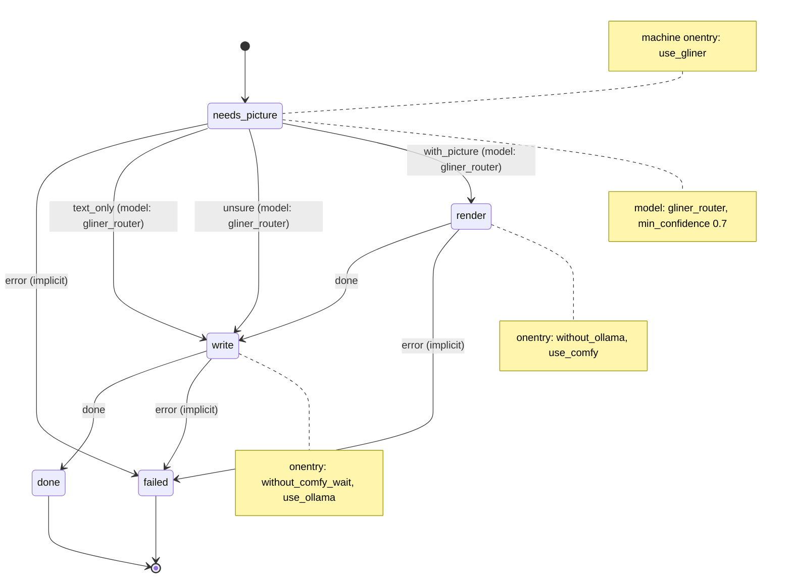

# Services in tmux sessions: GLiNER, Ollama and ComfyUI

This example runs long-running services in tmux sessions, so you can attach to them and watch them, and switches the GPU between two of them by unloading models, not by stopping servers. [`docs/services.md`](../../docs/services.md) shows the same switch with systemd units.

The pattern: `onentry` scripts named for what they do, listed in the order they run.

- **`use_<service>`** uses the service if its health URL answers, whoever runs it (a tmux session, a systemd service, anything). Otherwise it uses the service's tmux session, or starts the service in a new detached session named after it, then waits until it answers, and fails with a clear message if it does not.
- **`without_<service>`** unloads the service's models through its API and waits until they are gone, freeing the GPU. The server keeps running, with its queue and history, so the next `use_<service>` finds it answering and a swap costs a model load, not a server start. ComfyUI and Ollama never hold models together, so a state that needs one lists `without_<the other>` first.
  - **`without_ollama`** unloads every model `GET /api/ps` lists, with `POST /api/generate {"model": <name>, "keep_alive": 0}`, then polls `/api/ps` until it lists none ([API](https://docs.ollama.com/api/ps), [FAQ](https://docs.ollama.com/faq)). decree calls Ollama synchronously (a script waits for its answer), so when a state that needs ComfyUI starts, nothing from decree is using Ollama.
  - **`without_comfy_no_wait`** posts `/queue {"clear": true}` (drops the pending jobs), `/interrupt` (stops the running one) and `/free {"unload_models": true, "free_memory": true}`, then polls `GET /system_stats` until every device's `torch_vram_total`, the memory PyTorch has reserved, is at most `COMFY_RESERVED_MAX_MB`. ComfyUI's worker unloads between jobs, and a queued job would load its models again, so a full unload needs an empty queue: what was queued is lost, for when those jobs no longer matter.
  - **`without_comfy_wait`** first waits until ComfyUI's queue is empty, because its API is fire and forget: jobs queued earlier may still be rendering. It collects this run's images while ComfyUI still holds them, then runs `without_comfy_no_wait`, whose clear and interrupt then do nothing.
  - A service that does not answer has nothing loaded, so its `without_*` succeeds at once.
- GLiNER2.5-Decide runs on CPU, so `use_gliner` starts it first and it stays up.

What is freed: the models' weights, and for ComfyUI also PyTorch's cache, so `torch_vram_total` drops. What is not: the ComfyUI process keeps its CUDA context, a few hundred MB, which `/free` cannot release. If those few hundred MB matter, stop the server instead (`tmux kill-session -t comfyui`).

"Attach" means "use the running session": a script cannot take over your terminal. You attach with `tmux attach -t <session>`. decree still runs every script directly, never inside tmux ([Scripts](../../docs/reference/scripts.md)); only the services live in tmux.

## The machine

[`machines/illustrated_post.yml`](.decree/machines/illustrated_post.yml) ([graph](.decree/graph/illustrated_post.md)) writes a short post from the message, with a picture when the message asks for one:



1. The root `onentry`, `use_gliner`, uses or starts the `gliner` session, running the one copy of [`decide_server.py`](../route-by-complexity/gliner/decide_server.py), and waits for its `GET /health`.
2. `needs_picture` asks [`gliner_router`](.decree/machines/gliner_router.yml) (the same file as in `route-by-complexity`) "Does this post need a picture?". `with_picture` goes to `render`; `text_only`, and `unsure` below `min_confidence: 0.7`, go straight to `write`.
3. `render`'s `onentry` is `[without_ollama, use_comfy]`: it unloads Ollama's models, then uses ComfyUI or starts the `comfyui` session. `render` queues the FLUX2 text-to-image workflow from [`text-to-media`](../text-to-media/README.md) with the message as its prompt and returns at once: ComfyUI renders in the background, and the prompt id goes to `comfy-prompts.txt` in the run directory. Queue as many jobs as you like this way; nothing waits until something is about to unload ComfyUI's models.
4. `write`'s `onentry` is `[without_comfy_wait, use_ollama]`. [`without_comfy_wait`](.decree/scripts/without_comfy_wait.sh) polls ComfyUI's `GET /queue` until nothing is running or pending, so unloading cuts no job short; then it writes the images this run's prompts made to `images.txt`, and fails if one of them failed or ComfyUI lost it (a restart forgets the queue and the history), unloading nothing; otherwise it runs `without_comfy_no_wait`, which unloads ComfyUI's models. If ComfyUI is not running it has nothing to wait for, unless this run queued prompts. Then `use_ollama` uses Ollama or starts `ollama serve`, and `write` asks Ollama's `/api/generate` for the post and writes `post.md` in the run directory, linking the images.

An `onentry` failure is the state's `error` event, and these states have no `error` transition, so a service that does not start, or an unload that does not take effect within its timeout, ends the run in `failed`, with the reason in that script's log.

## The scripts

[`scripts/tmux_service.sh`](.decree/scripts/tmux_service.sh) is sourced by the three `use_*` scripts, and no machine runs it. It defines:

| Function | Does |
| --- | --- |
| `answers <health url>` | Whether the URL answers `curl -fsS`, whoever runs the service. |
| `ensure_session <session> <command>` | Starts `<command>` in a new detached session unless `tmux has-session` finds it, and prints which, plus `tmux attach -t <session>`. |
| `wait_until_up <health url> <seconds>` | Polls the URL with `curl -fsS` once a second, and fails with a clear message on timeout. |

Every name, command, URL and timeout is a variable with a default at the top of the script that uses it, so you can change any of them in decree's environment:

| Script | Variables (defaults) |
| --- | --- |
| [`use_gliner`](.decree/scripts/use_gliner.sh) | `GLINER_SESSION` (`gliner`), `GLINER_SERVER` (`../route-by-complexity/gliner/decide_server.py` from this example), `GLINER_PYTHON` (`python3`), `GLINER_HEALTH` (`http://127.0.0.1:8090/health`), `GLINER_START_TIMEOUT_S` (600: the first start downloads the model) |
| [`use_ollama`](.decree/scripts/use_ollama.sh) | `OLLAMA_SESSION` (`ollama`), `OLLAMA_COMMAND` (`ollama serve`), `OLLAMA_HEALTH` (`http://127.0.0.1:11434/api/version`), `OLLAMA_START_TIMEOUT_S` (60) |
| [`use_comfy`](.decree/scripts/use_comfy.sh) | `COMFYUI_SESSION` (`comfyui`), `COMFYUI_DIR` (`$HOME/ComfyUI`), `COMFYUI_PYTHON` (`python3`), `COMFYUI_HOST` (`127.0.0.1`), `COMFYUI_PORT` (8188), `COMFYUI_COMMAND` (`main.py` in `COMFYUI_DIR`), `COMFYUI_HEALTH` (`/system_stats`), `COMFYUI_START_TIMEOUT_S` (180) |
| [`without_ollama`](.decree/scripts/without_ollama.sh) | `OLLAMA_URL` (`http://127.0.0.1:11434`), `OLLAMA_UNLOAD_TIMEOUT_S` (60) |
| [`without_comfy_no_wait`](.decree/scripts/without_comfy_no_wait.sh) | `COMFY_URL` (`http://127.0.0.1:8188`), `COMFY_RESERVED_MAX_MB` (1024), `COMFY_UNLOAD_TIMEOUT_S` (60) |
| [`without_comfy_wait`](.decree/scripts/without_comfy_wait.sh) | `COMFY_URL`, `COMFYUI_DIR` (its `output/` holds the images), `COMFY_DRAIN_TIMEOUT_S` (1800), and `without_comfy_no_wait`'s |
| [`illustrated_post/render`](.decree/scripts/illustrated_post/render.sh) | `COMFY_URL`, `COMFY_WORKFLOW` (`../text-to-media/workflows/image_flux2_text_landscape.json` from this example) |
| [`illustrated_post/write`](.decree/scripts/illustrated_post/write.sh) | `OLLAMA_URL`, `OLLAMA_MODEL` (`gemma4:e4b`), `OLLAMA_TIMEOUT_S` (300) |

A new tmux session gets the tmux server's environment, which may not be your shell's. If GLiNER or ComfyUI live in a virtual environment, point `GLINER_PYTHON` or `COMFYUI_PYTHON` at its `python` (or set `GLINER_PYTHON="uv run --with 'gliner2[local]' python"`).

## Running it

These commands only read the project:

```bash
cd examples/tmux-services
decree check                             # every machine is valid
decree graph                             # rewrites .decree/graph/ with no change
```

To use it, install:

- `tmux`, `curl` and `jq`;
- [Ollama](https://ollama.com), and the model: `ollama pull gemma4:e4b`;
- [ComfyUI](https://github.com/comfyanonymous/ComfyUI) in `~/ComfyUI` (or set `COMFYUI_DIR`), with the FLUX2 models the [`text-to-media`](../text-to-media/README.md) workflows load;
- GLiNER2.5-Decide's Python package, Python 3.10 or newer: `pip install 'gliner2[local]'`.

Then, from this directory in the repository, queue a message and process it:

```sh
echo "A short post about lighthouses at dawn, with a picture of one." | decree emit --machine illustrated_post
decree process
```

`post.md` is in the run's directory under `.decree/runs/`. The scripts find `decide_server.py` and the workflow next to this example. When you copy `.decree/` into another project, set `GLINER_SERVER` to where `decide_server.py` is, and `COMFY_WORKFLOW` to a FLUX2 text-to-image workflow.

## Watching it

```sh
tmux ls                                  # which services tmux runs: gliner, comfyui, ollama
tmux attach -t comfyui                   # watch ComfyUI render; detach with Ctrl-b d
decree tail                              # the running script's log, live
```

Detach, do not exit: ending a session ends its service, and the next `use_*` starts it again.

## When Ollama is also a system service

It works: `use_ollama` uses whatever answers, so it uses the `ollama` systemd service and starts no session.

## tmux or systemd

tmux gives you each service live, in a terminal you can attach to, scroll and type into, and it needs no unit files. It does not restart a service that crashes (the session ends with it, and the next `use_*` starts it again), it starts nothing at boot, and it keeps no log once the scrollback is gone. systemd user units restart on failure, start at boot, keep logs in journald and enforce "never both" with `Conflicts=`, but you watch them through `journalctl`. Use tmux while you work at the machine and want to see the services; use systemd for a box that runs unattended.

## The files

```text
examples/tmux-services/
  .decree/
    machines/
      illustrated_post.yml             picture or not, render, write
      gliner_router.yml                a typed router: asks the classifier server (the same file as in route-by-complexity)
    scripts/
      tmux_service.sh                  answers, ensure_session, wait_until_up; sourced, not run
      use_gliner.sh                    root onentry: uses GLiNER if it answers, or the gliner session
      use_comfy.sh                     onentry: uses ComfyUI if it answers, or uses or starts the comfyui session
      use_ollama.sh                    onentry: uses Ollama if it answers, or uses or starts the ollama session
      without_ollama.sh                onentry: unloads Ollama's models (nothing waits on Ollama by then)
      without_comfy_wait.sh            onentry: waits until ComfyUI's queue is empty, writes images.txt, unloads
      without_comfy_no_wait.sh         onentry: clears ComfyUI's queue, interrupts, unloads its models
      illustrated_post/render.sh       queues the workflow and returns; ComfyUI renders in the background
      illustrated_post/write.sh        asks Ollama for the post, writes post.md
      gliner_router/ask_gliner.sh      posts the request to the classifier server, writes the reply
    graph/  schema/                    written by `decree graph` and `decree schema`
```
