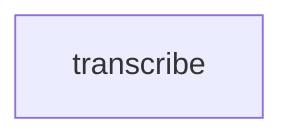

# All machines

Every machine, the `emits` and `invokes` edges between them, and cron entry points.

- [transcribe](transcribe.md): Transcribe an audio file with OpenAI Whisper into a .txt file.

```mermaid
flowchart LR
    transcribe["transcribe"]
```
