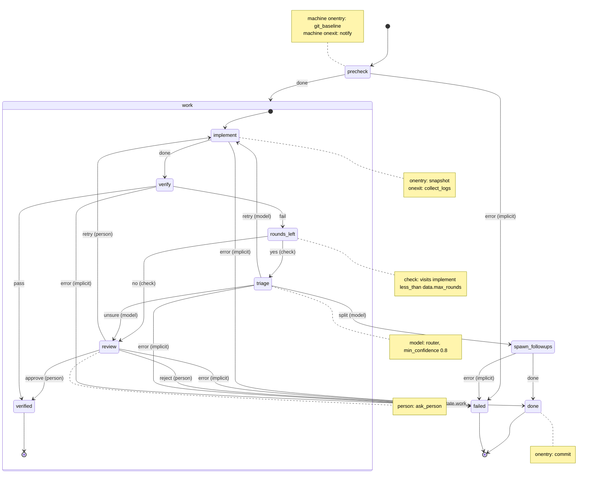

# feature

Implement one feature spec with an AI agent, verify it, and commit.

Machine: [machines/feature.yml](../machines/feature.yml)

```mermaid
stateDiagram-v2
    [*] --> precheck
    state work {
        [*] --> implement
        implement --> verify: done
        review --> verified: approve (person)
        review --> implement: retry (person)
        rounds_left --> review: no (check)
        rounds_left --> triage: yes (check)
        triage --> implement: retry (model)
        triage --> review: unsure (model)
        verify --> rounds_left: fail
        verify --> verified: pass
        verified --> [*]
    }
    implement --> failed: error (implicit)
    precheck --> work: done
    precheck --> failed: error (implicit)
    review --> failed: error (implicit)
    review --> failed: reject (person)
    spawn_followups --> done: done
    spawn_followups --> failed: error (implicit)
    triage --> failed: error (implicit)
    triage --> spawn_followups: split (model)
    verify --> failed: error (implicit)
    work --> done: done.state.work
    done --> [*]
    failed --> [*]
    note left of precheck
        machine onentry: git_baseline
        machine onexit: notify
    end note
    note right of done
        onentry: commit
    end note
    note right of implement
        onentry: snapshot
        onexit: collect_logs
    end note
    note right of review
        person: ask_person
    end note
    note right of rounds_left
        check: visits implement less_than data.max_rounds
    end note
    note right of triage
        model: router, min_confidence 0.8
    end note
```
