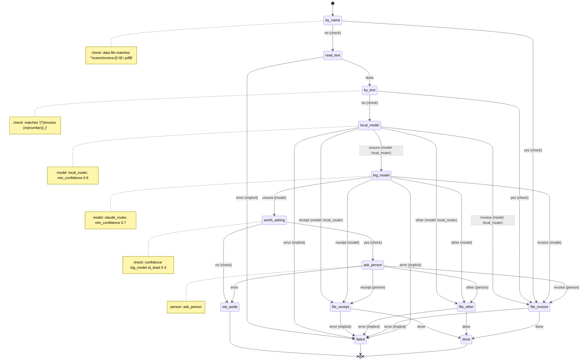

# sort_document

File one scanned document as an invoice, a receipt or other paperwork.

Machine: [machines/sort_document.yml](../machines/sort_document.yml)

```mermaid
stateDiagram-v2
    [*] --> by_name
    ask_person --> set_aside: error
    ask_person --> file_invoice: invoice (person)
    ask_person --> file_other: other (person)
    ask_person --> file_receipt: receipt (person)
    big_model --> failed: error (implicit)
    big_model --> file_invoice: invoice (model)
    big_model --> file_other: other (model)
    big_model --> file_receipt: receipt (model)
    big_model --> worth_asking: unsure (model)
    by_name --> read_text: no (check)
    by_name --> file_invoice: yes (check)
    by_text --> local_model: no (check)
    by_text --> file_invoice: yes (check)
    file_invoice --> done: done
    file_invoice --> failed: error (implicit)
    file_other --> done: done
    file_other --> failed: error (implicit)
    file_receipt --> done: done
    file_receipt --> failed: error (implicit)
    local_model --> failed: error (implicit)
    local_model --> file_invoice: invoice (model: local_router)
    local_model --> file_other: other (model: local_router)
    local_model --> file_receipt: receipt (model: local_router)
    local_model --> big_model: unsure (model: local_router)
    read_text --> by_text: done
    read_text --> failed: error (implicit)
    worth_asking --> set_aside: no (check)
    worth_asking --> ask_person: yes (check)
    done --> [*]
    failed --> [*]
    set_aside --> [*]
    note right of ask_person
        person: ask_person
    end note
    note right of big_model
        model: claude_router, min_confidence 0.7
    end note
    note right of by_name
        check: data file matches '^scans/invoice-[0-9]+\.pdf$'
    end note
    note right of by_text
        check: matches '(?i)invoice (no|number)[.:]'
    end note
    note right of local_model
        model: local_router, min_confidence 0.9
    end note
    note right of worth_asking
        check: confidence big_model at_least 0.4
    end note
```
