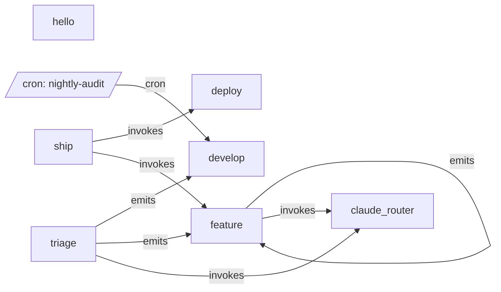

# All machines

Every machine, the `emits` and `invokes` edges between them, and cron entry points.

- [claude_router](claude_router.md): Ask Claude to pick one of the options in the request.
- [deploy](deploy.md): Build, ask a person to approve, then ship.
- [develop](develop.md): Make a small code change with an AI agent, then run the tests.
- [feature](feature.md): Implement one feature spec with an AI agent, verify it, and commit.
- [hello](hello.md): Run one script.
- [ship](ship.md): Implement a feature, then deploy it.
- [triage](triage.md): Read a free-form request and hand it to the machine that should do the work.

