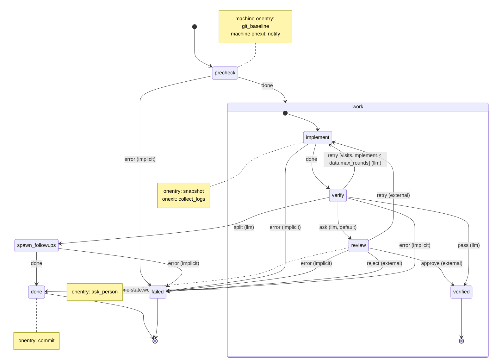
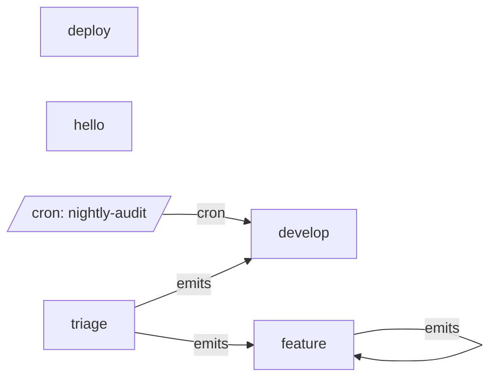

# decree 0.5 mock project

This directory is a decree 0.5 project frozen partway through its life: five machines, their scripts, two finished runs, one run waiting for a person, one interrupted run, and three queued messages (one of them the person's reply). Nothing here runs yet; it shows exactly what the files will look like once 0.5 ships. The contract is [`docs/0.5-spec.md`](../docs/0.5-spec.md). Tests hold the mock to it: `decree check` must pass with `mock/` as the project root, and `decree graph` must reproduce `graph/*.md` byte for byte.

## The three building blocks

```text
mock/.decree/
  config.yml                      global settings (router command, defaults)
  machines/                       MACHINES: control flow, no code
    hello.yml                       the smallest machine: one script
    deploy.yml                      build, wait for a person to approve, ship
    develop.yml                     small change, then tests (the default machine)
    triage.yml                      free-form request -> the right machine (0.4's global router, rebuilt)
    feature.yml                     everything: nesting, a model's decision, escalation to a person, commit
  scripts/                        SCRIPTS: the work, bash, no routing; shared by every machine
  scripts/<machine>/                  a machine's own scripts, checked before scripts/
  migrations/  processed.md       MESSAGES: ordered, run-once queue, committed
  inbox/                          MESSAGES: FIFO queue (emit, cron, humans), not committed
  cron/                           message templates that drop into inbox/ on a schedule
  runs/<id>/                      one folder per run: message copy, events.jsonl, numbered logs
graph/                            what `decree graph` prints: Markdown with a Mermaid diagram
observability/config.alloy        shipping events and logs to Loki
```

- A **message** says *what* to do (markdown body) and *which machine* does it (`machine:` in the frontmatter).
- A **machine** says *in what order and under what conditions*: states, events, transitions, conditions. It names scripts but never contains code or paths.
- A **script** does one piece of work and reports one outcome: exit 0 (`done`), non-zero (`error`), or a JSON line naming a richer event (`{"event":"pass"}`). Generic scripts (`commit`, `notify`, `snapshot`, `test`) live once in `scripts/` and serve every machine; `scripts/feature/implement.sh` and `scripts/develop/implement.sh` are each machine's own `implement`, found first because `scripts/<machine>/` is checked before `scripts/`.

The LLM appears in exactly one place: a **router state** (`router: llm`), where it picks one of the events the machine declares. It never names a state, a script or a machine.

## Reading a machine

Start small. [`machines/hello.yml`](.decree/machines/hello.yml) is a whole machine:

```yaml
name: hello
description: Run one script.
initial: greet
states:
  greet:
    invoke: greet                  # runs scripts/greet (or scripts/hello/greet)
    transitions: { done: done }    # exit 0 -> done; non-zero -> failed, implicitly
  done:   { final: true }
  failed: { final: true }          # every machine has one
```

`greet` runs `scripts/hello/greet.sh`. Exit 0 is the event `done`, which goes to `done`. Anything else is `error`; `greet` has no `error` transition, so it goes to `failed`, which every machine has.

[`machines/deploy.yml`](.decree/machines/deploy.yml) adds a person:

```yaml
name: deploy
description: Build, wait for a person to approve, then ship.
initial: build
states:
  build:
    invoke: build
    transitions: { done: approval }
  approval:                        # waits: no invoke, no done
    description: A person sends approve or reject.
    onentry: [ask_person]          # posts the question; decree only knows it is waiting
    timeout_s: 86400               # no reply in a day: error, which goes to failed
    transitions: { approve: ship, reject: rejected }
  ship:
    invoke: ship
    transitions: { done: done }
  done:     { final: true }
  rejected: { final: true }
  failed:   { final: true }
```

`approval` has no `invoke` and no `done`, so it is a **waiting state**: SCXML's "wait for an external event". Its `onentry` script, [`ask_person.sh`](.decree/scripts/ask_person.sh), tells someone how to reply; decree only records that the run is waiting for `approve` or `reject`. A reply is a small message (see Waiting for a person, below). No reply in a day (`timeout_s`) is an `error`.

[`machines/feature.yml`](.decree/machines/feature.yml) uses everything, drawn by `decree graph feature` ([`graph/feature.md`](graph/feature.md)):



- `work` is a **compound state**: `implement`, `verify` and `review` loop inside it until it reaches its own final state `verified`. Reaching it raises `done.state.work`, which `work` handles by going to `done`. The inner states never need to know what happens after `work`.
- `verify` is a **router state**: unless its script prints `pass`, a model picks `retry`, `split` or `ask`. If the model fails twice, `default: ask` hands the decision to a person.
- `review` is a **waiting state**, like `deploy`'s `approval`.
- Unhandled errors **bubble up**: the state's own transitions are checked first, then `work`'s, then the root's, and an `error` nobody handles goes to `failed` (the `(implicit)` edges).

A machine is an SCXML statechart written in YAML. The keys are SCXML's names; if you (or an AI) know SCXML, you know how this file behaves. decree implements a strict subset of SCXML (spec section 5), plus a few marked extensions:

| Key | SCXML | What decree does with it |
| --- | --- | --- |
| `name`, `initial`, `states` | `<scxml name initial>`, child `<state>` | Where a run starts; nesting. |
| `invoke: implement` | `<invoke src>` | Runs the `implement` script (here `scripts/feature/implement.sh`) while the state is active. Its completion is the event. |
| `transitions: { done: verify }` | `<transition event target>` | Event → target. `done` = exit 0, `error` = non-zero. On a compound state, they apply to everything inside it. |
| `onentry: [snapshot]`, `onexit: [collect_logs]` | `<onentry>`, `<onexit>` | Scripts run every time the state is entered or exited. They report no event. |
| `final: true` | `<final>` | At the root, ends the run. Inside a compound state `P`, raises `done.state.P`. |
| No `invoke`, no `done` | a state waiting for external events | Pauses the run until a reply message delivers one of its events. |
| `cond: "visits.implement < data.max_rounds"` | `cond` | One comparison. Here it removes `retry` from the model's options after two rounds. |
| `type: internal` (not used here) | `type="internal"` | A compound state's transition to its own child without leaving the compound. |
| `data` (in the machine), `params` (in a message) | `<datamodel><data>`, `<invoke><param>` | Typed, read-only values; a message's `params` set them for its run. Scripts see `DECREE_DATA_MAX_ROUNDS`. |
| `router: llm`, `default: ask` | extension | A model chooses among the declared events; `default` is taken if it fails twice. The backend contract is being settled by a spike (below). |
| `emits: [feature]` | extension | Which machines this state's scripts may queue messages for, via `decree emit`. |
| `max_attempts`, `timeout_s` | extension (as AWS Step Functions `Retry`, `TimeoutSeconds`) | Mechanical retry and time limit for an invoke, or for a reply. |

## The life of one migration

`migrations/01-rate-limit-upload.md` names `machine: feature`. `processed.md` lists it, so it has run. Its run folder, `runs/01-rate-limit-upload/`, holds the whole story. [`events.jsonl`](.decree/runs/01-rate-limit-upload/events.jsonl) has one line per thing that happened; each `script` event names the log file it wrote:

| Event (`seq`, `type`) | Log | What happened | Why |
| --- | --- | --- | --- |
| 1 `transition` `claimed → precheck` | | decree created `runs/01-rate-limit-upload/`, copied the migration to `message.md` (adding `id` and `trigger: migration`) and recorded the claim. | Migrations are immutable; the run works on a copy. |
| 2 `script` git_baseline, onentry | `0001` | Root `onentry`, 41 ms. | `onentry: [git_baseline]` at the machine root runs once, first. |
| 3 `script` precheck, invoke | `0002` | Exit 0. | |
| 4 `transition` `precheck → implement` (`done`) | | Target was `work`, a compound state, so decree followed `work.initial` to `implement`. | SCXML: entering a compound enters its initial child. |
| 5 `script` snapshot, onentry | `0003` | `onentry` of `implement`. | `onentry` runs on every entry into the state. |
| 6 `script` implement, invoke | `0004` | The agent implemented the spec: 11 min 44 s (`duration_ms: 704512`). `path` shows `scripts/feature/implement.sh` ran. | |
| 7 `script` collect_logs, onexit | `0005` | `onexit` of `implement`, on the way to `verify`. | `onexit` runs on every exit from the state. |
| 8 `transition` `implement → verify` (`done`) | | | |
| 9 `script` verify, invoke | `0006` | `cargo test` failed, so `verify.sh` printed no event and exited 0. | A pass is deterministic; only failures go to the model. |
| 10 `router` verify | `0007` | Options were all four events (`ask`, `pass`, `retry`, `split`), because `visits.implement` was 1 and the `cond` `1 < 2` held. The model chose `retry` in 2.4 s; the reason is recorded. | Every model decision is auditable. |
| 11 `transition` `verify → implement` (`retry`, `source: llm`) | | | |
| 12 `script` snapshot, onentry | `0008` | Round 2 (`DECREE_VISITS=2`). | |
| 13 `script` implement, invoke, attempt 1 | `0009` | The agent's API call failed: exit 1. | |
| 14 `transition` `implement → implement` (`error`, `source: attempt`) | | `max_attempts: 2`, so decree re-ran the invoke in place: no `onexit` or `onentry`. | Attempts are mechanical retries; they are not visits. |
| 15 `script` implement, invoke, attempt 2 | `0010` | `DECREE_FINAL_ATTEMPT=true`. Succeeded. | |
| 16 `script` collect_logs, onexit | `0011` | | |
| 17 `transition` `implement → verify` (`done`) | | | |
| 18 `script` verify, invoke | `0012` | Tests passed; the script printed `{"event":"pass"}`. | The model was not asked. |
| 19 `transition` `verify → verified` (`pass`, `source: stdout`) | | `verified` is `work`'s own final state. | |
| 20 `transition` `verified → done` (`done.state.work`, `source: internal`) | | decree raised `done.state.work` at once; `work` handles it. decree appended `01-rate-limit-upload.md` to `processed.md`, *then* ran `done`'s `onentry`. | So the commit includes the ledger line. |
| 21 `script` commit, `onentry` of `done` | `0013` | One commit with the code and the ledger line. | decree never runs git itself. |
| 22 `script` notify, root `onexit` | `0014` | Last script of the run. | |
| 23 `run_finished` `done` | | 21 min 7 s end to end. | |

Had the second round failed too, the `cond` `visits.implement < 2` would have been false. `retry` would have dropped out of the options, so the model could only choose `pass`, `split` or `ask`, and the loop is bounded by the machine, not by the model's judgement.

`runs/01-rate-limit-upload/message.md` says `state: done`. That is a mirror for humans. The record is the last `transition` event; if decree crashes between the two writes, it trusts the log and repairs the mirror.

## Waiting for a person

Migration 02 is in [`runs/02-upload-quota-per-plan/`](.decree/runs/02-upload-quota-per-plan/events.jsonl), paused. Nobody needs to run `decree retry`: the run continues by itself when the reply arrives.

1. `verify`'s tests failed on a file the spec did not locate, and the model chose `ask` (event 10, reason recorded). The run went to `review` (event 11).
2. `review`'s `onentry` script, `ask_person.sh`, ran with `DECREE_WAIT_ID=02-upload-quota-per-plan.w11` and `DECREE_ACCEPTS="approve reject retry"`, and printed how to reply ([`0008-review-ask_person.log`](.decree/runs/02-upload-quota-per-plan/0008-review-ask_person.log)). A real one would post this to chat or open an issue.
3. decree appended a `waiting` event (event 13) with the wait id, the accepted events and the deadline (`timeout_s`: two days). `decree status` lists the run as `waiting`; `decree process` prints the same commands and exits 0. Migrations after 02 wait too.
4. A person replied with `decree event 02-upload-quota-per-plan.w11 retry -m "..."`, which wrote [`inbox/20261001T160301Z-9be210.md`](.decree/inbox/20261001T160301Z-9be210.md):

   ```markdown
   ---
   id: 20261001T160301Z-9be210
   to: 02-upload-quota-per-plan.w11
   event: retry
   ---
   plans.toml lives in config/, next to the other settings. Read it from there.
   ```

   Any tool can write the same file (a chat bot, a web UI), so the person never needs a terminal.
5. On the next `process` or `daemon` pass, decree checks that the run is still waiting on `.w11` and that `retry` is accepted, moves the message to `runs/02-upload-quota-per-plan/received/`, appends a `received` event, and continues: `review → implement` with `source: external`. `implement.sh` finds the note through `DECREE_RECEIVED`.

A reply to a stale wait id, or with an event the state does not accept, is not applied; it shows up in `decree status` as a failed message with the reason.

## Two kinds of retry

| | `max_attempts` | A transition back (`retry`) |
| --- | --- | --- |
| Means | "That crashed; run it again." | "That worked but the result is wrong; do another round." |
| Decided by | Exit code | The machine (and, in a router state, the LLM) |
| Leaves the state? | No: no `onexit` or `onentry`, no new visit | Yes: `onexit`, `onentry`, `visits` + 1 |
| Bounded by | `max_attempts` (state, else config) | A `visits` `cond` |
| In `events.jsonl` | `transition` with `source: attempt`, `from == to` | An ordinary `transition` |

## Routing a free-form request (0.4's router, rebuilt)

In 0.4 a message without `routine:` went to a global LLM router that could pick any routine. In 0.5 that is just a machine: [`machines/triage.yml`](.decree/machines/triage.yml).

1. Someone dropped `dark-mode.md` (`machine: triage`) into `inbox/`. decree claimed it as `runs/20261001T151455Z-5d2e90/`.
2. `classify` is a router state with no invoke, so the router ran at once. Its reply came back in a code fence, which the chat backend strips ([`0001-classify-_router.log`](.decree/runs/20261001T151455Z-5d2e90/0001-classify-_router.log)). It chose `small_change`.
3. `to_develop` invoked `forward.sh`, which piped the body into `decree emit --machine develop`. `emit` checked that `develop` is in `to_develop`'s `emits`, wrote `inbox/.20261001T151502Z-a41c07.md.tmp`, and renamed it into place with `parent`, `depth: 1` and `trigger: emit`.
4. That message is waiting in [`inbox/`](.decree/inbox/20261001T151502Z-a41c07.md). The inbox drains in filename order (FIFO): it runs first, then the reply for migration 02, then `fix-login-typo.md`.

If the model had failed twice, `default: reject` would have ended the run without doing any work. Pick a safe default.

## The whole system

`decree graph` with no argument ([`graph/system.md`](graph/system.md)) shows how machines connect: one box per machine, `emits` edges between them, and cron files as entry points. Each machine's own graph shows its states.



## Viewing the graphs

`decree graph` prints a Markdown document with the diagram in a `mermaid` block; the files in [`graph/`](graph/) are exactly that output.

1. Save it: `decree graph feature > feature.md`.
2. Open it in VS Code and press `Ctrl+Shift+V` (`Cmd+Shift+V` on macOS). VS Code 1.121 and later render Mermaid in the Markdown preview with no extension. GitHub, GitLab and Obsidian render it as it is.
3. Anywhere else: copy the lines inside the `mermaid` fence into https://mermaid.live.

Mermaid and its live editor are MIT-licensed, so a team can host its own copy.

State ids in the graph are the state names (`<machine>__<state>` in the system graph), and every event in `events.jsonl` carries `machine`, `state` and `run_id`. A UI built outside decree can use those to link each node to its logs in Grafana.

## What every script sees

From `0010-implement-implement.log`'s point of view:

```text
DECREE_PROJECT_ROOT=/home/me/app
DECREE_MESSAGE=/home/me/app/.decree/runs/01-rate-limit-upload/message.md
DECREE_MESSAGE_ID=01-rate-limit-upload
DECREE_MACHINE=feature
DECREE_STATE=implement
DECREE_PHASE=invoke
DECREE_VISITS=2
DECREE_RUN_DIR=/home/me/app/.decree/runs/01-rate-limit-upload
DECREE_ATTEMPT=2
DECREE_MAX_ATTEMPTS=2
DECREE_FINAL_ATTEMPT=true
DECREE_TRIGGER=migration
DECREE_DATA_MAX_ROUNDS=2
```

## Stopping and crashes

decree never continues a run on its own. A kill may be deliberate, and decree cannot tell, so it records what happened and waits for you.

[`runs/20261001T030000Z-c4e81b/`](.decree/runs/20261001T030000Z-c4e81b/events.jsonl) is the nightly cron run. Someone pressed Ctrl-C while `implement` was updating dependencies:

1. decree sent SIGTERM to the script's process group, waited for it to exit (SIGKILL after 10 s), wrote no `script` event for it, and appended `{"type":"interrupted","cause":"signal","state":"implement","script":"implement"}`. No `onexit` scripts ran. `decree process` exited 130.
2. The run is now `interrupted`. `decree status` lists it; later `process` and `daemon` passes leave it alone. Had decree been killed with SIGKILL or lost power instead, the next `process` or `daemon` would find the stale lock and append the same event with `cause: "crash"`.
3. `decree retry 20261001T030000Z-c4e81b` appends a `transition` with `source: "retry"` back into `implement`. That makes the run `pending`, and the next `process` or `daemon` continues it: root `onentry`, then the `onentry` scripts down to `implement`, then the invoke. Scripts must be safe to re-run; `git_baseline.sh` only writes its baseline the first time.

An interrupted migration blocks the migrations after it, exactly as a failed one does. `runs/<id>/.lock` only stops two decree processes from stepping the same run at once.

## Watching it in Grafana

`events.jsonl` is the telemetry as well as the record: every line is self-contained (`run_id`, `machine`, `trigger`, `type`, `ts`), and `script` and `router` events carry `started_at` and `duration_ms`. [`observability/config.alloy`](observability/config.alloy) ships the events, and optionally the script output, to Loki with Grafana Alloy:

- Labels: `job`, `machine`, `type`, and `script` for script output. `run_id` goes in structured metadata; a label per run makes Loki slow.
- Timestamps come from `ts`, so late or back-filled lines land at the right time.
- Script output filenames carry their context (`runs/<run_id>/<NNNN>-<state>-<script>.log`). State and script names cannot contain `-`, so the path regex is unambiguous.

```logql
# p95 script duration by script, last 24 h
quantile_over_time(0.95, {job="decree", type="script"} | json | unwrap duration_ms [24h]) by (script)

# runs that ended in failed, per machine, per day
sum by (machine) (count_over_time({job="decree", type="run_finished"} | json | state="failed" [1d]))

# runs waiting for `decree retry`
{job="decree", type="interrupted"} | json

# the slowest agent rounds this week
topk(10, max_over_time({job="decree", type="script", machine="feature"} | json | script="implement" | unwrap duration_ms [7d]) by (run_id))
```

## The router is being decided

Router states are settled: the machine declares the options, `cond`s prune them, decree validates the choice and falls back to `default`. *How* a backend is asked is not settled. The logs above show today's draft, a chat prompt sent to `commands.ai_router`. A typed-choice model such as TypeSafe's Jev takes the declared options directly and returns a choice with per-option probabilities and a confidence, which decree would record on the `router` event and could gate on: act when confident, divert to `ask` (a person) when not. [`docs/spikes/router.md`](../docs/spikes/router.md) is the plan for deciding.

## From 0.4 to 0.5

| 0.4 | 0.5 |
| --- | --- |
| `routines/develop.sh` (one script doing everything) | `machines/develop.yml` + scripts, one per step, shared where generic |
| Comment-scraped description and params | `description:` and `params:` in the machine |
| `DECREE_PRE_CHECK` mode | An ordinary first state (`precheck`) |
| `hooks: beforeAll / afterAll` | Root `onentry` / `onexit` |
| `hooks: beforeEach / afterEach` | `onentry` / `onexit` on states |
| `hooks: onDeadLetter`, `inbox/dead/` | `failed` final state and its `onentry` |
| `router.md`, any-routine routing | Router states over declared events; `triage` machine |
| `outbox/` relay | `decree emit`, checked against `emits` |
| Chain ids, `seq` | `id`, `parent`, `depth` |
| `run.json`, `routine.log` | `events.jsonl` (state, timings, router decisions), numbered logs |
| `decree routine`, `routine verify` | `decree check` |
| `decree log`, `decree cron list` | `decree status <id>`, `decree status --cron` |

## Standards this draws from

W3C SCXML (terms, semantics and key names; Harel statecharts underneath), AWS Step Functions retry/timeout/catch, LangGraph-style edge selection by a model, typed-choice routing (under evaluation), event sourcing over a JSON Lines log, Loki label practice and the OpenTelemetry span model, Maildir-style temp-then-rename delivery, Mermaid for diagrams. Spec section 13 lists each one, what decree takes from it, and where decree deliberately deviates.

In a real project `.decree/.gitignore` contains `inbox/` and `runs/`. This mock commits them so you can read them.
