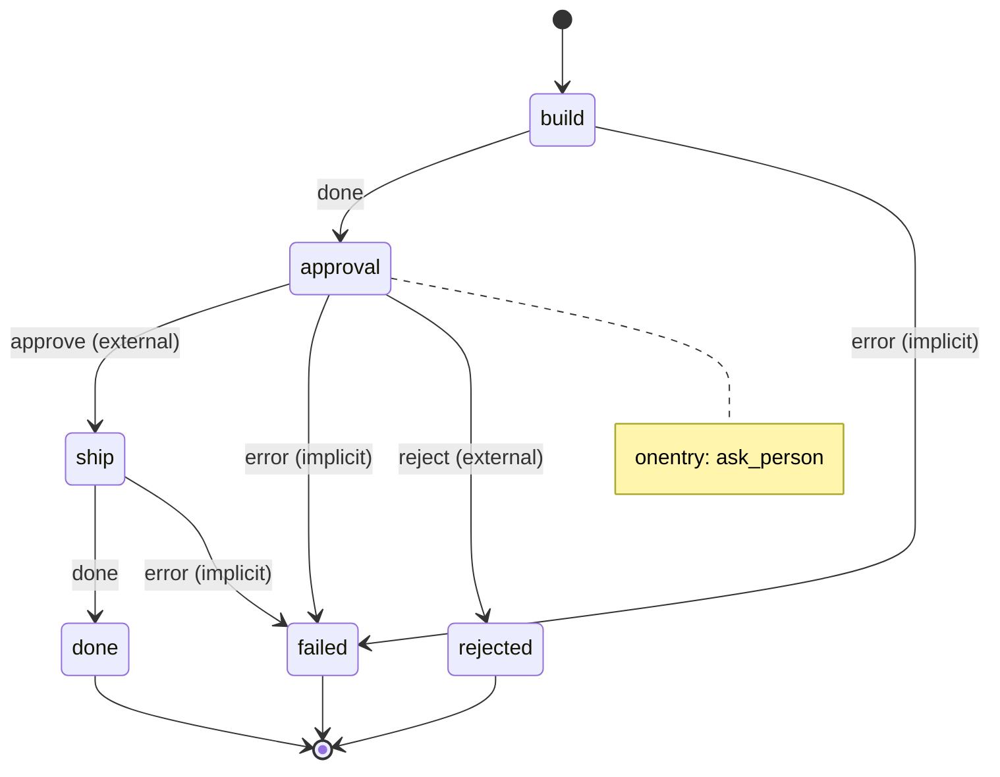

# deploy

Build, wait for a person to approve, then ship.

```mermaid
stateDiagram-v2
    [*] --> build
    approval --> ship: approve (external)
    approval --> failed: error (implicit)
    approval --> rejected: reject (external)
    build --> approval: done
    build --> failed: error (implicit)
    ship --> done: done
    ship --> failed: error (implicit)
    done --> [*]
    failed --> [*]
    rejected --> [*]
    note right of approval
        onentry: ask_person
    end note
```
