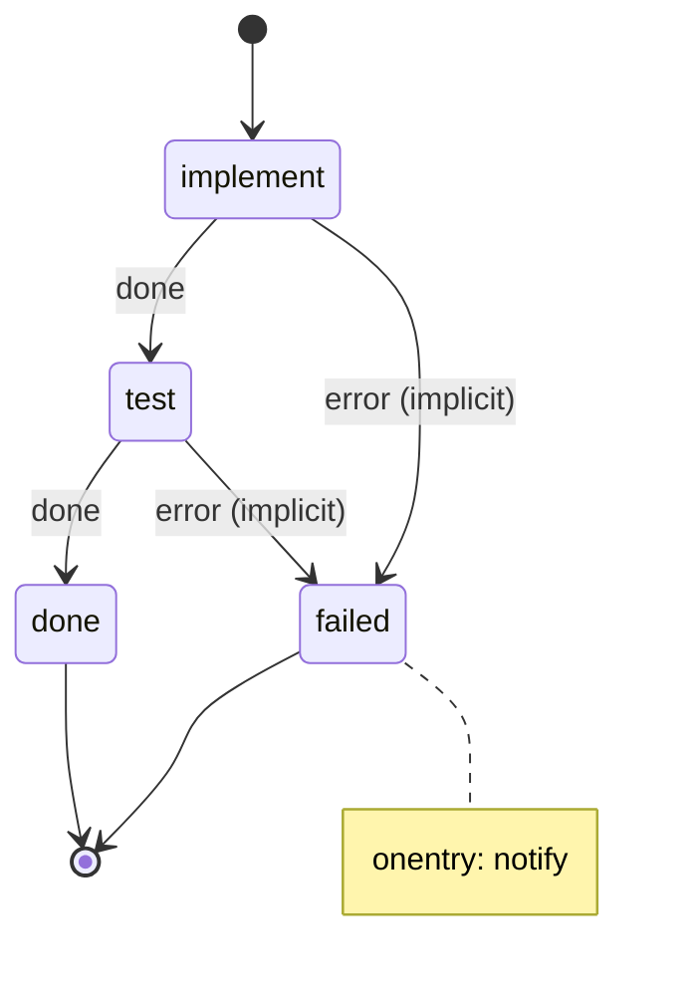

# develop

Make a small code change with an AI agent, then run the tests.

```mermaid
stateDiagram-v2
    [*] --> implement
    implement --> test: done
    implement --> failed: error (implicit)
    test --> done: done
    test --> failed: error (implicit)
    done --> [*]
    failed --> [*]
    note right of failed
        onentry: notify
    end note
```
