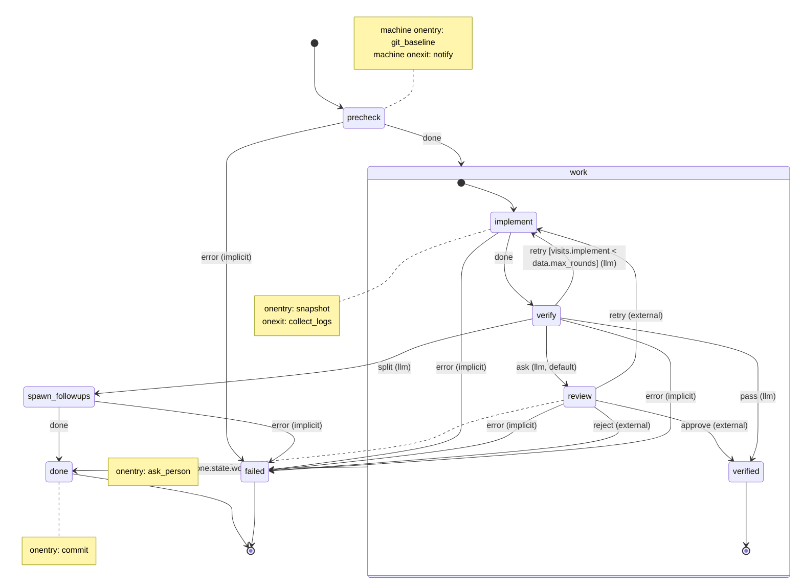

# feature

Implement one feature spec with an AI agent, verify it, and commit.

```mermaid
stateDiagram-v2
    [*] --> precheck
    state work {
        [*] --> implement
        implement --> verify: done
        review --> verified: approve (external)
        review --> implement: retry (external)
        verify --> review: ask (llm, default)
        verify --> verified: pass (llm)
        verify --> implement: retry [visits.implement #lt; data.max_rounds] (llm)
        verified --> [*]
    }
    implement --> failed: error (implicit)
    precheck --> work: done
    precheck --> failed: error (implicit)
    review --> failed: error (implicit)
    review --> failed: reject (external)
    spawn_followups --> done: done
    spawn_followups --> failed: error (implicit)
    verify --> failed: error (implicit)
    verify --> spawn_followups: split (llm)
    work --> done: done.state.work
    done --> [*]
    failed --> [*]
    note left of precheck
        machine onentry: git_baseline
        machine onexit: notify
    end note
    note right of done
        onentry: commit
    end note
    note right of implement
        onentry: snapshot
        onexit: collect_logs
    end note
    note right of review
        onentry: ask_person
    end note
```
