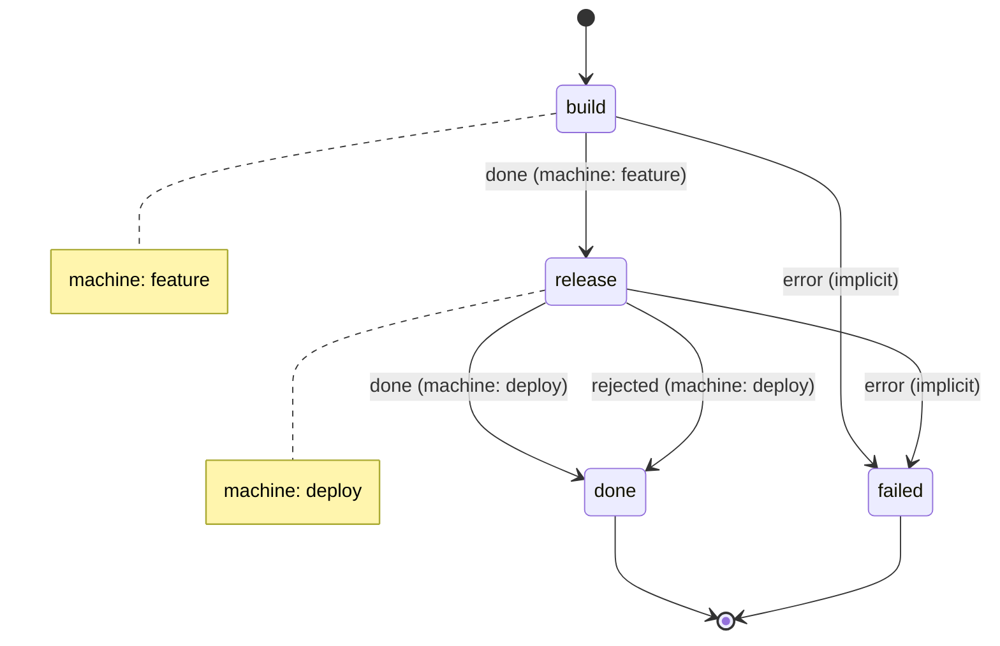

# ship

Implement a feature, then deploy it.

```mermaid
stateDiagram-v2
    [*] --> build
    build --> release: done (machine: feature)
    build --> failed: error (implicit)
    release --> done: done (machine: deploy)
    release --> failed: error (implicit)
    release --> done: rejected (machine: deploy)
    done --> [*]
    failed --> [*]
    note right of build
        machine: feature
    end note
    note right of release
        machine: deploy
    end note
```
