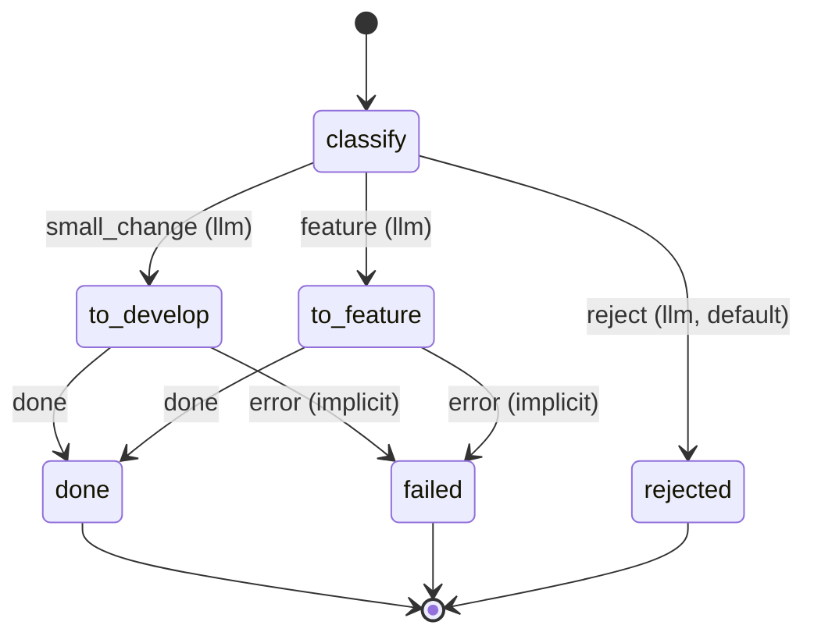

# triage

Read a free-form request and hand it to the machine that should do the work.

```mermaid
stateDiagram-v2
    [*] --> classify
    classify --> to_feature: feature (llm)
    classify --> rejected: reject (llm, default)
    classify --> to_develop: small_change (llm)
    to_develop --> done: done
    to_develop --> failed: error (implicit)
    to_feature --> done: done
    to_feature --> failed: error (implicit)
    done --> [*]
    failed --> [*]
    rejected --> [*]
```
