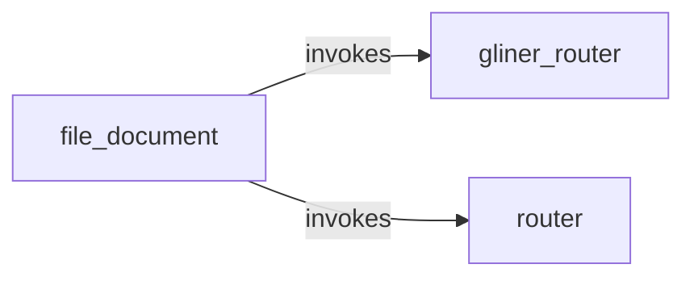

# All machines

Every machine, the `emits` and `invokes` edges between them, and cron entry points.

- [file_document](file_document.md): File one scanned document as an invoice, a receipt or other paperwork.
- [gliner_router](gliner_router.md): Ask the local GLiNER2.5-Decide classifier to pick one of the options in the request.
- [router](router.md): Ask Claude to pick one of the options in the request.

