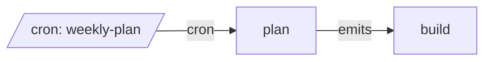

# All machines

Every machine, the `emits` edges between them, and cron entry points.

```mermaid
flowchart LR
    build["build"]
    plan["plan"]
    cron__weekly_plan[/"cron: weekly-plan"/]
    cron__weekly_plan -->|cron| plan
    plan -->|emits| build
```
