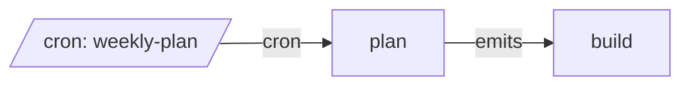

# All machines

Every machine, the `emits` and `invokes` edges between them, and cron entry points.

- [build](build.md): Build one change.
- [plan](plan.md): Split a request into follow-up messages for build.

